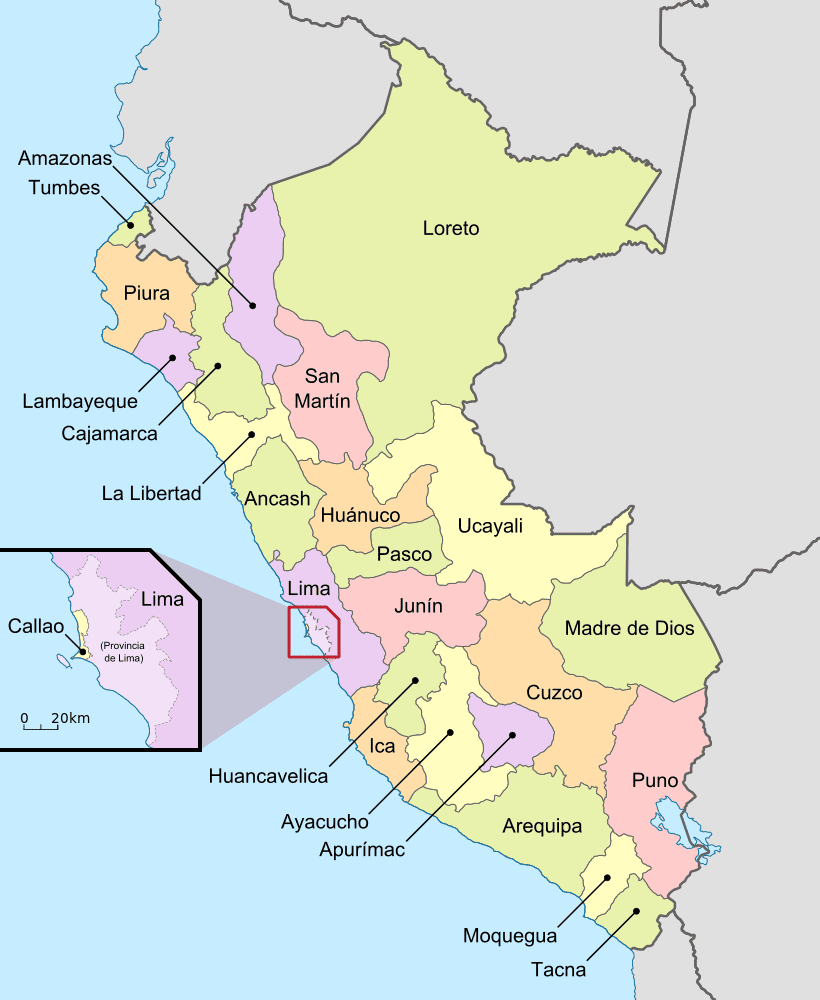
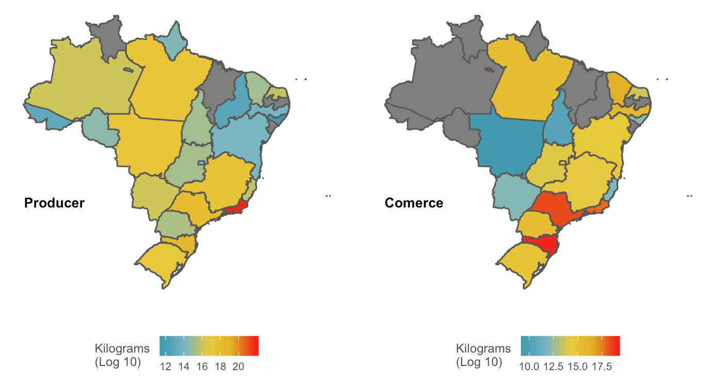
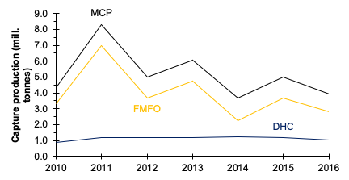
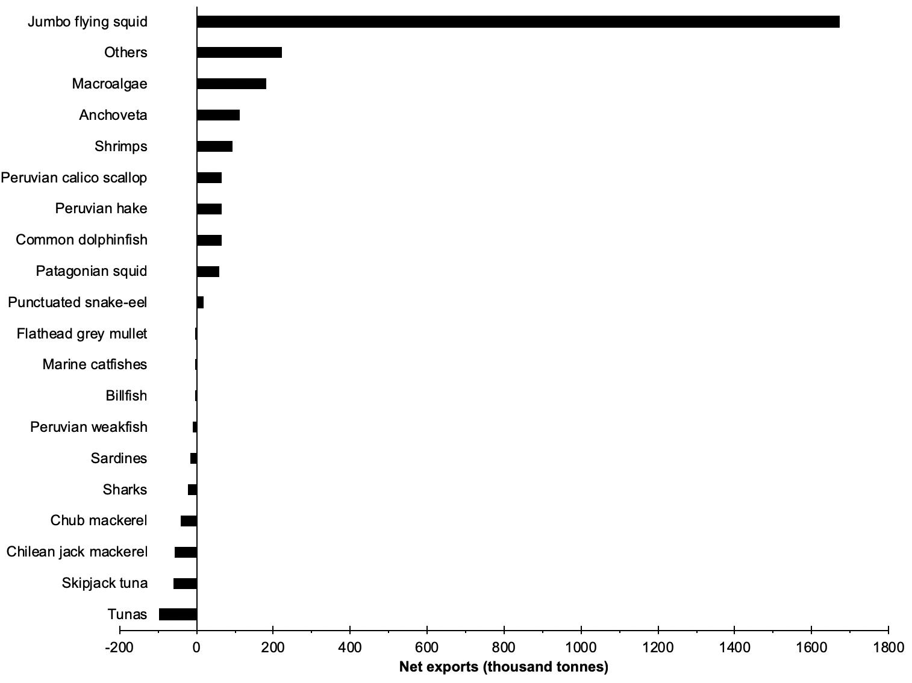

```{r setup, eval = T, echo=F, warning=F,message=F,results='hide'}

#### READ ME !!! ####
# Run this chunk before knit so you make sure you have all pkgs installed in R
# Please include any package used in your analysis

ipak <- function(pkg){
  new.pkg <- pkg[!(pkg %in% installed.packages()[, "Package"])]
  if (length(new.pkg)) 
    install.packages(new.pkg, dependencies = TRUE)
  sapply(pkg, require, character.only = TRUE)
}

#### Library ####
packages <- c(
  "readxl", # Read dataframe
  "dplyr", # Data manipulation
  "tidyr", # Data manipulation
  "ggplot2", #Nice grpahs and spatial analysis
  "cowplot",
  "ggpubr",
  # "plotly",
  "wesanderson",
  "stringr",
  "purrr", #for loading multiple datasets
  # "rgdal",
  # "RColorBrewer",
  "knitr",
  "kableExtra",
  "data.table",
  "ggrepel",
  "gridExtra",
  # "ggmap",
  # "rgeos",
  "sf",
  "rgdal", #Spatial analysis
  "tools" #Spatial analysis
)

suppressWarnings(
  suppressMessages(
    suppressPackageStartupMessages(
      ipak(packages)
    )
  )
)

# Remove scientific numbers
options("scipen"=100, "digits"=4) 

```


```{r Data_Fun, eval = T, echo = F, warning = F, message = F, results = 'hide'}

#### Functions ####

# Note that the main function is on a separate file (corefx.r)
source('Functions/corefx.R')

#### For all plots look alike ###

ggtheme_plot <- function() {
  theme(
    plot.title = element_text(size = rel(1), hjust = 0, face = "bold"),
    panel.background = element_blank(),
    strip.background = element_blank(),
    # strip.text       = element_text(size = base_size, face = "italic"),
    panel.border     = element_blank(),
    panel.grid.minor = element_blank(),
    panel.grid.major = element_blank(),
    axis.ticks = element_blank(),
    axis.text.x = element_text(size = 10,
                               angle = 0,
                               face = "plain"),
    axis.text.y = element_text(size = 12),
    axis.title = element_text(size = 14),
    legend.key = element_rect(colour = NA, fill = NA),
    legend.position  = "top",
    legend.title = element_text(size = 16),
    legend.text = element_text(size = 14),
    strip.text.x = element_text(size = 18, colour = "darkgrey")
  )
}

ggtheme_map <- function(base_size = 9, Region = "NA") {
  
  theme(text             = element_text(#family = "Helvetica",
    color = "gray30", size = base_size),
    plot.title       = element_text(size = rel(1.25), hjust = 0, face = "bold"),
    panel.background = element_blank(),
    panel.border     = element_blank(),
    panel.grid.minor = element_blank(),
    panel.grid.major = element_line(color = "transparent"),
    strip.background =element_rect(fill = "transparent"),
    axis.line        = element_blank(), # element_line(colour = "grey30", size = .5))
    axis.ticks       = element_blank(),
    axis.text        = element_blank(),
    axis.title       = element_blank(),
    # legend.key       = element_rect(colour = NA, fill = NA, size = 4),
    legend.position = "bottom"#,
    # legend.key.width =unit(6,"line")
  )
}


#### Datasets ####

# International Datasets #### 

# All datafiles should be in THIS path
Int_Data_Path <- "./clean_databases/International/"

#### SAU dataset used for international analysis chunks:
# 1, 2 & 3, 4

# # # File name
SAU_F_Name <- "SAU_Dataset.csv"
# #read dataset
SAU_Database <- fread(paste(Int_Data_Path,
                            SAU_F_Name,
                            sep = ""))

#### FAO datasets used for international analysis chunks:


Trade_F_Name <- "FAO_Trade_USD.csv"

FAO_USD <- read.csv(paste(Int_Data_Path,
                              Trade_F_Name,
                              sep = ""))
# head(FAO_USD)

FAO_F_Name <- "International_Data.csv"

International_D<- read.csv(paste(Int_Data_Path,
                              FAO_F_Name,
                              sep = ""))

# head(International_D)
```

# Project Goal and Objectives

- Determine the contribution of specific fisheries to domestic fish consumption and domestic livelihoods throughout Brazil, Chile, and Peru. 

- Critical analysis highlighting important capture fisheries for domestic food security, in the context of vulnerable populations and regions.

- Determine most important capture fisheries for food provision, and domestic seafood consumption patterns through time and space.

- Determine most important capture fisheries and fisheries sectors for regional employment and income.

- Determine most important capture fisheries and fisheries sectors for domestic catch and landed value.

<!-- - Deliverable - Final report including a critical analysis of domestic seafood consumption, related fisheries employment and income, and general fishery conditions of each nation included (Brazil, Chile and Peru). - National datasets and associated R-script, properly documented for replicating analyses and results. - Summary of key uncertainties, data gaps and priority areas for future research and policy. -->

\clearpage


# Executive Summary

\clearpage

# Resumen Ejecutivo

\clearpage

# Background

Latin American nations include some of the world’s most important producers of seafood from capture fisheries and aquaculture and, with a high (51%) proportion of net seafood production traded locally [@ref], domestic fisheries remain highly important for national food security across the region. The UN Food and Agriculture Organization (FAO) estimates that Latin American countries consumed around 6.2 million tons of fish in 2015, averaging a per capita food fish consumption of 9.8 kg/year [@FAO:2018vf]. The contribution of fisheries to food security and livelihoods is particularly pertinent given the adoption of the UN Sustainable Development Goals (SDGs) [@UnitedNations2018], where adequate management of marine fisheries can be directly linked to the achievement of goals related to decreasing hunger and poverty throughout the world [@Singh:2017ds]. There has been a further increase in attention to global capture fisheries due to the ongoing World Trade Organization (WTO) negotiations on fishery subsidies disciplines [@WTO:2018vv], as these are partially intended to avoid trade and operational distortions that may threaten local food security in maritime nations. 

In 2016, total fish landings in Chile and Peru, two of the world’s top fishing nations, averaged 8 million tons per year [@Fishstat]. In Peru, the seafood sector generates over US 1.7 billion per year, supporting over 200 thousand jobs. Moreover, Chile’s aquaculture production is among the largest of the world1 and fish meal and salmon exports generate over US$2.2 billion per year. Despite comparatively lower catches, Brazil’s fisheries sustain thousands of local families in coastal areas 5-6, and inland captures along riverine systems including the Amazon basin are among the largest in the world. Aside from seafood production volumes, fisheries in Latin America are extremely important as a source of employment and livelihoods along coastal regions, and further inland through value chains. Around 90% of all motorized fishing vessels in Latin America are part of the small-scale fisheries sector (SSF) and are under 12m length. Despite supporting 120 million people [@FAO:2015vu], this sector is among the most marginalized groups in the region 7, despite it being critical to achieving critical development goals [@UnitedNations2018], as highlighted by the recent FAO small scale fisheries guidelines that explicitly link the sector with food security, poverty eradication, and social [@FishStatJsoftware:2016uf; @FAO:2015vu]. 

Given the increasing pressures on vulnerable populations, including climate change but also rapid national and international policy and market shifts, it is imperative to highlight the critical importance of particular capture fisheries for meeting domestic seafood supply. This knowledge can help guide future policies to ensure economic development does not jeopardize health and livelihoods, either in fishing communities or at the national scale. 

# Methods

The objective of this project is to determine the most important species for domestic seafood consumption (regionally, as possible) produced by wild capture fisheries in Brazil, Chile, and Peru, and their relationship with local employment. Given that seafood is a widely traded commodity and that aquaculture has steadily increased market supply, meeting this objective involved using species-specific data on domestic catches, aquaculture, and seafood imports and exports to highlight the most important species and fisheries that contribute to local and national food security and livelihoods. 

## Analytical framework

Given the nature of fisheries data and governance systems, each of the nations considered presented unique analytical challenges (see ‘Data sources’), but a consistent methodological framework (**Fig. 1**) was used to maintain consistency in methods and comparability of results across nations. 

Based on the best available data in each country, total seafood supply was estimated as the sum of per-species production of domestic catch and aquaculture (minus exports), plus the sum of species net imports. Catch statistics were separated by sectors whenever possible, including artisanal, industrial, and subsistence catches. In the case of domestic catch, inputs to aquaculture are subtracted from production (similar to exports); this is particularly relevant for large industrialized fisheries for small pelagics that are almost entirely reduced into fish feeds. The distribution of consumption (demand) of this seafood supply was based on regional (as available) estimates of seafood consumption per capita and regional populations. An important additional aspect for the critical analysis portion of the project was the linking of fisheries landings with available regional socioeconomic and governance indicators, providing a basis for discussing relative vulnerabilities to potential changes in seafood supply.


The framework proposed in Figure 1 is similar to that proposed by FAO [@FAO:2017vf], which has also been slightly modified and applied to specific national fisheries [@Sumaila:2007gf]. We further incorporate species-specific accounting in our approach, which is challenging due to the differences in aggregation in data reporting, for example when landings are reported by species (e.g., “Whiteleg shrimp”) and trade statistics by product name (e.g., “Shrimp frozen,” “Shrimp fresh”). However, this modification is critical for identifying specific species or species groups that are important for national food security.  

The following sections provide detailed methods for estimating i) net seafood supply and ii) revenues for key species in each country. This focuses on production from capture fisheries, but also includes aquaculture and trade supply. This analysis was applied across all countries using different datasets. Results will vary within countries according to the dataset (source) used.

## Estimating National Seafood Supply

We followed the framework described above (Figure 1) to estimate total seafood supply. The model included fish production  from for wild (marine) domestic catch, farmed fish, and trade. (Unless otherwise noted, ‘fish’ is used here to refer to all marine organisms.) In addition, estimations accounted for discards at sea and biomass losses due to processing (Table 1).

```{r NSS_Variables, eval = T, echo = F}

data.table(
  Symbol = c(
    "C",
    "A",
    "I",
    "E",
    "D",
    "O",
    "P",
    "L",
    "TDFS",
    "NDFS",
    "TFS",
    "NSS"
  ),
  Description = c(
    "Fish catch, i.e., wild capture production.",
    "Aquaculture production.",
    "Fish imports.",
    "Fish exports.",
    "Rate of losses () from discards (D) at sea.",
    "Rate of losses from other uses (O), i.e., not for human consumption.",
    "Rate of losses from processing (P), i.e., during canning, filleting, etc.",
    "Landings from wild capture production (catch minus discards).",
    "Total domestic fish supply. Total amount of fish produced in the country.",
    "Net domestic fish supply. Total amount of fish produced in the country, minus exports and discards.",
    "Total fish supply. Total amount of fish in the country (NDFS plus imports).",
    "Net seafood supply. Effective amount of fish for human consumption in the country (TFS for human consumption, minus processing waste)."
  )
) %>% 
  # kable("latex", booktabs = T) %>% 
  # kable_styling(full_width = F) %>% 
  #  column_spec(2, width = "15cm") %>% #wraps text in column2
  kable()

```

The model first estimated the total domestic catch of fish supply per species (*i*) from wild captures and aquaculture as follows:

$${TDFS_i} = {C_i} + {A_i}$$

Note that, to avoid double-counting fish production, domestic catch that is fed to farmed fish was subtracted from overall production. This was done as possible given available country information and context (i.e., this may be more of an issue for some countries than others). Then, not domestic fish supply was estimated from fish landed (catch minus discards), aquaculture and exports as follows:

$${NDFS_i} = {L_i} + {A_i} - {E_i} $$


$${L_i} = {C_i} - ({C_i} * {\lambda_{d,i}} )$$


where the second term in Equation 3 allows for a calculation of total discards in each country. In Equations 4 and 5, we assume that all imported seafood (we do not include imports not for human consumption, e.g., fish meal) is ready to be consumed and thus do not include losses from processing. We also assume that all aquaculture production is for human consumption and that none of this production is discarded, though processing losses do occur as in production from capture fisheries (e.g., farmed and wild caught shrimps would receive similar processing).

$${TFS_i} = NDFS_i + I_i$$

Therefore, national seafood supply will be estimated for each country and species as follows:

$$NSS_i = [(L_i - L_i * {\lambda_{o,i}} + A_i] * {\lambda_{p,i}}- E_i + I_i$$


## Estimating National Economic Participation

Estimations of economic participation of fish in each country were computed based on fisheries landings, trade, aquaculture, and market value. Note that landings may have different ex-vessel prices depending on the buyer and the intended use (e.g., for direct human consumption, reduction into fish meal or fish oil, etc.).


```{r NEE_Variables, eval = T, echo = F}

data.table(
  Symbol = c(
    "beta",
    "alpha",
    "I",
    "RI",
    "E",
    "FR",
    "NT"
  ),
  Description = c(
    "Ex-vessel price for catch landed for direct human consumption",
    "Ex-vessel price for catch landed for indirect human consumption",
    "Imports. Economic value of imported fish",
    "Re-Imports. Economic value of fish products re imported in the country",
    "Exports. Economic value of exported fish",
    "Fishing Revenue. The total revenue for that species provided by the fishing activity",
    "Net trade. Economic value of fish traded considering both exports and imports"
  )
) %>% 
  kable("latex", booktabs = T) #%>%
  # kable_styling(full_width = F) %>%
   # column_spec(2, width = "15cm") %>%  #wraps text in column2
  # kable()

```


Fishing revenue integrates the different ex-vessel price that landings have, depending on the final destination: direct human consumption (DHC) and indirect human consumption (IHC). Therefore, total revenue (R) is estimated in the SAU database as follows:

$$FR = \sum_{i = 1}^n (L_{i}*\beta_{i})*\beta P_{i} + (L_{i}*\alpha _{i}) *\alpha P_{i}$$

An important part of the economic participation of fishing is the activities after landings. For that, we used the information included in Dyck *et al* (2010) to estimate the contribution of landings to the country GDP [@Dyck:2010ez].

In addition to the landings data, we used the FAO [@FAO:2018vf] database to determine the value (US dollars) of fish and crustaceans, mollusks and other aquatic invertebrates imported and exported by Brazil, Chile and Peru. We estimate the net trade (NT) as follows:

$$NT = (E-I)-RI$$


## Data descriptions

This section outlines the sources, types, and limitations of available input data for the models described above. Data searches and analysis were undertaken at two levels. The first collated and used intergovernmental and global (e.g., FAO, SAU) datasets that were comparable across countries but involved various uncertainties. The second involved in-country data searches and validation and, though data quality varied across countries, results represent estimates using the best available information for each country. 


### Intergovernmental Analysis

```{r EEZ_Map, eval =F, echo = F, fig.cap = "Map of South America showing the EEZs of the three countries included in the present analysis."}

#### EEZ limits ###

path_eez_world <- ("international/information/raw_databases/Spatial/World_EEZ_v9_20161021/")
#The File
fnam_eez_world <- "eez.shp"
#Load it!

#### Extract
eez_world <- readOGR(dsn = path_eez_world,
                     layer =file_path_sans_ext(fnam_eez_world))

Countries <- c("Brazil","Chile","Peru")

South_America <- eez_world[eez_world$Territory1 %in% Countries,]

South_America_f <- fortify(South_America) %>% 
  filter(id != 14)

South_America_f$id<- gsub("10","Chile",South_America_f$id)
South_America_f$id<- gsub("243","Peru",South_America_f$id)
South_America_f$id<- gsub(255,"Brazil",South_America_f$id)

South_America_f <- South_America_f %>% 
  rename(Country = id)

path.ne.coast <- "international/information/raw_databases/Spatial/TM_WORLD_BORDERS-0.3"
file_name <- "TM_WORLD_BORDERS-0.3.shp"

# Loading the shapefile:
World_Land <- readOGR(dsn = path.ne.coast, 
                      layer = file_path_sans_ext(file_name),
                      verbose = FALSE
                      )

# Central_A@data$NAME

South_Border <- c("Brazil",
                  "Peru",
                  "Chile",
                  "Argentina",
                  "Colombia",
                  "Venezuela",
                  "Guyana",
                  "Suriname",
                  "French Guiana",
                  "Ecuador",
                  "Uruguay",
                  "Bolivia",
                  "Paraguay")


South_America_Land <- subset(World_Land, NAME %in% South_Border)

ggplot() +
  geom_polygon(data = South_America_Land,
               aes(
                 x = long,
                 y = lat,
                 group = group
               ),
               fill = "lightgray",
               colour = "white"
               ) +
  geom_polygon(data = South_America_f,
       aes(
         x = long,
         y = lat,
         group = group,
         fill = Country
       )
       ) +
  scale_fill_manual(values = wes_palette("Darjeeling1", 5, type = "discrete")) +
  coord_fixed(xlim = c(-88, -24),  
              ylim = c(-60, 5), ratio = 1.2) +
  # facet_wrap(~Type,
  #            scales = "free") +
  ggtheme_map() + 
  annotate("text",
           label= "Brazil",
           x = -26,
           y = -9,
           size = 5,
           colour = "#000000"
  ) +
  annotate("text",
           label= "Chile",
           x = -85,
           y = -26.5,
           size = 5,
           colour = "#00A08A"
  ) +
  annotate("text",
           label= "Peru",
           x = -86,
           y = -12,
           size = 5,
           colour = "#F2AD00"
  ) +
  theme(
    legend.position = ""
  )

```

The first approach using intergovernmental data is a somewhat broad analysis when one considers the uncertainties associated with global fisheries data [@refPauly;@Garibaldi], — that are nevertheless the best available official information — but it provides general and easily comparable trends across nations. This also provides a good starting point for highlighting key areas and species of interest that could then be addressed during in-country searches. The intergovernmental analysis used three main datasets:

1. *FAO* - The United Nations Fish and Agriculture Organization through the FishStatJ platform [^1], provides landings by country, year, and species (or species groups); imports, exports, and re-exports (i.e., exports of imported fish after processing) by country, year, and product name; and aquaculture production by species. All datasets report in tonnes, and trade information includes both weight and USD values. Landings data are available from 1950 to 2016, and other data from the early 1970s; all data are provided to FAO by member nations. 

[^1]: UN-FAO FishStatJ, available at http://www.fao.org/fishery/statistics/software/fishstatj/en.

2. *SAU* - The Sea Around Us project maintains a global dataset of “reconstructed” fisheries catches for every country from 1950 to 2014[^2]. The dataset for each country was estimated using the FAO data as a baseline, on top of which estimated unreported catches and discards are added based on available literature and expert consultation [@Zeller]. Catches are furthermore divided by sector (industrial, artisanal, recreational, subsistence) and, as possible, split into specific species when FAO reports species groups. Data furthermore include yearly ex-vessel prices by species [@refTai].

[^2]:The Sea Around Us, available at www.seaaroundus.org

3. A recent study estimated the proportion of fish landings used for human direct consumption and fish meal and fish oil, by species and country [@Cashion:2018]. These estimates were based on the SAU database and available country-specific information. 

Data extracted from SAU for Chile included the islands Juan Fernandez Islands, Easter Island, and Desventuradas Islands. For Brazil, landings data included Fernando de Noronha Island, St Paul and St. Peter Archipelagos, and Trindade & Martim Vaz Islands (Fig. 2).

For this level of analysis we used the FAO database to estimate the total landings (tonnes) of Chile, Brazil, and Peru in 2014, the last year with data available for all databases. For calculating species landings, all fishing sectors were aggregated (Industrial, Subsistence,  Artisanal, Recreational). We did not include catches by foreign fleets fishing in within Chile, Peru and Brazil which were not landed in these countries. Landings were grouped by taxa excluding those not identified (e.g. “Marine fishes not identified”).

### Country-specific data, Brazil 

```{r Brazil_Regions, eval=T, echo=F}

path_bra <- ("international/information/raw_databases/Spatial/bra_adm1/")
#The File
fnam_bra <- "BRA_adm1"
#Load it!

#### Extract

system.time(Bra_Shape <- st_read(dsn = path_bra, layer=fnam_bra)) 

ggplot(Bra_Shape) +
  aes(
    
  )

```


There is no basic fisheries statistics in the country since 2008. The lack of national fisheries statistics posed a great challenge to this study. Several researchers and fisheries managers consulted during the study pointed out the lack of data to provide basic information on Brazilian fisheries. Information such as how much the country produces, how much it consumes or even the number of fishers in the country is very sparse. In an interview with the most renowned fisheries scientist in the country, Dr. Fabio Hazin, he pointed out that there are between 400 thousand and one million fishers in the country. Additionally, he pointed out that data from FAO on Brazilian fisheries is mostly a copy of the production from the previous years. And this has been going on since 2008, when the last year of national fisheries statistics was recorded, and even then it wasn't very reliable. Therefore, we had to be creative to conduct this study. We contacted people from all fisheries sectors to find out what was available. After an extensive search, we gathered six different databases representing the different fisheries sectors and conducted an extensive literature research. We also identified other potential sources of information that we were not able to obtain in time for this study. 


After this effort, we gathered the following databases representing different fisheries sectors and complemented this information with an extensive literature review. We also identified other sources of information that could potentially be available but we were not able to obtain in time to include in this study.


1. *SIGSIF* - Data obtained from the sanitary inspection services of the Brazilian Ministry of Agriculture. This database contains all seafood processed by fishing industries that carry a federal inspection certificate. This certificate is required for industries to commercialize their product throughout Brazil and to export and import seafood products. It is a rigorous inspection program, where one of the requirements is to report all seafood that enters each company. Thus, this database includes all seafood products by species imported or from domestic production that enters all seafood processing companies with this federal inspection certificate (total of 472 companies). It includes both aquaculture and wild caught products from both freshwater and the oceanic species, and we were able to access information for 2016-2017.

2. *CEAGESP* - is the largest wholesale open seafood market in Latin America, located in the city of São Paulo. It is run by a state-owned company where sellers and buyers from all over the country gather to trade seafood and seafood products. We obtained information on all the seafood products traded in the market by species and price, for 2016-2017.

3.  *MDIC* - Import and Export data from the Ministry of Development, Industry and Foreign Trade. This database contains all seafood imported and exported in Brazil, available to us for 2014-2017.

4. *State fisheries landings* - Fisheries landings data from three states of Brazil (out of 27) where there is continuous data collection and data are publicly available. These three states (São Paulo, Parana and Santa Catarina) are located in Southern Brazil and have a continuous data collection program sponsored by Petrobras in partnership with various universities. Petrobras is required to collect landings information for insurance purposes and has made some of its data publicly available for research projects (2016-2017).

5. *IBGE* - Brazilian Institute of Geography and Statistics. This federal institute is responsible for surveying the country to provide basic information on social indicators. We gathered two pieces of information to inform our analysis: household food consumption and income by region of Brazil (last survey dates from 2009 and 2010). 

6. *Fishing Permits* - Number of registered fishers in the country from the extinct Ministry of Fisheries and Aquaculture (MPA), 2003 - 2010.


### Country-specific data, Chile

** MAP OF CHILE REGION **

1. *SERNAPESCA* - The Chilean National Service of Fisheries is in charge of keeping track of landings and other fisheries and aquaculture related data in Chile. In their website there is public access to databases reporting landings per sector (artisanal, industrial and factory vessels) and aquaculture harvest. We also received from them datasets with information on prices of first transaction in artisanal fisheries and number of fishers and fisher vessels officially registered as proxi to estimate employment in this sector. SERNAPESCA data is reportes at a specie level and for each geopolitical region of the country.

2. *RPA* - The RPA holds information regarding the gender, date of birth, location and type of activities performed by each fisher (e.i. diver, fisher, boat owner, shore gatherer).

3. *Aduanas Chile (Chilean Costumes)*. This source details products (amount and prices) imported and exported for each region of the country. We expect to be able to estimates of the domestic consumption of local species by understanding how much of what is landed is being exported. 


### Country-specific data, Peru 



Data from the following governmental institutions was used to characterize Peruvian capture and aquaculture production, internal and international trade of seafood products, apparent seafood consumption and the contribution of seafood to the national economy:

1. *PRODUCE* - The Peruvian Ministry of Production (Ministerio de la Producción del Perú), reports fisheries landings by species and line of production (e.g., canning, curing, freezing, etc.) on annual statistical reports available on their webpage[^3]. They also report aquaculture production, yields by line of production, internal trade, and apparent seafood consumption [@PRODUCE 2012; 2013; 2015a; 2015b: 2016; 2017].

[^3]: Peruvian Ministry of Production (Ministerio de la Producción del Perú; PRODUCE), Available at <http://www.produce.gob.pe>

2. *IMARPE* - The Peruvian Marine Research Institute (Instituto del Mar del Perú; IMARPE), reports off-vessel prices on a daily basis by species and landing site. This database was provided by Juan Carlos Riveros (Oceana Peru), and can be found at IMARPE's website [^4]. Moreover, they have published the results of several national surveys of small-scale fishermen by fishing gear [@Guevara-CarrascoBertrand2017]. These include information on the number of fishers by gear.

[^4]: Peruvian Marine Research Institute (Instituto del Mar del Perú; IMARPE) Available at <http://www.infomar.imarpe.gob.pe>

3. *SUNAT* - The Peruvian Customs Agency (Superintendencia Nacional de Aduanas y de Administración Tributaria), reports seafood imports and exports by ‘custom code’, which group together products by type and sometimes species.

4. *INEI* - The Peruvian Institute of Statistics and Informatics (Instituto Nacional de Estadística e Informática). They provided, upon request, the results of the annual household survey (ENAHO – Encuesta Nacional de Hogares). The results of these surveys include information regarding per capita seafood consumption by species, product type and region.

# Results

The results section is divided in two main subsections representing Intergovernmental datasets (*Intergovernmental results*) and national datasets (*Brazil, Chile, Peru*). The results for each subsection follow the same structure and include a general overview, estimates of seafood supply and consumption, and contributions to employment and income. Unless otherwise noted, results presented as average yearly values (tonnes or monetary) include the last five years of available data.

## Regional Overview

<!-- ### Fisheries Context -->

```{r Load_Spatial_Data, eval=T, echo=F, warning=F, message=F, results='hide'}

path.ne.coast <- "~/Documents/Github/Oceana_LA/international/information/raw_databases/Spatial/TM_WORLD_BORDERS-0.3"
file_name <- "TM_WORLD_BORDERS"

# Loading the shapefile:
World_Land <- st_read(dsn = path.ne.coast, 
                      layer = file_path_sans_ext(file_name)
                      )

# Now we load SAU shapefile with fishing data

path_SAU_shp <- ("~/Documents/Github/Oceana_LA/international/information/raw_databases/Spatial/SAU_Shapefile_Clean/")
#The File
fnam_SAU_shp <- "SAU_Shapefile"
#Load it!

SAU_shp <- st_read(
  dsn = path_SAU_shp,
  layer =file_path_sans_ext(fnam_SAU_shp)
  )
```

```{r SAU_Fishing_Effort_Map, eval=T, echo=F, warning=F, message=F}

#### Countries shape ####

South_Border <- c("Brazil",
                  "Peru",
                  "Chile",
                  "Argentina",
                  "Colombia",
                  "Venezuela",
                  "Ecuador",
                  "Uruguay",
                  "Bolivia",
                  "Paraguay",
                  "Guyana",
                  "Suriname",
                  "French Guiana"
                  )

South_America_Land <- World_Land %>% 
  filter(NAME %in% South_Border)


# And now we plot theactual map

# Some Zissouy collors :)
pal <- wes_palette("Zissou1", 100, type = "continuous")

ggplot(South_America_Land) +
  geom_sf() +
  geom_tile(data = SAU_shp,
               aes(
                 x=Long,
                 y=Lat,
                 fill = Log,
                 colour = Log
               )
               ) +
  scale_fill_gradientn("Wild Captures\n (Log x 10)",
                       colours = pal
                       ) +
  scale_colour_gradientn("Wild Captures\n (Log x 10)",
                         colours = pal) +
  coord_sf(
    xlim = c(-85, -26),
    ylim = c(-58, 10)
  ) +
  ggtheme_map() +
  theme(
    legend.key = element_rect(size = 2),
    legend.key.width =unit(3,"line")
  ) +
  annotate("text",
           label= "Brazil",
           x = -28,
           y = -1,
           size = 4,
           colour = "#000000"
  ) +
  annotate("text",
           label= "Chile",
           x = -83,
           y = -26.5,
           size = 4,
           colour = "#000000"
  ) +
  annotate("text",
           label= "Peru",
           x = -83.5,
           y = -16,
           size = 4,
           colour = "#000000"
  ) +
  theme(
    legend.position = "bottom"
  )

```

Results from the initial analysis of intergovernmental data show a clear dominance in fisheries landings of both Chile and Peru over Brazil, even thou Brazil captures around 3 times more species than the former. In terms of total fishing revenue, all nations are similar (**Table XX**).

```{r Total_Table, eval = T, echo = F}

Totals <- SAU_Database %>%
  group_by(Reporter,Variable,scientific_name) %>%
  summarise_if(is.numeric,mean,na.rm =T) %>% 
  group_by(Reporter,Variable) %>% 
  summarise(
    "Totals" = round(sum(Value,na.rm=T)),
    "Exploited Species" = n()
  ) %>%
  tidyr::spread(Variable,Totals)

International_D %>%
  gather("Variable","Value",Aquaculture:Production) %>%
  group_by(Country,Species,Variable) %>%
  summarise_if(is.numeric,mean,na.rm =T) %>% 
  group_by(Country,Variable) %>% 
  summarise(
    "Totals" = round(sum(Value,na.rm=T)/1000,0), #Thousands
    "Exploited Species" = n()
  ) %>%
  filter(Variable %in% c("Aquaculture","Capture","Exports","Imports")) %>% 
  tidyr::spread(Variable,Totals) %>% 
  kable(
    caption = "Summary of results. Database used: SOFIA-FAO. Thousand tones",
    format.args = list(big.mark = ",")
  ) 

```

When we analyze the top ten species in terms of landing volume in tones using the SAU database we found different trends between and within countries (**Fig. XX**). Brazil's most exploited specie (in terms of landings) was the ray-finned fish *Sardinella brasiliensis*. For both Chile and Peru, the most landed species was *Engraulis ringens*. 

<!-- \clearpage -->

```{r SAU_Landings_Data, eval = T, echo = F, warning =F, message = F, fig.height = 10, fig.width= 12, fig.cap= "Top 10 species by landings from the SAU dataset between 2010-2014. Brown bars represent species not present in the other category. White boxes represent the contribution of that speciest to the total country landing"}

Totals_Plot <- Totals %>%
  select(-2) %>%
  tidyr::gather("Variable","Totals",2:3)

# Including the proportion of the catch/value of each species
SAU_Prop <- SAU_Database %>%
  filter(year >= 2010) %>% # last 5 years of data
  left_join(Totals_Plot,
            by = c("Reporter", "Variable")) %>%
  group_by(scientific_name, Reporter, Variable) %>% 
  summarise(
    Value = mean(Value,na.rm=T),
    Totals = mean(Totals,na.rm=T)) %>% 
  mutate(
    Proportion = round((Value/Totals)*100,2)
  ) %>%
  group_by(Reporter,Variable) %>%
  top_n(n = 10, wt = Proportion) %>%
  group_by(Reporter,scientific_name) %>%
  mutate(Repeated = n()) %>%
  mutate(Repeated = ifelse(Repeated == 1, "No", "Yes"))

# Including the accumulative proportion of plotted species

Prop_Total <- SAU_Prop %>%
  group_by(Reporter,Variable) %>%
  summarise(
    Tot_Prop = sum(Proportion),
    Location = max(Value)
  )

### Plot of total catch

SAU_Prop_C <- SAU_Prop %>% 
  filter(Variable == "Total_tonnes") %>% #Rounds everything without decimals
  mutate_if(is.numeric,round,0)

Prop_Total_C <- Prop_Total %>%
  filter(Variable == "Total_tonnes") %>% 
  mutate_if(is.numeric,round,0)

ggplot() +
  geom_bar(data = SAU_Prop_C, # Catch and value data
           aes(
             x= reorder(scientific_name,-Proportion),
             y = Value/1000, #thousands
             fill = Repeated
           ),
           stat = "identity"
  ) +
  geom_label(data = SAU_Prop_C, # Species proportion data (Barx boxes)
             aes(
               x = reorder(scientific_name,-Proportion),
               y = Value/1000,
               label = paste(as.character(Proportion),"%",sep = " ")
             )
  ) +
  geom_label(data = Prop_Total_C, # Total proportion data
             aes(
               x = 9,
               y = Location/1100,
               label = paste("Proportion of total",Variable, "\n of selected species\n",as.character(Tot_Prop),"%",sep = " ")
             )
  ) +
  theme(axis.text.x = element_text(angle = 45,
                                   hjust = 1,
                                   face = "italic")
  ) +
  scale_fill_manual(values =c("#D69C4E",
                              "#046C9A"),
                    name ="Repeated") +
  facet_wrap(~Reporter,
             scales = "free",
             ncol = 1) +
  labs(
    # title="Top 25 species by landings (left) and value (right)\n from the SAU dataset",
    x ="Species",
    y = "Tons"
  ) +
  ggtheme_plot() +
  coord_flip() +
  theme(axis.text.y = element_text(face = "italic")
        )


```

<!-- \clearpage -->


Subsistance fisheries are an important aspect for Brazil, Chile and Peru. Results from the SAU database suggest that species such as ...

```{r SAU_Subsistance_Landings, eval = T, echo = F, warning =F, message = F, fig.height = 10, fig.width= 12, fig.cap= "Top 10 subsistance species by landings from the SAU dataset."}

# For now this path but fix it in the future ###

SAU_Dat_S <- read.csv("/Users/jpalacios/Documents/Github/Oceana_LA/international/information/raw_databases/SAU/SAU EEZ 76,969,77,970,604,152,153,154,155 v47-0.csv")

Countries <- c("Brazil","Chile","Peru")

SAU_Subsistance <- SAU_Dat_S %>%
  filter(scientific_name != "Marine\nfishes\nnot\nidentified") %>%  #Removed but top in B and P
  filter(fishing_entity %in% Countries) %>% # Remove other fishing nations
  group_by(year,
           scientific_name, # Trade data is too generic for species details
           fishing_entity,
           fishing_sector # #Trade data is too generic for sector details
  ) %>%
  summarise(
    Total_tonnes = sum(tonnes),
    Landings_Value = sum(landed_value)
  ) %>%
  filter(year == 2014,
         fishing_sector == "Subsistence") %>%  # Choose year to be analyzed
  group_by(fishing_entity) %>%
  top_n(n = 10, wt = Total_tonnes) 
    
# SAU_Subsistance$scientific_name <- gsub(" ", "\n",SAU_Subsistance$scientific_name)
    
  # Plot 
  
  ggplot(SAU_Subsistance,
       aes(
         x= reorder(scientific_name,-Total_tonnes),
         y = Total_tonnes#, #thousands
       )
       ) +
  geom_bar(stat = "identity", fill = "#046C9A") +
  facet_wrap(~fishing_entity,
             scales = "free",
             ncol = 1) +
  labs(
    # title="Top 25 species by landings (left) and value (right)\n from the SAU dataset",
       x ="Species",
       y = "Tonns"
  ) +
    ggtheme_plot() +
    coord_flip() +
    theme(axis.text.y = element_text(face = "italic",
                                   size = 10)
        )

```


<!-- In addition to the internal fish production, Brazil, Chile and Peru all import and export fish (**Fig. XXX**). According to FAO-SOFIA data, imports and exports balances....  -->

```{r Trade_Food, eval = F, echo = F, warning=F, fig.align='center', fig.height = 4, fig.width= 6, fig.cap= "Revenue from fisheries production, imports and exports for each nation from the UN database."}

names(International_D)

International_D %>% 
  group_by(
    Country,
    Species
  ) %>% 
  summarize_at(vars(Exports:Imports), mean, na.rm= T)%>% 
  mutate(Net_Trade = Imports-Exports) %>% 
  group_by(Country) %>% 
  top_n(n = 5, wt = Net_Trade) %>% 
  kable(
    caption = "Summary of results. Database used: SOFIA-FAO. Thousand tones",
    format.args = list(big.mark = ","),
    digits = 1
  ) 

```

### Estimating National Seafood Supply

**Talk about FAO consumptions rates per country. I believe the WHO also has a simliar study. Also describe the table...**

```{r R_Seafood_Consmption, eval = T, echo = F}


International_D <- International_D %>% 
  group_by(Species,
           Country) %>% #Average of all years
  summarise_at(vars(Aquaculture:Discards),
               mean, na.rm=T)

Data <-corefx(
  Country=International_D$Country,
  Species = International_D$Species,
  Catch = International_D$Capture,
  Dis = 0.20,
  DHC = International_D$DHC_Use,
  PL = 0.20,
  AP = International_D$Aquaculture,
  A_PL = 0.20,
  I_DHC = International_D$Imports,
  Exp = International_D$Exports,
  Result = "T",
  n = 5
)


Data %>% 
  group_by(Country) %>% 
  top_n(n = 5, wt = `National Seafood Supply`) %>%
  mutate_if(is.numeric,round) %>% 
  arrange(Country,desc(`National Seafood Supply`)) %>% 
  select(-Warning) #%>% 
  # kable("latex", booktabs = T,
  #       caption = "Top 5 species (or species groups) contributing to the National Seafood Supply of Brazil, Chile and Peru. Data from FAO and SAU",
  #       format.args = list(big.mark = ","),
  #       digits = 1) %>%
  # kable_styling(full_width = F) %>%
  # column_spec(2, width = "13em") %>% #wraps text in column2
  # column_spec(3:6, width = "6em") %>% 

```


### Estimating National Economic Participation

In terms of landing values Brazil's most prolific fishery in 2014 was *Umbrina canosai*, a croaker fished in the southern part of the country. For Chile, the most valuable fishery was *Engraulis ringens*, Peruvian anchoveta. Finally, Peru most valuable fishery in 2014 was the Peruvian scallop *Argopecten purpuratus*.


```{r SAU_Landings_Value, eval = T, echo = F, warning =F, message = F, fig.height = 10, fig.width= 12, fig.cap= "Top 10 species by economic value from the SAU dataset. Red bars represent species not included as top 10 most landed species. White boxes represent the contribution of that speciest to the total country value"}

### Plot of Landing value

SAU_Prop_V <- SAU_Prop %>% 
  filter(Variable == "Landings_Value") %>% #Rounds everything without decimals
  mutate_if(is.numeric,round,0)

Prop_Total_V <- Prop_Total %>%
  filter(Variable == "Landings_Value") %>% 
  mutate_if(is.numeric,round,0)

ggplot() +
  geom_bar(data = SAU_Prop_V, # Catch and value data
           aes(
             x= reorder(scientific_name,-Proportion),
             y = Value/1000, #thousands
             fill = Repeated
           ),
           stat = "identity"
  ) +
  geom_label(data = SAU_Prop_V, # Species proportion data (Barx boxes)
             aes(
               x = reorder(scientific_name,-Proportion),
               y = Value/1000,
               label = paste(as.character(Proportion),"%",sep = " ")
             )
  ) +
  geom_label(data = Prop_Total_V, # Total proportion data
             aes(
               x = 9,
               y = Location/1100,
               label = paste("Proportion of total",Variable, "\n of selected species\n",as.character(Tot_Prop),"%",sep = " ")
             )
  ) +
  theme(axis.text.x = element_text(angle = 45,
                                   hjust = 1,
                                   face = "italic")
  )+
  scale_fill_manual(values =c("#D69C4E",
                              "#046C9A"),
                    name ="Repeated") +
  facet_wrap(~Reporter,
             scales = "free",
             ncol = 1) +
  labs(
    # title="Top 25 species by landings (left) and value (right)\n from the SAU dataset",
    x ="Species",
    y = "Values \n (Thousand of USD)"
  ) +
  ggtheme_plot() +
  coord_flip() +
  theme(axis.text.y = element_text(face = "italic",
                                   size = 10)
        )

```


Trade is an importat component of fisheries. From the countries analyzed Brazil was the only country to have a net import of fish. Brazil spends more money importing fish than what it makes from producing it and exporting that production. In the other hand, both Chile and Peru have positive surplus from their fisheries and commerce activities being Chile the most "*profitable*" country.

```{r Exports_Per_Country, eval = T, echo = F, warning =F, message = F}

names(FAO_USD)
unique(FAO_USD$Year)

## Totals 

Total_Trade <- FAO_USD %>%
  filter(Year != c("X2010,X2011")) %>% 
  group_by(
    Country,
    Year
  ) %>% 
    summarize_at(vars(Exports:Imports), sum, na.rm= T) %>% 
    group_by(Country) %>% 
    summarize_at(vars(Exports:Imports), mean, na.rm= T) %>% 
    mutate(Net_Trade = Exports-Imports) %>% 
    mutate(Category = "All products")

FAO_USD %>% 
  filter(Year != c("X2010,X2011")) %>% 
  group_by(
    Country,
    MatchName
  ) %>% 
  summarize_at(vars(Exports:Imports), mean, na.rm= T) %>% 
  mutate(Net_Trade = Exports-Imports) %>% 
  group_by(Country) %>% 
  top_n(n = 5, wt = Net_Trade) %>% 
  rename(Category = MatchName) %>% 
  bind_rows(Total_Trade) %>% 
  arrange(Country,desc(Net_Trade)) 
  mutate_if(is.numeric,funs = funs(. * 1000))
  mutate_each(funs(.*deflator), starts_with("inc"))
  kable(
    caption = "Summary of results. Database used: SOFIA-FAO. Thousand USD",
    format.args = list(big.mark = ","),
    digits = 1
  ) 


```


## Results Brazil

```{r Brazil_Data, eval =T, echo = F}

#### Brazil Datasets ####

# All datafiles should be in THIS path
B_Data_Path <- "./clean_databases/Brazil/"

# File names

B_Files <- c(
  "MDIC.csv", # Imports and exports
  "producao_seagesp.csv", #CEAVESP
  "SIGSIF.csv",
  "IBGE_consumption.csv",
  "IBGE_renda.csv",
  "rgp_MPA.csv", # Number of registered fishers
  "Santa_Catarina.csv", #State of Santa Catarina
  "parana.csv" #State of Parana
) 

#Load data

Brasil_Data <- B_Files %>% # read in all the files, appending the path before the filename
  map(~ fread(file.path(B_Data_Path, .))
      ) # Loads all data into a list


```

### Fisheries Context

As previously mentioned, there are no national-level fisheries statistics data in Brazil since 2008. Therefore, the country-wide assessment was only possible using the SAU and FAO datasets. While these datasets provide information regarding landings by species, it is worth mentioning that they are far from realistic. In our meeting with Dr. Fabio Hazin, he pointed out that data from FAO on Brazilian fisheries is mostly extrapolated as-is from production in previous years, were reliability was already questionable. 

According to both the FAO and SAU data, Brazil's fisheries capture has been declining since 2012 as opposite to the increasing aquaculture production. The SAU database accounts for unreported and unregulated catches in Brazil [@REF] so it estimates around 50 thousand tonnes more captures than FAO. These captures are importan since they are mainly believed to be explited by the artisanal sector, hence, contributing directly to food security. As pattern that diferes in Brazil from the other countries is the overall dominance of inports over exports (**Table xxx**).

```{r Brazil_Totals, eval=T,echo=F}

# names(SAU_Database)
# unique(SAU_Database$year)
# unique(SAU_Database$Variable)

# Estimating captures according to the SAU database
SAU2010 <- SAU_Database %>% 
  filter(Reporter == "Brazil",
         year >= 2012, #SAu database goes back to 1951
         Variable == "Total_tonnes") %>% 
  group_by(Year = year) %>% 
  summarise(SAU_Capture = round(sum(Value,na.rm=T)/1000,0)) # Thosand tones

# Estimating all variables from the FAO database
International_D %>%
  filter(Country == "Brazil") %>% 
  gather("Variable","Value",Aquaculture:Production) %>%
  group_by(Year,Variable) %>% 
  summarise(
    "Totals" = round(sum(Value,na.rm=T)/1000,0), #Thousands
    "Exploited Species" = n()
  ) %>%
  ungroup() %>% 
  tidyr::spread(Variable,Totals) %>% 
  mutate(Year = seq(2010,2016)) %>% 
  filter(Year >= 2012) %>% 
  left_join(SAU2010,
            by = "Year") %>% 
  select(
    Year,
    `Exploited Species`,
    Aquaculture,
    Capture,
    "SAU Capture" = SAU_Capture,
    everything()
  )
  kable(
    caption = "Summary of results for Brazil. Database used: SOFIA-FAO and SAU. Exploited species in quantity, other variables represent thousand tones",
    format.args = list(big.mark = ",")
  ) 

```

According to the SAU database *Macrodon ancylodon*,*Micropogonias furnieri*,*Sardinella brasiliensis"*,*Umbrina canosai*, and Ray fishes (*Baitoidea*) are the most landed fish between 2010 and 2014 (**Figure xxx**). Due to the importance of these fish, it is very likeley that these fish are consumed in the country representing an important source of food. 

```{r Brazil_Landings, eval=T, echo=F, fig.height=9,fig.width=9, fig.cap="Top 5 most landed groups in Brazil."}

# names(SAU_Database)
# unique(SAU_Database$Variable)
# unique(SAU_Database$year)

## Top 5 landings total
Top_5_Bra <- SAU_Database %>% 
  filter(
    Reporter == "Brazil",
    Variable == "Total_tonnes",
    year >= 2010
    ) %>% 
  group_by(scientific_name,year) %>% 
  summarise(tons = sum(Value)
            ) %>% 
  group_by(year) %>% 
  top_n(n = 5, wt = tons)

SAU_Database$scientific_name <- gsub("\n"," ",SAU_Database$scientific_name)

# unique(Top_5_Bra$scientific_name)

Comm.Names <- c("(Ray fishes)","(King weakfish)" ,"(Whitemouth croaker)","(Brazilian sardinella)","(Argentine croaker")

Top_5_Bra <- Top_5_Bra %>% 
  mutate(Names = paste(scientific_name,Comm.Names, sep="\n"))


P1 <- SAU_Database %>% 
  filter(
    Reporter == "Brazil",
    Variable == "Total_tonnes",
    year >= 2010
    ) %>% 
  filter(!scientific_name %in% Top_5_Bra$scientific_name) %>% 
  group_by(year) %>% 
  summarise(tons = sum(Value)
            ) %>% 
  mutate(
    scientific_name = "Others",
    Names = "Others") %>% 
  bind_rows(Top_5_Bra) %>%
  ggplot(.,
         aes(x = year, 
             y = tons/1000, 
             fill = Names)
         ) + 
    geom_bar(stat= "identity")+
    scale_y_continuous(expand = c(0, 0)) +
    labs(y="", x="Year") +
  theme(
    legend.position = "top"
  )+
  scale_fill_manual(name = "",
                    values = c(wes_palette("Darjeeling1", 5, type = "discrete"),"#000000")#,
                    # labels = c("Anchovies","Brown Algae")
                    ) +
  theme(
    legend.key = element_rect(size = 20),
    legend.key.width =unit(4,"line"),
    legend.justification = "center"
  ) +
  guides(fill = guide_legend(nrow = 1, byrow = TRUE))

P2 <- SAU_Database %>%
  filter(
    Reporter == "Brazil",
    Variable == "Total_tonnes",
    year >= 2010
    ) %>% 
  filter(!scientific_name %in% Top_5_Bra$scientific_name) %>% 
  group_by(year) %>% 
  summarise(tons = sum(Value)
            ) %>% 
  mutate(Names = "Others") %>% 
  bind_rows(Top_5_Bra) %>% 
  ggplot(.,
         aes(x = reorder(Names,tons), 
             y = tons/1000, 
             fill = Names)
         ) + 
    geom_bar(stat= "identity")+
    scale_y_continuous(expand = c(0, 0)) +
    labs(y="", x="Year") +
  facet_wrap(~year,
             ncol = 2) + 
  ggtheme_plot() +
  theme(
    # axis.text.x = element_text(size = 10,
    #                            angle = 45,
    #                            hjust = 1,
    #                            face = "plain")
    axis.text.x = element_blank(),
    legend.position = ""
  ) +
  scale_fill_manual(name = "Species",
                    values = c(wes_palette("Darjeeling1", 5, type = "discrete"),"#000000")#,
                    # labels = c("Anchovies","Brown Algae")
                    )

### Do we want to add images? ##
# library(png)
# ima <- readPNG("Ray.png")
# rast <- grid::rasterGrob(ima, interpolate = T)
# 
# P2 + annotation_custom(rast, ymin = 50, ymax = 100, xmax = 4)


# Transform plot to grob with the cowplot package


gt <- arrangeGrob(P1,
                  P2,
                  ncol = 1,
                  nrow = 2,
                  left ="Landings (Thousand Tons)"
                  )

as_ggplot(gt) # + # transform to a ggplot
  # draw_plot_label(
  #   label = c("", ""),
  #   size = 20,
  #   x = c(0, 0),
  #   y = c(.5, 1)
  #   )

# unique(Top_5_Bra$scientific_name)

```


### Estimating National Seafood Supply

Using data from FAO and quantity imported and exported, it is possible to estimate the amount of seafood that is consumed in Brazil per year. The estimated consumption of seafood in Brazil is: 760k tonnes from fisheries plus 750k tonnes from aquaculture plus 380k tonnes from imports minus 37k tonnes from exports. This sums to about 1.86 million tonnes of seafood consumed in Brazil. If we divide this number by the number of people (about 200 million) we estimate a consumption of about 9.3 kg/capita/year.

Domestic consumption of fish and seafood in Brazil is estimated to be around 10 kilograms per capita per year (FAO, 2014). Per capita consumption in Brazil is low relive to other countries (average of 18 kg in the world) and the World Health Organization recommendation (12 kg). However, fish and seafood consumption has been steadily increasing from 4.6 kg per capita in 1961 to about 10 kg per capita in 2014 (FAO). Because of Brazil's large population (about 200 million people), this sums up to large amounts of seafood being consumed in the country, although consumption significantly varies across regions of the country. Additionally, estimates from FAO does not account for subsistence consumption of fish, where in some regions of the Amazon can be as high as 169 kg/capita/year [@Isaacetal2015].

Despite large potential for seafood production from both capture fisheries and aquaculture, Brazil imports large quantities of seafood for domestic consumption. In 2017, Brazil imported more than 380 thousand tonnes of fish and seafood products, while exporting less than 10% of that value (**Figure xx**). This shows that local production is not meeting seafood demand in the country and increased national production, especially from aquaculture, has great potential to fill this gap.


```{r B_Trade, eval = T, echo = F, warning =F, message = F, fig.height=4, fig.width=5, fig.cap="Seafood and fish imports and exports from Brazil between 2014 to 2017 (Source: MDIC)"}

#MDIC

Brasil_Data[[1]] %>% 
  group_by(year, carac) %>%
  summarize(sum(quantity_kg)) %>%
  rename(prod = "sum(quantity_kg)") %>% 
  ggplot(.,
         aes(x=year,
             y=prod/1000000, # From gk to tones and to thousands
             fill=carac)
         ) + 
  geom_bar(stat = "identity", position = position_stack(reverse = TRUE)) + 
  labs(x="Year", y="Quantity\n(Thousand Tonnes)") +
  ggtheme_plot() +
  scale_fill_manual(values = c("#D69C4E",
                              "#046C9A"),
                    labels = c("Export","Import") ) +
  guides(fill=guide_legend(title="Trade Category"))

```

Fish and seafood import data shows that the main imported species in 2017 was the sardine followed by salmon, catfish fillet (pagasius) and hake fillet (**Table xxx**). There was a major increase in the import of sardine in the last two years, from 17 thousand tonnes imported in 2014 to 90 thousand tonnes in 2017. This increase is mainly result of the decline in sardine catches from the industrial fleet. According to information from research developed about this fishery, about 100 thousand tonnes of sardine was landed in 2014 followed by a decline to about 20 thousand tonnes in 2017 (Pincinato and Asche 2018). According to the authors, this decline is mainly because of environmental variability in the south of Brazil and "El Niño" events that occurred during that period. Thus, Brazilian sardine and imports form a fully integrated market, which maintains a steady supply of sardines to canary industries year-round.

```{r B_Imports, eval = T, echo = F, warning =F, message = F}

# "MDIC.csv"

###Rank main species imported - production
Brasil_Data [[1]] %>% 
  filter(carac == "import" & year == "2017") %>%
  group_by(description) %>%
  summarize(sum(quantity_kg)) %>%
  rename(Product = description, Quantity = "sum(quantity_kg)") %>%
  arrange(desc(Quantity)) %>%
  transform(Percent = Quantity/sum(Quantity)*100) %>% 
  mutate(Quantity = Quantity/1000) %>% #Million
  mutate_if(is.numeric,round,0) %>% 
  slice(1:9) %>% # top 10
  mutate(
    Product = c("Sardines","Atlantic and danube salmon","Catfishes","Hake and Abrotea","Misc. Fish (excl. herrings, cod, anchovies)","Alaskan hake","Dogfish and other sharks","Misc. Fish","Cods")
  ) %>% 
    kable(
        caption = "Main species imported in 2017, Brazil (Source, MDIC)", 
        booktabs = T,
        format.args = list(big.mark = ",")
        ) %>%
  kable_styling(position = "center")
  # kable_styling(latex_options = c("striped", "hold_position"))
  

```

Data from SEAGESP market suggests that the main species consumed in Brazil in 2017 was tilapia, followed by croaker, sardine, salmon, sharks and weakfishes (**Table xxx**). From these species, tilapia and salmon are from aquaculture production and the remaining are from wild fisheries. Only in São Paulo market, 4.2k tonnes of tilapia was commercialized, with a total for all fish and seafood products of 42k tonnes in 2016 and 37k tonnes in 2017.


```{r CEAGESP_Consumption, eval = T, echo = F, warning =F, message = F}

##CEAGESP
# "producao_seagesp.csv"

###Rank main species - quantity
Brasil_Data[[2]] %>% 
  filter(year == "2016") %>%
  group_by(species_english) %>%
  summarize(sum(production_kg)) %>%
  rename(Species = species_english, Quantity = "sum(production_kg)") %>%
  arrange(desc(Quantity)) %>%
  transform(Percent = Quantity/sum(Quantity)*100) %>% 
  mutate(Quantity = Quantity/1000) %>% #Million
  mutate_if(is.numeric,round,0) %>% 
  slice(1:9) %>% # top 10
    kable(
        caption = "Main species commercialized in CEAGESP market, Sao Paulo, Brazil in 2017 (Source: CEAGESP)", 
        booktabs = T,
        format.args = list(big.mark = ",")
        ) %>%
  kable_styling(position = "center")
  # kable_styling(latex_options = c("striped", "hold_position"))


```

Data from SIGSIF shows that the main species processed in the country in 2017 was tilapia, followed by tambaqui (*Colossoma macropomum*), sardine, croaker, tambatinga (hybrid aquaculture species from the Amazon), catfish, salmon and tuna (**Table x**). From the top 10 species processed in the country, 5 are from aquaculture production and 5 are from wild caught fisheries. A total of 360k tonnes of fish and seafood products were commercialized by 472 processing and distribution companies. This volume corresponded to about 20% of all estimated seafood consumed in the country (1.8b tonnes).

```{r Comercialization, eval = T, echo = F, warning =F, message = F}

# SIGSIF

###Rank main species comercialized 

Brasil_Data[[3]] %>% 
  filter(origin == "PRODUTOR" & year == "2017") %>%
  group_by(species_english) %>%
  summarize(sum(quantity)) %>%
  rename(Species = species_english, Quantity = "sum(quantity)") %>%
  arrange(desc(Quantity)) %>%
  transform(Percent = Quantity/sum(Quantity)*100) %>% 
  mutate(Quantity = Quantity/1000) %>% #Million
  mutate_if(is.numeric,round,0) %>% 
  slice(1:9) %>% # top 10
    kable(
        caption = "Main species comercialized by seafood industries with SIGSIF certificate in Brazil (Source: Minitry of Agriculture)", 
        booktabs = T,
        format.args = list(big.mark = ",")
        ) #%>%
  # kable_styling(latex_options = c("striped", "hold_position"))

```


```{r SIGIF_Map, eval = F, echo = F, warning =F, message = F}

path_bra <- ("international/information/raw_databases/Spatial/bra_adm1/")
#The File
fnam_bra <- "BRA_adm1"
#Load it!

#### Extract

system.time(Bra_Shape <- st_read(dsn = path_bra, layer=fnam_bra)) 

# head(Bra_Shape)

# plot(Bra_Shape)


# SIGSIF


###Rank main species comercialized 

unique(Brasil_Data[[3]]$origin)
head(Brasil_Data[[3]])

Mean_Data <- Brasil_Data[[3]] %>% 
  filter(origin == "PRODUTOR") %>% 
  group_by(UF,
           # form,
           year) %>% 
  summarise(
    Total = sum(quantity, na.rm = T)
  ) %>% 
  group_by(UF#,
           # form
           ) %>% 
summarise(mean = mean(Total)
          ) %>% 
  mutate(HASC_1 = paste("BR.",UF,sep="")) %>% 
  select(-UF)

  Bra_ShapeB <- Bra_Shape %>% 
  left_join(Mean_Data,
            by = "HASC_1")


  # First we make it work with bars
    # ggplot(Bra_ShapeB) +
  # geom_bar(
  #   aes(
  #     x = HASC_1,
  #     y = log(mean)
  #   ),
  #   stat = "identity"
  # ) 
    
  pal <- wes_palette("Zissou1", 100, type = "continuous")
 
  P1 <- ggplot(Bra_ShapeB) +
  geom_sf(
    aes(
      fill = log(mean)
    )
  ) +
   scale_fill_gradientn("Kilograms \n(Log 10)",
                        colours = pal) +
    ggtheme_map()
  
  
  Mean_Data <- Brasil_Data[[3]] %>% 
  filter(origin %in% c("ESTABELECIMENTO NACIONAL","ESTABELECIMENTO INTERNACIONAL")) %>% 
  group_by(UF,
           # form,
           year) %>% 
  summarise(
    Total = sum(quantity, na.rm = T)
  ) %>% 
  group_by(UF#,
           # form
           ) %>% 
summarise(mean = mean(Total)
          ) %>% 
  mutate(HASC_1 = paste("BR.",UF,sep="")) %>% 
  select(-UF)

  Bra_ShapeB <- Bra_Shape %>% 
  left_join(Mean_Data,
            by = "HASC_1")


  # First we make it work with bars
    # ggplot(Bra_ShapeB) +
  # geom_bar(
  #   aes(
  #     x = HASC_1,
  #     y = log(mean)
  #   ),
  #   stat = "identity"
  # ) 
    

  P2 <- ggplot(Bra_ShapeB) +
  geom_sf(
    aes(
      fill = log(mean)
    )
  ) +
   scale_fill_gradientn("Kilograms \n(Log 10)",
                        colours = pal) +
    ggtheme_map()
  
Map_grid <- arrangeGrob(P1,
                  P2,
                  ncol = 2#,
                  # nrow = 2,
                  # left ="Number of Fishers"
                  )

as_ggplot(Map_grid) + # transform to a ggplot
  draw_plot_label(
    label = c("Producer","Commerce"),
    size = 10,
    x = c(0,.5),
    y = c(.5, .5) 
    )


```

Figure X shows the regional patterns of the data from seafood processing industries (SIGSIF). The map on the left (producers) shows the quantity of fish and seafood products that entered industries directly from producers (fisheries and aquaculture). This map provides insights on the main producing states and location of seafood industries. According to this map, the Rio de Janeiro state has the largest density of seafood industries in the country. The map on the right (commerce) shows the quantity of fish and seafood products received from other seafood industries. In other words, the map shows the exchange of products between seafood industries. Because the map shows the receiving sates, it provides important insights on the consumption of seafood products per region. It is important to highlight that Santa Catarina state shows high quantity of fish and seafood products received, but not necessarily means there is high consumption. This happens because Santa Catarina State is where most of the sardine and tuna canaries are located. Such canned products are produced in these states and then distributed and consumed all over the country.  




Consumption of fish and seafood products in Brazil increases significantly during religious dates. Data from SEAGESP suggests that seafood consumption increases during Easter, when other types of meat are not consumed in respect of Christian tradition. For this reason, there is a significant peak in fish and seafood consumption during Easter week (**Figure xxx**).

```{r Comercial_Plot, eval = T, echo = F, warning =F, message = F, fig.height=10, fig.width= 7, fig.cap= "Quantity of fish and seafood products commercialized per month in 2017 at CEAGESP market (Source: CEAGESP)"}

# "producao_seagesp.csv" 2

####graph monthly prodcution
P1 <- Brasil_Data[[2]] %>% 
  filter(year == "2016") %>%
  group_by(month,species_english) %>%
  summarize(sum(production_kg)) %>%
  rename(month = month, 
         prod = "sum(production_kg)") %>% 
  transform(monthabb = month.abb[month]) %>% 
  group_by(month) %>% 
  top_n(n = 3, wt = prod) %>%
  ggplot(.,
         aes(x = reorder(monthabb, 
                         month),
             y = prod/1000000,
             fill = species_english)
         ) + 
  geom_bar(stat = "identity") + 
  labs(x="Month", y="Quantity (Thausand Tones)") + 
  # facet_wrap(~month,
  #            nrow= 4) #+
  ggtheme_plot() +
  scale_fill_manual(values = wes_palette("Darjeeling1", 5, type = "discrete")#,
                    # labels = c("Export","Import") 
                    ) +
  guides(fill=guide_legend(title="Species")) +
  theme(
    legend.position = ""
  )

P2 <- Brasil_Data[[2]] %>% 
  filter(year == "2016") %>%
  group_by(month,species_english) %>%
  summarize(sum(production_kg)) %>%
  rename(month = month, 
         prod = "sum(production_kg)") %>% 
  transform(monthabb = month.abb[month]) %>% 
  group_by(month) %>% 
  top_n(n = 3, wt = prod) %>%
  ggplot(.,
         aes(x = reorder(monthabb, 
                         month),
             y = prod/1000000,
             fill = species_english
             )
         ) + 
  geom_bar(stat = "identity") + 
  labs(x="Month", y="Quantity (Thausand Tones)") + 
  facet_wrap(~species_english,
             nrow= 4,
             scales = "free_x") +
  ggtheme_plot() +
  scale_fill_manual(
    name = "Species",
    values = wes_palette("Darjeeling1", 5, type = "discrete")#,
                    # labels = c("Export","Import")
                    ) +
  theme(
    legend.position = "bottom",
    legend.box = "horizontal"
  )


# Transform plot to grob with the cowplot package
gt <- arrangeGrob(P1,
                  P2,
                  ncol = 1,
                  nrow = 2
                  )

as_ggplot(gt) + # transform to a ggplot
  draw_plot_label(
    label = c("", ""),
    size = 20,
    x = c(0, 0),
    y = c(.5, 1)
    )


```

Fish and seafood consumption in Brazil has distinct patterns according to the region of the country. As shown in IBGE data, the top consumers of fish and seafood products in the country are from the north and northeast regions (**Figure xxx**). These regions are the poorest of the country (**Figure xxx**) and have the greatest number of registered fishers [@MPA2013], especially from the small-scale sector. 

Since most of the artisanal production is consumed locally, these regions have greater availability of fish and seafood products relative to capitals far from fishing activities. In addition to greater availability of fish and seafood products, the North and Northeast regions of Brazil have, in general, greater tradition of consuming seafood products. Because of extensive areas of coastline, the northeast region has tradition of eating seafood in restaurants close to the ocean, especially in the summer. Similarly, the North region has extensive areas of rivers and coast, being part of the culture to eat fish and seafood products. In other parts of the country, people traditionally eat other types of protein. Brazil has historically been a agriculture and livestock production country, with large tradition of eating barbecue and bovine meat. In many places there are cultural barriers for regularly consuming fish and seafood products. However, with increased aquaculture production, many of these states are now producing more fish and as consequence are starting to eat more fish. In addition, people are increasingly aware of the health benefits derived from eating fish and seafood products. In summary, the north and northeast regions are the greatest consumers of fish and seafood in the country because of the availability and tradition of consuming fish and seafood products. Because these regions are the poorest of the country, fish and seafood products are crucial for food security, especially in coastal and riverine areas.


```{r IBGE_Consumption_Income, eval = T, echo = F, warning =F, message = F, fig.height= 4, fig.width= 8, fig.cap= "Per capita consumption of protein types per region of Brazil (Source: IBGE)"}

# "IBGE_consumption.csv"

P1 <- Brasil_Data[[4]] %>%
  transform(kg = consumption*365/1000) %>% 
  ggplot(.,
         aes(x=region,
             y=kg,
             fill=protein)) + 
  geom_bar(stat = "identity",
           position = position_stack(reverse = FALSE)) + 
  labs(x="",
       y="Per capita Consumption\n(kg/year)") +
  ggtheme_plot() +
  scale_fill_manual(name = "Protein Type",
                      values = wes_palette("Darjeeling1", 5, type = "discrete")#,
                    # labels = c("Export","Import")
                    ) +
  theme(
    legend.position = "bottom"
  )

### And Income 


# "IBGE_renda.csv"

P2 <- Brasil_Data[[5]] %>% 
  filter(type == "region") %>% 
  mutate(region = c("North","Northeast","Southeast","South","Middle-West")) %>% 
  ggplot(.,
         aes(x=region,
             y=per_capita
             )
         ) + 
  geom_bar(stat = "identity",
           position = position_stack(reverse = FALSE),
           fill = "#046C9A") + 
  labs(x="",
       y="Monthly Per Capita\nIncome (R$)") +
  # theme(axis.text.x = element_text(angle = 45, hjust = 1)) +
  ggtheme_plot()


gt <- arrangeGrob(P1,
                  P2,
                  ncol = 2
                  )

Plot <- as_ggplot(gt) + # transform to a ggplot
  draw_plot_label(
    label = c("", ""),
    size = 20,
    x = c(0, 0),
    y = c(.5, 1)
    )

  annotate_figure(Plot,
                bottom = text_grob("Region",
                                   hjust = 1, 
                                   x = 0.6, 
                                   size = 16)
                )

```

```{r IBGE_Income, eval = F, echo = F, warning =F, message = F, fig.height = 5 , fig.width = 5, fig.cap= "Monthly per capta income by region of Brazil in 2014 (Source: IBGE)"}

# "IBGE_renda.csv"

Brasil_Data[[5]] %>% 
  filter(type == "region") %>% 
  ggplot(.,
         aes(x=name,
             y=per_capita
             )
         ) + 
  geom_bar(stat = "identity",
           fill = "#046C9A") + 
  labs(x="Region",
       y="Monthly Per capita Income (R$)") +
  theme(axis.text.x = element_text(angle = 45, hjust = 1)) +
  ggtheme_plot()

```

In the North and Northeast regions, where consumption of seafood is highest, it is important to distinguish resources that are important for food security in coastal and riverine areas. Generally, while the most valuable species are usually sold for profit, smaller and less valuable fish are consumed by fishers and their families. Hundreds of species are consumed in these regions, with very little information on the most important species for food security.

For those people not involved directly in fishing activity, consumption of fish and seafood products is expensive relative to other protein types (**Figure xxx**). Fish and seafood products are on average three times more expensive than poultry, twice the price of pig meat and 25% more expensive than cow meat [@InstituteofAgricultureEconomics-IEA2018]. Such difference in price ca explain in part the low consumption of fish and seafood products in Brazil, especially during an economic crisis. In many cases, consumption of fish and seafood products are mostly in restaurants as a "fancy" dinner and not a meat for the day-to-day life.

```{r Meat_Comparrison, eval = F, echo = F, warning =F, message = F, fig.cap= "Average wholesale price of protein types in the state of Sao Paulo, Brazil (Source: IEA, 2018)"}

data.frame(protein = c("Fish", "Bovine", "Pig", "Poultry"), price = c(31.56, 23.18, 15.24, 10.44)) %>% 
  ggplot(.,
         aes(x = reorder(protein,
                         price), 
             y = price)) + 
  geom_bar(stat = "identity",
           fill = "#046C9A") + 
  labs(x="Protein type", y="Price per Kilogram (R$)"
  ) + 
  ggtheme_plot()

```

In addition to elevated prices, frozen seafood products available in supermarkets are many times unreliable and with poor quality. According to the Ministry of Agriculture, seafood fraud was detected in 21% of the fish sold in supermarkets. In addition, a preeminent newspaper article pointed out that 70% of frozen fillets sold in supermarkets had excess water, reaching up to one third of the total weight of the fish. This practice makes the product even more expensive and discourages people from buying seafood products [@FolhadeSP2008]. Therefore, for the average consumer, seafood products are expensive and unreliable relative to other protein options. This explains in part low seafood consumption levels in many parts of the country.

Data on the main species consumed in Brazil suggests that consumers are mostly driven by price, although there are some exceptions. From the top 10 seafood products sold in CEAGESP, 7 where below the 0.5 percentile of prices (**Table xxx**). This indicates that the primary driver of domestic consumption is affordability. However, there are some expeditions, such as salmon, shark and shrimps. Consumption of these species are mainly driven by desirability, supplying high-end markets and restaurants. Species such as salmon and shrimp have high demand because of their distinct flavor and color. Other species, especially white fish can be more easily substituted by other similar fish.

```{r Price_Comercialization,  eval = T, echo = F, warning =F, message = F}

##CEAGESP
# "producao_seagesp.csv"

###Rank main species - quantity
Brasil_Data[[2]] %>% 
  filter(year == "2016") %>%
  group_by(species_english) %>%
  summarize(sum(production_kg), mean(price_rs)) %>%
  rename(Species = species_english, Quantity_kg = "sum(production_kg)", Price_RS = "mean(price_rs)") %>%
  transform(Price_percentile = ecdf(Price_RS)(Price_RS)) %>% 
  arrange(desc(Quantity_kg)) %>% 
  mutate(Quantity_kg = Quantity_kg/1000) %>% 
  mutate_if(is.numeric,round,1) %>% 
  slice(1:9) %>% # top 9
    kable(
        caption = "Price (RS/Kg) and quantity (Tones) of main species commercialized in CEAGESP market, Sao Paulo, Brazil in 2017", 
        booktabs = T,
        format.args = list(big.mark = ",")
        ) #%>%
  # kable_styling(latex_options = c("striped", "hold_position"))

```

The aquaculture industry in Brazil has been growing rapidly. According the Brazilian fish farming association, the aquaculture industry is the fastest growing food production sector in the country [@PeixeBr2018]. Brazil has some the largest potential for freshwater aquaculture in the world and will become a significant producer of fish in the next years. Fish farming has been growing around 8% per year in recent years, with a large increase in farming of native fish, especially in the north and middle-west regions. Additionally, Brazil is the fourth largest producer of tilapia in the world, with rapidly growing industries in the south and northeast regions. Another important aquaculture industry in the country is shrimp farming in the northeast region, although it has not been growing the production in recent years. With the expansion of the aquaculture industry in the country, the domestic supply of seafood will increase thus increasing accessibility of fish and seafood product for Brazil's population. In the North region, farmed fish is already affecting the market and reducing prices. Today, a large portion of the fish consumed in the region is produced by aquaculture. Tilapia is already the second most commercialized species in the CEAGESP market in São Paulo and the top species processed by seafood companies in the country. Cachuma (or Tambaqui) is a native species farmed in the north and mid-west regions and is the second most processed fish by seafood industries in Brazil. Thus, aquaculture products are already an important source of seafood for Brazil and has the perspective to grow rapidly in the future.

### Estimating National Economic Participation

To respond to the economic question we put together several pieces of information from different sources to have an estimate of the importance of fisheries for employment in Brazil. Data from IBGE (2013) estimates that Brazil had about 500 thousand fishers throughout the country, with 90% from the small-scale sector and 10% from the industrial sector [@CamposandChaves2016]. Data from the extinct Ministry of Fisheries and Aquaculture (MPA) suggests there are many more fishers in Brazil **(Figure xxx)**. According to these data, there were about 900 thousand registered fishers in 2010 throughout the country, with 95% of the registered fishers from the small-scale sector **(MPA, 2013**). There is a large discrepancy between these two sources, which reiterates the uncertainty around estimates of the number of fishers in the country. Nonetheless, these numbers highlight the huge importance of the fisheries sector to employment in Brazil.

```{r Brazil_Registerd fishers, eval = T, echo = F, warning =F, message = F, fig.cap= "Number of registered fishers in Brazil from 2003 to 2010 (Source: Minitry of Fisheries and Aquaculture)", fig.height=3,fig.width=4,fig.align='center'}

# rgp_MPA.csv
ggplot(Brasil_Data[[6]], 
       aes(x = year,
           y = fishers/1000)
       ) + 
  geom_bar(stat = "identity",
           fill = "#046C9A") + 
  labs(x="Year", y="Number of Registered\nFishers (Thousands)"
       # caption = "Figure 1 - Number of registered fishers in Brazil from 2003 to 2010 (Source: Minitry of Fisheries and Aquaculture)"
       ) + 
  ggtheme_plot()

```

Employment along the supply chain varies according to the region, fisheries and species commercialized. In the artisanal sector, most of the catch is consumed regionally, or in nearby capitals. However, some valuable fish and seafood are also commercialized in the main capitals - São Paulo and Rio de Janeiro. Typically, there are three main supply chain configurations in artisanal fisheries. First, there are estuarine/mangrove species (mostly crabs, shrimp and bivalves) that are commercialized whole in local markets or processed to achieve larger markets. For example, processing of crab meat is an important activity for coastal communities, especially for fisher woman. To obtain one kilogram of crab meat, a full day's work is required, which involves extraction of the crab, cooking and manually removing the meat. This meat is then distributed through middleman to nearby cities and capitals. Second, most of the fish captured by the artisanal sector is consumed locally or regionally. In most cases, there is no record of the catch or commercialization of these fish, being sold in local markets and restaurants. Third, more valuable fish such as snappers, groupers, snook, weakfish and large shrimp are sold in capitals throughout the country. These fish are sold through middleman and larger seafood industries to large capitals, thus involving a larger number of people in the supply chain. Again, there is no reliable estimate on the total number of people employed in the supply chain of artisanal fisheries. The MPA estimates that there are about two million people involved in these fisheries [@MPA2013].

Assuming that the number of fishers are between 500 thousand and 1 million, and that about 90% of them are from the small-scale sector, the most important fisheries for employment in the country are those from the artisanal sector. The artisanal sector is where we have the least amount of data on the production and species harvested. There is an estimate from the MPA that 50-70% of the catch from the entire country comes from the artisanal sector [@MPA2013]. Small-scale fisheries in Brazil target hundreds of species and there is no reliable information on the most important species for this sector.

Most of the registered fishers in Brazil are from the North and Northeast regions [@MPA2013]. In these regions, freshwater resources from the Amazon and estuarine fisheries are very important. From the Amazonas state, the top commercialized fish are: curimatã (*Prochilodus nigricans*), jaraqui (*Semaprochilodus spp.*), matrinchã (*Brycon amazonicus*), pacu *(Mylossoma duriventre*), tambaqui (*Colossoma macropomum*) and tucunaré (*Cichla monoculus*) (**data from the secretary of fisheries in the Amazon state - Sepror, 2018**). In estuaries, there are many important resources such as the mangrove crabs, shrimps, bivalves, weakfish and snook (information gathered though literature review and interviews). Besides these fisheries, the small-scale fishers target all ecosystems and resources, such as pelagic, reefs, demersal and coastal. In the Northeast region for example, reef fisheries are very important, capturing some highly valued species such as snappers, groupers and lobsters. In the south, the mullet fishery is very important, with the first quota system for Brazil implemented in 2018 to manage this fishery. Therefore, the artisanal sector is a multi-species fishery, with the main species depending on the region and ecosystem.

Industrial fisheries in Brazil employ only about 10% of the fishers and are responsible for about 30-50% of the fisheries production. The industrial sector in Brazil is mainly concentrated in the south of the country, especially in Santa Catarina state where the main industrial fisheries port is located (**Itajai port**). Landings data from Santa Catarina indicate that sardines are the most important species, followed by corvina and skipjack tuna (**Table X**). Another important industrial fisheries fleet is located in the mouth of the Amazon river, in the north of Brazil. The main resource captured in the region is the catfish piramutaba (*Brachyplatystoma vaillantii*), although there is no data available from this fleet. Therefore, the top fisheries by employment in the industrial sector are represented in the landings data from the Santa Catarina state and the piramutaba fishery in the north.

```{r Brazil_SC, eval = T, echo = F, warning =F, message = F}

# Santa_Catarina
###Graph main species - production

Brasil_Data[[7]] %>% 
  filter(year == "2017") %>%
  group_by(species_english) %>%
  summarize(sum(production_kg)) %>%
  rename(Species = species_english, Production = "sum(production_kg)") %>%
  arrange(desc(Production))%>%
  transform(Percent = Production/sum(Production)*100) %>% #rounds everything 
  mutate(Production = Production/1000) %>% #Million
  mutate_if(is.numeric,round,0) %>% 
  slice(1:10) %>% # top 10
  kable(
        caption = "Main species caught (Thousand tones) in Santa Catarina state, Brazil in 2017 (Source: Univali)", 
        booktabs = T,
        format.args = list(big.mark = ",")
        ) #%>%
  # kable_styling(latex_options = c("striped", "hold_position"))

```

In the industrial sector, the majority of the catch is processed by large companies to be distributed in supermarkets and restaurants all over the country. According to data published by the Seafood Industry Association (ABIPESCA), the seafood industry employs about 8 thousand direct employments and 30 thousand indirect employments. Data from the seafood companies (SIGSIF) indicates that the most important industrial fisheries are sardines, croacker, tuna and piramutaba catfish (**Table xxx**). Thus, the industrial sector employs relatively less people per ton of captured fish compared to the artisanal sector. 

```{r SIGIF, eval = T, echo = F, warning =F, message = F}

### Rank main species comercialized 
# SIGIF

Brasil_Data[[3]] %>% 
  filter(origin == "PRODUTOR" & form == "EXTRATIVO" & year == "2017") %>%
  group_by(species_english) %>%
  summarize(sum(quantity)) %>%
  rename(Species = species_english, Quantity = "sum(quantity)") %>%
  arrange(desc(Quantity)) %>%
  transform(Percent = Quantity/sum(Quantity)*100) %>% 
  mutate(Quantity = Quantity/1000) %>% #Million
  mutate_if(is.numeric,round,0) %>% 
  slice(1:10) %>%  #top 10
  kable(
    caption = "Main species comercialized (thousand tpones) by seafood industries with SIF certificate in Brazil (Source: Ministry of Agriculture)",
    booktabs = T,
    format.args = list(big.mark = ",")
    ) #%>%
  # kable_styling(latex_options = c("striped", "hold_position"))


```

Because there is no reliable national-level landings data in Brazil since 2008, it is challenging to determine the top fisheries by income generated in the country. Data available are mainly from the industrial sector, where sardines, croaker and tuna are the main species caught. However, information from the SIGSIF (**Table xxx**) and Santa Catarina state landings does not have any information on price. 

A report by Nielsen analytic (Nielsen, 2018) shows that the canned sardine market in Brazil is valued at about 1.4 billion Brazilian Reais (approx. 380 million Dollars) and the canned tuna market is worth about 145 million Brazilian Reais (approx. 39 million Dollars). Additionally, according to the Brazilian seafood industry association, seafood industries have an aggregate revenue of 8 billion Brazilian Reais (approx. 2.2 billion Dollars) per year. These numbers demonstrate the strength of the seafood market (especially canned market) in Brazil and the importance of sardines for income and food security in the country.

Data from SEAGESP market have important information on the value of seafood in the country. This database contains quantity and price information for all seafood products. Products sold in the market are both from industrial and artisanal sectors. **Table xxx** shows the main species ranked by value sold in the CEAGESP market in 2017. The most valuable species in this year were sardines followed by sharks, croaker, tuna and acoupa weakfish (**Table x**). 
Sharks are not distinguished by species and are captured by both artisanal and industrial fleets. Sardines, croakers and tunas are caught mainly by the industrial fleet, while the acoupa weakfish is mainly caught by artisanal fisheries from the north and northeast regions of Brazil. Snook is also one of the top 10 species sold in the market and mainly captured by the artisanal sector. It is one of the species with greater price in the market.

```{r CEAGESP, eval = T, echo = F, warning =F, message = F}

###Graph main species - production

Brasil_Data[[2]] %>% 
  filter(year == "2017" & origin == "extraction") %>%
  group_by(species_english) %>%
  summarize(sum(value_rs)) %>%
  rename(Species = species_english, Value_RS = "sum(value_rs)") %>%
  arrange(desc(Value_RS)) %>%
  transform(Percent = Value_RS/sum(Value_RS)*100) %>% 
  mutate(Value_RS = Value_RS/1000) %>% #Million
  mutate_if(is.numeric,round,0) %>% 
  slice(1:10) %>%  #top 10
  kable( 
      caption = "Main species comercialized (thousand tones) in 2017 at CEAGESP fishmarket, Sao Paulo, Brazil (Source: CEAGESP)", 
      booktabs = T,
      format.args = list(big.mark = ",")
      ) #%>%
  # kable_styling(latex_options = c("striped", "hold_position"))

```

Many important small-scale resources are not sold in the SEAGESP market but are important sources of income through sale in local markets. Resources such as crabs, mullets, shrimp, snappers and groupers are very important sources of income for small-scale fishers. Only from our databases there are over 500 different species reported. For example, in Paraná state most of the production is from small-scale fisheries. In this state, shrimps, weakfishes and crab are the most important species in terms of value (Table 4).

```{r Parana, eval = F, echo = F, warning =F, message = F}

###Rank main species - value
Brasil_Data[[8]] %>% 
  filter(year == "2016") %>%
  group_by(species_english) %>%
  summarize(sum(value_rs)) %>%
  rename(Species = species_english, Value_RS = "sum(value_rs)") %>%
  arrange(desc(Value_RS)) %>%
  transform(Percent = Value_RS/sum(Value_RS)*100) %>% 
  mutate(Value_RS = Value_RS/1000) %>% #Million
  mutate_if(is.numeric,round,0) %>% 
  slice(1:10) %>%  #top 10
  kable( 
    caption = "Main species caught in the Parana state, Brazil, 2016 (Source: Fundepag)", 
    booktabs = T,
    format.args = list(big.mark = ",")
  ) #%>%
# kable_styling(latex_options = c("striped", "hold_position"))
  
  
  
```

Another important piece of information regarding income generated are the main species exported in Brazil. Data from the Ministry of Development, Industry and Foreign Trade (MDIC) show that the main species exported are lobsters, followed by other fish, swim bladders and pelagic fish (tunas and swordfish) (**Table xxx**). The main species exported, lobsters, are caught exclusively by the artisanal sector, with resources threatened by over exploitation (according to the Ministry of Environment). Because of the high value, the lobster fishery is profitable even when the resource is depleted. Exports of lobsters in Brazil reached staggering US$ 73 million in 2017, with no reported landings of the species in the country.


```{r Exports, eval = T, echo = F, warning =F, message = F}

### Rank main species exported - value

Brasil_Data[[1]] %>% 
  filter(carac == "export" & year == "2017") %>%
  group_by(description) %>%
  summarize(sum(value_uss)) %>%
  rename(Product = description, Value_USS = "sum(value_uss)") %>%
  arrange(desc(Value_USS)) %>%
  transform(Percent = Value_USS/sum(Value_USS)*100) %>% 
  mutate(Value_USS = Value_USS/1000) %>% #Million
  mutate_if(is.numeric,round,0) %>% 
  slice(1:10) %>%  #top 10
  kable( 
    caption = "Main species exported in 2017, Brazil (Source: MDIC). Thousand of USD", 
    booktabs = T,
    format.args = list(big.mark = ",")
  ) #%>%
# kable_styling(latex_options = c("striped", "hold_position"))

```

## Results Chile

### Fisheries Context

Landing and harvest data was obtained through the National Service of Fisheries of Chile. In general, wild caught fish has almost double the tons of the amount harvested in the last five years. 

```{r importing and wrangling data to create table1, eval = T, echo=FALSE, include=FALSE}

##Total landig data

## Import landing data
landings_reg<- read.csv("clean_databases/Chile/landings_SERNAPESCA.csv") %>% 
  filter(region != "national") %>% 
  mutate( tons = as.numeric(tons))


## add all landings per year

landings_total_yr <- landings_reg %>% 
  group_by(year) %>% 
  summarise(total_landing = sum(tons, na.rm = T)) %>% 
  data.frame()

##Total aquaculture data

## Import harvest data

harvest_reg<- read.csv("clean_databases/Chile/aquaculture_SERNAPESCA.csv") %>% 
  filter(region != "national") %>% 
  mutate( tons = as.numeric(tons))


## Add all tons of aquicultore produces per year

harvest_total_yr <- harvest_reg %>% 
  group_by(year) %>% 
  summarise(total_harvest = sum(tons, na.rm = T)) %>% 
  filter(year != 2012)
  data.frame()

##Total Exports

## IFOP (Instituto Fomento Pesquero) reports yearly total Chile'e exportation of wild harvest and aquaculture. 

##Build th data frame bases on total numbers reportes by IFOP

year <- c(2013, 2014, 2015, 2016, 2017)
exports <-  c(1248720, 1340771, 1237585, 1179721, 1219665)

exports_total_yr_IFOP <- data.frame(year, exports)


```

```{r Chile_Totals, eval = T, echo=FALSE}
## Landing, harvest and exports data in one dataframe
##Totals landings, harvest and exports (tons) per year (2013-2017)

Unit <- 1000

landings_total_yr %>% 
  left_join(harvest_total_yr, by = "year") %>% 
  left_join(exports_total_yr_IFOP, by = "year") %>% 
  rename(
    Year = year,
    Exports = exports,
    Landings = total_landing,
    Aquaculture = total_harvest
             ) %>% 
  mutate(
    Year = Year,
    Exports = Exports/Unit,
    Landings = Landings/Unit,
    Aquaculture = Aquaculture/Unit
  ) %>% 
  kable("latex",
        caption = "Total amount of landings, aquaculture and exports (tons) in Chile from 2013-2017",
        booktabs = T,
        digits = 0,
        format.args = list(big.mark = ",")
        ) #%>%
# kable_styling(latex_options = c("hold_position"))
```

According to SERNAPESCA information in the last five years the most important fisheries in terms of landings have been Anchovy (*Engraulis ringens*), Chilean jack mackerel (*Trachurus murphy*) and Araucanian herring (*Strangomera bentincki*) (**Figure xx**), all three of them mainly catch by the industrial fleet. This pelagic fishes are mainly used to produce fish meal. Other species that contribute importantly to industrial catch are merluza comun, merluza del sur, merluza de tres aletas, cod, merluza de cola, and langostinos amarillo and colorado.

```{r top_fisheries_catch, eval = T, echo= FALSE, warning=FALSE,fig.height=9, fig.width= 9}

## Landings
## Totals

landing_reg_sp_total <- landings_reg %>%
  group_by(year, species) %>% 
  summarise(tons = sum(tons, na.rm = T)) %>% 
  data.frame()

## In 2017 they changed from "huiro negro o chascon" to  "chascon o huiro negro" so we need to fix this

landing_reg_sp_total$species <- gsub("HUIRO NEGRO O CHASCON","CHASCON O HUIRO NEGRO",landing_reg_sp_total$species)

## Top 10 landings total

top5_catch_per_yr <- landing_reg_sp_total  %>%
  arrange(year, desc(tons)) %>% 
  group_by(year) %>% 
  top_n(5, tons) %>% 
  data.frame()


P1 <-landing_reg_sp_total  %>%
  arrange(year, desc(tons)) %>% 
  group_by(year) %>% 
  filter(!species %in% top5_catch_per_yr$species) %>% 
  group_by(year) %>% 
  summarise(tons = sum(tons)) %>% 
  mutate(species = "Others") %>% 
  bind_rows(top5_catch_per_yr) %>% 
  mutate(
    species =  tolower(species)
  ) %>% 
  ggplot(.,
         aes(x = year, 
             y = tons/1000, 
             fill = species)
         ) + 
    geom_bar(stat= "identity")+
    scale_y_continuous(expand = c(0, 0)) +
    labs(y="", x="Year") +
  theme(
    legend.position = "top"
  )+
  scale_fill_manual(name = "",
                    values = c(wes_palette("Darjeeling1", 5, type = "discrete"),"#000000")#,
                    # labels = c("Anchovies","Brown Algae")
                    ) +
  theme(
    legend.key = element_rect(size = 20),
    legend.key.width =unit(4,"line"),
    legend.justification = "center"
  ) +
  guides(fill = guide_legend(nrow = 1, byrow = TRUE))


## The rest

P2 <- landing_reg_sp_total  %>%
  arrange(year, desc(tons)) %>% 
  group_by(year) %>% 
  filter(!species %in% top5_catch_per_yr$species) %>% 
  group_by(year) %>% 
  summarise(tons = sum(tons)) %>% 
  mutate(species = "Others") %>% 
  bind_rows(top5_catch_per_yr) %>% 
  mutate(
    species =  tolower(species)
  ) %>% 
  ggplot(.,
         aes(x = reorder(species,tons), 
             y = tons/1000, 
             fill = species)
         ) + 
    geom_bar(stat= "identity")+
    scale_y_continuous(expand = c(0, 0)) +
    labs(y="", x="Year") +
  facet_wrap(~year,
             ncol = 2) + 
  ggtheme_plot() +
  theme(
    # axis.text.x = element_text(size = 10,
    #                            angle = 45,
    #                            hjust = 1,
    #                            face = "plain")
    axis.text.x = element_blank(),
    legend.position = ""
  ) +
  scale_fill_manual(name = "Species",
                    values = c(wes_palette("Darjeeling1", 5, type = "discrete"),"#000000")#,
                    # labels = c("Anchovies","Brown Algae")
                    )

# Transform plot to grob with the cowplot package


gt <- arrangeGrob(P1,
                  P2,
                  ncol = 1,
                  nrow = 2,
                  left ="Landings (Thousand Tons)"
                  )

as_ggplot(gt) + # transform to a ggplot
  draw_plot_label(
    label = c("", ""),
    size = 20,
    x = c(0, 0),
    y = c(.5, 1)
    )


```


In terms of aquaculture production the main species harvested in the last 5 years have been: Atlantic salmon (*Salmo salar*), mussels (*Mytilus chilensis*) and coho salmon (*Oncorhynchus kisutch*) in descending order (Figure x). 


```{r top_fisheries_aqua, eval = T, echo= FALSE, warning=FALSE,fig.height=9, fig.width= 9}


##Harvest
## Totals
# harvest_reg_sp_total <- harvest_reg %>%
#   group_by(year, species) %>% 
#   summarise(tons = sum(tons, na.rm = T)) %>% 
#   data.frame()
# ## Top 10 harvest total
# top10_harvest_per_yr <- harvest_reg_sp_total  %>%
#   arrange(year, desc(tons)) %>% 
#   group_by(year) %>% 
#   top_n(10, tons) %>% 
#   data.frame()
# 
#   
# top10_harvest <-
#   ggplot(data = top10_harvest_per_yr, 
#          aes(x = year,
#              y = tons/1000, #thousand
#              fill = species)) + 
#     geom_bar(stat= "identity")+
#     scale_y_continuous(expand = c(0, 0)) +
#     labs(y="Harvest (1000 x Tons)",
#          x="Year") +
#   ggtheme_plot()


aqua_reg_sp_total <- harvest_reg %>%
  group_by(year, species) %>% 
  summarise(tons = sum(tons, na.rm = T)) %>% 
  data.frame()


## In 2017 they changed from "huiro negro o chascon" to  "chascon o huiro negro" so we need to fix this

aqua_reg_sp_total$species <- gsub("HUIRO NEGRO O CHASCON","CHASCON O HUIRO NEGRO",aqua_reg_sp_total$species)
aqua_reg_sp_total$species <- sub("O COHO","",aqua_reg_sp_total$species) # So many different ways to report salmon
# aqua_reg_sp_total$species <- gsub("SALMON DEL ATLANTICO","atlantic salmon",aqua_reg_sp_total$species) # So many different ways to report salmon
aqua_reg_sp_total$species <- gsub("TRUCHA.*","rainbow trout",aqua_reg_sp_total$species) # Rainbow trout
aqua_reg_sp_total$species <- gsub("SALMON PLATEADO ","SALMON PLATEADO",aqua_reg_sp_total$species)

## Top 10 landings total

top5_aqua_per_yr <- aqua_reg_sp_total  %>%
  arrange(year, desc(tons)) %>% 
  group_by(year) %>% 
  top_n(5, tons) %>% 
  data.frame()

# unique(top5_aqua_per_yr$species)


P1 <- aqua_reg_sp_total  %>%
  arrange(year, desc(tons)) %>% 
  group_by(year) %>% 
  filter(!species %in% top5_aqua_per_yr$species) %>% 
  group_by(year) %>% 
  summarise(tons = sum(tons)) %>% 
  mutate(species = "Others") %>% 
  bind_rows(top5_aqua_per_yr) %>% 
  # filter(species != "Others") %>% 
  mutate(
    species =  tolower(species)
  ) %>% 
  ggplot(.,
         aes(x = year, 
             y = tons/1000, 
             fill = species)
         ) + 
    geom_bar(stat= "identity")+
    scale_y_continuous(expand = c(0, 0)) +
    labs(y="", x="Year") +
  theme(
    legend.position = "top"
  ) +
  scale_fill_manual(name = "",
                    values = c(wes_palette("Darjeeling1", 5, type = "discrete"),"#000000")#,
                    # labels = c("Anchovies","Brown Algae")
                    ) +
  theme(
    legend.key = element_rect(size = 20),
    legend.key.width =unit(4,"line"),
    legend.justification = "center"
  ) +
  guides(fill = guide_legend(nrow = 1, byrow = TRUE))


## The rest

P2 <- aqua_reg_sp_total  %>%
  arrange(year, desc(tons)) %>% 
  group_by(year) %>% 
  filter(!species %in% top5_aqua_per_yr$species) %>% 
  group_by(year) %>% 
  summarise(tons = sum(tons)) %>% 
  mutate(species = "Others") %>% 
  bind_rows(top5_aqua_per_yr) %>% 
  mutate(
    species =  tolower(species)
  ) %>% 
  ggplot(.,
         aes(x = reorder(species,tons), 
             y = tons/1000, 
             fill = species)
         ) + 
    geom_bar(stat= "identity")+
    scale_y_continuous(expand = c(0, 0)) +
    labs(y="", x="Year") +
  facet_wrap(~year,
             ncol = 2) + 
  ggtheme_plot() +
  theme(
    # axis.text.x = element_text(size = 10,
    #                            angle = 45,
    #                            hjust = 1,
    #                            face = "plain")
    axis.text.x = element_blank(),
    legend.position = ""
  ) +
  scale_fill_manual(name = "Species",
                    values = c(wes_palette("Darjeeling1", 5, type = "discrete"),"#000000")#,
                    # labels = c("Anchovies","Brown Algae")
                    )

# Transform plot to grob with the cowplot package
gt <- arrangeGrob(P1,
                  P2,
                  ncol = 1,
                  nrow = 2,
                  left ="Landings (Thousand Tons)"
                  )

as_ggplot(gt) + # transform to a ggplot
  draw_plot_label(
    label = c("", ""),
    size = 20,
    x = c(0, 0),
    y = c(.5, 1)
    )

```


### Estimating National Seafood Supply


### Estimating National Economic Participation

#### Artisanal sector

By 2017, there were 80,056 artisanal fishers officially registered along with 11,819 vessels. 

<!-- Although detailed, the RPA does not provide information on the specific species targeted by each fisher. Thus, we cannot determine the contribution of particular species to artisanal fishers livelihoods. Nonetheless, we can combine information from the RPA with other data to get estimates.  -->

**Figure xxx** shows the number of fishers in each region that perform a particular activity based on the 2018 RPA for women (upper panel) and men. 
<!-- Different activities are associated to different groups of species; fishers usually target pelagic and demersal species, divers target mostly benthic species, while gatherers tend to collect and harvest algae. This give us an idea of the groups of species that are more important in terms of employment in each region and for each gender. We see that in general, women mostly participate in the extraction of algae while men tend to rely on multiple group of species as sources of employment. -->

```{r number of fishers in each activity,  eval = T, echo = FALSE, warning = F, fig.cap= 'Number of fishers participating in different activities in each Chilean region based RPA 2018, provided by SERNAPESCA. The upper panel refers to women while the panel below to men. A single fisher can be register under multiple activities.',fig.height=5,fig.width=6}

# Importing national records of artisanal fisheres
rpa <- read_excel("Chile/information/raw_databases/RPA_RPI_mano_obra.xlsx", sheet = "RPA PESCADORES", skip = 2, n_max = 138294) %>% 
  rename(region = "Regi\u00f3n", year = "A\u00f1o Inscripci\u00f3n")
# Number of boat owners, divers, fishers and gatherers in each region.
rpa_activity <- rpa %>% 
  select(region, 
         gender= Genero, 
         year,
         Indistrial = ARMADOR, 
         Diver = BUZO,
         Collector = RECOLECTOR,
         Fisher = PESCADOR
         ) %>% 
  gather(activity, 
         practice, 
         Indistrial:Fisher) %>% 
  filter(practice == 'X') %>% 
  group_by(region, activity, gender) %>% 
  summarize(count = n())

# Ploting by gender, activity and region 
men_activities <- ggplot(filter(rpa_activity, gender == 'M'), aes(as.factor(region), count)) +   
  geom_bar(aes(fill = activity), position = "dodge", stat="identity")+
  ylab("")+
  xlab('Region') +
  ggtheme_plot()+
  scale_fill_manual(name = "",
                    values = c(wes_palette("Darjeeling1", 5, type = "discrete"),"#000000")#,
                    # labels = c("Anchovies","Brown Algae")
                    ) +
  theme(legend.position = "")

women_activities <- ggplot(filter(rpa_activity, gender == 'F'), aes(as.factor(region), count)) +   
  geom_bar(aes(fill = activity), position = "dodge", stat="identity")+
  ylab("")+
  xlab('') +
  ggtheme_plot() +
  scale_fill_manual(name = "Activity",
                    values = c(wes_palette("Darjeeling1", 5, type = "discrete"),"#000000")#,
                    # labels = c("Anchovies","Brown Algae")
                    ) +
  theme(legend.position = "top")

# Transform plot to grob with the cowplot package


gt <- arrangeGrob(women_activities,
                  men_activities,
                  ncol = 1,
                  # nrow = 2,
                  left ="Number of Fishers"
                  )

as_ggplot(gt) + # transform to a ggplot
  draw_plot_label(
    # label = c("♂", "♀"),
    label = c("Man","Woman"),
    size = 10,
    x = c(.2,.2),
    y = c(.50, .90)
    )

```

The artisanal sector generates employment beyond the extraction stage. After extraction, most resources are directly sold by the fishers in commercial facilities near their landing points, some are sold to local restaurants 

#### Industrial sector


```{r importing Registro Pescadores Industriales, eval = T,  warning = F, echo = F}
# Importing national records of industrial vessels
rpi <- read_excel("Chile/information/raw_databases/RPA_RPI_mano_obra.xlsx", sheet = "RPI", skip = 2, n_max = 472)
# Number of industrial vessels registered by 2018
number_ind_vessels <- length(unique(rpi$`RPI Nave`))
# Number of industrial vessel owners
number_ind_owners <- length(unique(rpi$`Nombre Armador`))
```

For the industrial fishing sector, SERNAPESCA holds records only on the number of boats and its owners. There are currently `r number_ind_vessels` industrial vessels owned by `r number_ind_owners` different companies based on official registers. Estimates from SUBPESCA indicate that the overall operation of industrial vessels provide around 3,500 jobs nationwide. 

Most of the catch from the industrial sector ends up going to processing facilities where it is transformed in products for domestic consumption, exportation or as supplies for the aquaculture industry. 

```{r Importing data on jobs in production facilities, eval = T, echo = F}
# Importing national records of job positions in processing facilities
mano_obra_plantas <- read_excel("Chile/information/raw_databases/RPA_RPI_mano_obra.xlsx", sheet = "MANO DE OBRA", skip = 2, n_max = 48140)
colnames(mano_obra_plantas) <- c('year', 'month', 'region', 'port', 'code', 'name', 'mo_perm_m', 'mo_perm_f', 'mo_temp_m', 'mo_temp_f', 'system')
# Average number of permanent and temporal job positions 
number_job_planta <- mano_obra_plantas %>% 
  group_by(year) %>% 
  summarise(mo_perm_m = max(mo_perm_m), mo_perm_f = max(mo_perm_f), mo_temp_m = max(mo_temp_m), mo_temp_f = max(mo_temp_f))
```

In terms of processing SERNAPESCA holds records on the self-reported number of permanent and temporal jobs in each facility. There were 7,751 permanent job positions and another 1,233 temporal positions in processing facilities in 2017.

## Results Peru


### Fisheries Context

Based on the most recent published data by the Ministry of Production, seven species and three groups of species (i.e. shrimps, tunas and sharks) were responsible for 95% of the country’s marine capture production (MCP) between 2010 and 2016 (**Figure x**) [@PRODUCE 2017]. Anchoveta (*Engraulis ringens*) represented 78% of these landings. On average, 3.93 (± 1.56) million tonnes these species were annually reduced into fishmeal and fish oil (FMFO) during the studied period. Peruvian FMFO is mainly used in feed producing value chains abroad [@Christensen et al. 2014; @Majluf et al. 2016]. 

```{r P_Capture, eval=T,echo=F, fig.height=9,fig.width=9}

Capture_Peru <- read_excel("clean_databases/Peru/Peru_Dataset.xlsx", 
           sheet = "Table 1") %>% 
  rename(Species = `Species and/or groups of species`)

Capture_Peru$Species <- gsub("_","\n",Capture_Peru$Species)

Top_5_Peru <- Capture_Peru %>% 
  filter(
    !Species %in% c("Others","Total")) %>% 
  arrange(desc(Average)) %>%
  slice(1:5)

P1 <- Capture_Peru %>%
  filter(!Species %in% Top_5_Peru$Species,
         Species != "Total"
         ) %>% 
  summarise_if(is.numeric,sum) %>% 
  mutate(Species = "Others") %>% 
  bind_rows(Top_5_Peru) %>% 
  gather("Year","tons",`2012`:`2016`) %>% 
  ggplot(.,
         aes(x = Year, 
             y = tons/1000, 
             fill = Species)
  ) + 
  geom_bar(stat= "identity") +
  scale_y_continuous(expand = c(0, 0)) +
  labs(y="", x="Year") +
  scale_fill_manual(name = "",
                    values = c(wes_palette("Darjeeling1", 5, type = "discrete"),"#000000")#,
                    # labels = c("Anchovies","Brown Algae")
  ) +
  ggtheme_plot() +
  theme(
    legend.position = "top",
    legend.key = element_rect(size = 20),
    legend.key.width =unit(4,"line"),
    legend.justification = "center"
  ) +
  guides(fill = guide_legend(nrow = 1, byrow = TRUE))
  

P2 <- Capture_Peru %>%
  filter(!Species %in% Top_5_Peru$Species,
         Species != "Total"
         ) %>% 
  summarise_if(is.numeric,sum) %>% 
  mutate(Species = "Others") %>% 
  bind_rows(Top_5_Peru) %>% 
  gather("Year","tons",`2012`:`2016`) %>% 
  ggplot(.,
         aes(x = reorder(Species,tons), 
             y = tons/1000, 
             fill = Species)
  ) + 
  geom_bar(stat= "identity") +
  scale_y_continuous(expand = c(0, 0)) +
  labs(y="", x="Year") +
  facet_wrap(~Year,
             ncol = 2) + 
  scale_fill_manual(name = "",
                    values = c(wes_palette("Darjeeling1", 5, type = "discrete"),"#000000")#,
                    # labels = c("Anchovies","Brown Algae")
  ) +
  ggtheme_plot() +
  theme(
    legend.position = "",
    axis.text.x = element_blank()
  )
  
  
gt <- arrangeGrob(P1,
                  P2,
                  ncol = 1,
                  # nrow = 2,
                  left =""
                  )

as_ggplot(gt)


```

Only 22% of the Peruvian MCP was used in direct human consumption (DHC) value chains (**Figure x**), at a rate of 1.13 (± 0.13) million tonnes per year. The remaining 2% is discarded at sea, never reaching Peruvian landing sites.



Freshwater capture production (FAP) in Peru is severely underestimated by PRODUCE and has very low species resolution [@SueiroDelaPuente2015]. In the last published annual report, PRODUCE failed to segregate landings by species coming from freshwater systems [@PRODUCE2017]. As FAP is predominantly used for subsistence in rural Amazonian and Andean communities, the catch hardly ever reaches landing sites monitored by the regional fisheries authorities and thus is almost never registered [@SueiroDelaPuente2015]. Between 2010 and 2016 Peruvian freshwater systems produced average estimated yields of 68.30 (± 10.11) thousand tonnes per year. The reported freshwater capture production by PRODUCE during the study period totalled 478 thousand tonnes [@PRODUCE2017], amounting to ~1% of the marine capture production (**S_Table X**).

<!-- #### Aquaculture -->

Marine aquaculture production (MAP) in Peru is much smaller than its MCP. MAP is mainly focused on two species: the Peruvian calico scallop (*Argopecten purpuratus*) and the Whiteleg shrimp (*Litopenaeus vannamei*). Scallop aquaculture is a semi-intensive to extensive industry with annual average yields of 42,913 ± 19,804 tonnes per year. Only a minor segment of the producing entities purchases seeds from hatcheries and uses suspended cultures [@Mendoetal.2016; @Lopezdelalamaet al2018a]. Most scallop aquaculture production is harvested from bottom cultures in the Sechura Bay (*Piura* Region) using seeds taken from natural banks at *Isla Lobos de Tierra*, a marine protected area [@Lopezdelalamaetal.2018a]. Production is thus highly susceptible to changes in environmental conditions, where El Niño events have led to massive economic losses for producers along the Peruvian coast [@Badjeck et al. 2009; @Mendo et al. 2016].

Shrimp aquaculture has been increasing steadily during the study period, with an average annual production of 18,538 ± 3,045 tonnes per year. This is an intensive industry that uses closed-system cultures [@Christensen et al. 2014] in large pools near mangrove forest in northern Peru [@PRODUCE 2017]. Additionally, some artisanal fishing communities are starting exploratory cultures of red algae (*Chondracanthus chamissoi*). Their production however has not surpassed 150 tonnes per year and has been declining severely since it started in 2012. Similarly, a company is developing closed-system cultures of fine flounder (*Paralichthys adspersus*) and turbot (*Scophthalmus maximus*). Nonetheless, their production is still negligible for commercial purposes or national food security (3.05 ± 1.26 tonnes per year between 2012-2016).

It is worth noting that freshwater aquaculture production (FAP) has increased during the studied period surpassing marine aquaculture production in both 2015. FAP is based on rainbow trout (*Oncorhynchus mykiss*) grown in Andean lakes and tilapia (*Oreochromis* sp.) grown in across the Andean and Amazonian regions of Peru. Both of these are introduced species. FAP of local species like gamitana (*Colossoma macropomum*) and arapaima (*Arapaima gigas*), has also increased during the studied period but remains small in comparison (**Fig x**).

```{r P_Aquaculutre, eval=T,echo=F, fig.height=9,fig.width=9}

Aqua_Peru <- read_excel("clean_databases/Peru/Peru_Dataset.xlsx", 
           sheet = "Table 2") %>% 
  rename(Species = `Species and/or groups of species`)

Aqua_Peru$Species <- gsub("_","\n",Aqua_Peru$Species)

Top_5_Peru <- Aqua_Peru %>% 
  filter(
    Species != "Others native species",
    !str_detect(Species,"Total")
  ) %>% 
  arrange(desc(Average)) %>%
  slice(1:5)

P1 <- Capture_Peru %>%
  filter(
    Species != "Others native species",
    !str_detect(Species,"Total")
  ) %>% 
  summarise_if(is.numeric,sum) %>% 
  mutate(Species = "Others") %>% 
  bind_rows(Top_5_Peru) %>% 
  gather("Year","tons",`2012`:`2016`) %>% 
  ggplot(.,
         aes(x = Year, 
             y = tons/1000, 
             fill = Species)
  ) + 
  geom_bar(stat= "identity") +
  scale_y_continuous(expand = c(0, 0)) +
  labs(y="", x="Year") +
  scale_fill_manual(name = "",
                    values = c(wes_palette("Darjeeling1", 5, type = "discrete"),"#000000")#,
                    # labels = c("Anchovies","Brown Algae")
  ) +
  ggtheme_plot() +
  theme(
    legend.position = "top",
    legend.key = element_rect(size = 20),
    legend.key.width =unit(4,"line"),
    legend.justification = "center"
  ) +
  guides(fill = guide_legend(nrow = 1, byrow = TRUE))
  

P2 <- Capture_Peru %>%
  filter(
    Species != "Others native species",
    !str_detect(Species,"Total")
  ) %>% 
  summarise_if(is.numeric,sum) %>% 
  mutate(Species = "Others") %>% 
  bind_rows(Top_5_Peru) %>% 
  gather("Year","tons",`2012`:`2016`) %>% 
  ggplot(.,
         aes(x = reorder(Species,tons), 
             y = tons/1000, 
             fill = Species)
  ) + 
  geom_bar(stat= "identity") +
  scale_y_continuous(expand = c(0, 0)) +
  labs(y="", x="Year") +
  facet_wrap(~Year,
             ncol = 2) + 
  scale_fill_manual(name = "",
                    values = c(wes_palette("Darjeeling1", 5, type = "discrete"),"#000000")#,
                    # labels = c("Anchovies","Brown Algae")
  ) +
  ggtheme_plot() +
  theme(
    legend.position = "",
    axis.text.x = element_blank()
  )
  
  
gt <- arrangeGrob(P1,
                  P2,
                  ncol = 1,
                  # nrow = 2,
                  left =""
                  )

as_ggplot(gt)


```

<!-- #### Trade -->

Peru is both a major importer and exporter of seafood products. Based on data obtained from SUNAT, between 2010 and 2016, Peru imported 727.86 thousand tonnes of seafood products, at a rate of 103.98 ± 24.62 thousand tonnes per year **(Table 6)**. Peruvian seafood exports however are much larger than their imports. During the same period, Peru exported 10.76 million tonnes of seafood products, at a rate of 1.54 ± 0.39 million tonnes per year **(Table 6)**. When only focusing on products for DHC (i.e., excluding products for the aquarium trade, fishmeal and fish oil), average exports ascend to 371.56 ± 57.93 thousand tonnes per year, whilst imports to 97.24 ± 57.93 thousand tonnes per year. 

```{r P_Trade_Table, eval=T,echo=F}

read_excel("clean_databases/Peru/Peru_Dataset.xlsx", 
           sheet = "Table 6") %>% 
  select(-`2010`,-`2011`)
```

It is worth noting that imports of Atlantic salmon (*Salmo salar*) and basa (*Pangasius bocourti*), species which are not caught or cultivated in Peru, have recently increased. Between 2010-2016, net exports (i.e. exports minus imports) of basa were negative, occurring at an average rate of -2.18 ± 0.76 thousand tonnes per year. In the case of Atlantic salmon, a similar trend is seen. Net exports are negative and occurring at a rate of -1.72 ± 1.38 thousand tonnes per year. 

Tilapia (*Oreochromis* sp.), a non-native species that is farmed in Peru, shows a similar trend where net exports negative and decreasing (-1.46 ± 0.83 thousand tonnes per year). Conversely, net exports of rainbow trout (*Oncorhynchus mykiss*), a heavily farmed introduced species, are positive, increasing and occurring at an annual average rate of 1.03 ± 0.33 thousand tonnes per year. It is worth noting that aside of these species (Atlantic salmon, basa, rainbow trout and tilapia), almost all remaining trade for DHC involves marine species native to Peru.

Between 2010-2016, net exports of seafood products for DHC totalled 2.29 million tonnes and occurred at an average rate of 327.65 ± 95.18 thousand tonnes per year. Overtime total net exports follows a trend that closely resembles that of the production of frozen seafood which is dominated by the jumbo flying squid (*Dosidicus gigas*) (**Fig x**). However, it is worth noting that net exports were not positive for all lines of production. Two lines of production show negative values for this indicator:

-	Net exports of canned products increased until 2011 and have decreased steadily since. They reached negative value in the last two years of the studied period, indicating that imports exceeded exports in 2015 and 2016. The lowest value was recorded in 2016 with -4.98 thousand tonnes of canned products. 

-	Net exports of fresh seafood products were negative throughout the studied period, reaching -30.34 thousand tonnes in 2013. 
This indicates that the internal market of canned products was unsatisfied with local production in the last two years. However, the demand of fresh seafood was unsatisfied by the local supply for the whole studied period.




### Estimating National Seafood Supply


When destined for direct human consumption (DHC) marine living resources landed (or harvested) in Peru enter one of four different supply chains these begin: frozen, fresh (refrigerated or chilled), canned, or cured [Christensen et al. 2014]. Before estimating the national food supply, we were able to estimate the ratio in witch fresh fish (landed) is converted to actual consumable seafood (e.g. un ton of fish could be 400 kg of actual edible meat) by supply chain.

```{r P_Frozen_seafood_table, eval=T, echo=F, fig.height=4, fig.width=5}

Frozen <- read_excel("clean_databases/Peru/Peru_Dataset.xlsx", 
           sheet = "Table 3") %>% 
  rename(Species = `Species and/or groups of species`) %>% 
  mutate(Type = "Frozen")

Fresh <- read_excel("clean_databases/Peru/Peru_Dataset.xlsx", 
           sheet = "Table 4") %>% 
  rename(Species = `Species and/or groups of species`) %>% 
  mutate(Type = "Fresh")


Canned <- read_excel("clean_databases/Peru/Peru_Dataset.xlsx", 
           sheet = "Table 5") %>% 
  rename(Species = `Species and/or groups of species`) %>% 
  mutate(Type = "Canned")

Processed <- Frozen %>% 
  bind_rows(Fresh,Canned)

Processed$Species <- gsub("_","\n",Processed$Species)

Processed_top5 <- Processed %>% 
  group_by(Type) %>% 
  top_n(n = 5, wt = Average) %>% 
  select(Type,Species,Average)


Processed %>% 
  filter(!Species %in% Processed_top5$Species) %>% 
  group_by(Type) %>% 
  summarise_if(is.numeric,sum) %>% 
  mutate(Species = "Others") %>% 
  select(Type,Species,Average) %>% 
  bind_rows(Processed_top5) %>% 
  ggplot(.,
         aes(
           x = reorder(Species,Average),
           y = Average/1000, #thousand
           fill = Type
         )) +
  geom_bar(stat = "identity")+
  facet_wrap(~Type,
             nrow = 1) +
  ggtheme_plot() +
  theme(
    axis.text.x = element_text(angle = 45,
                               hjust = 1)
  ) +
  scale_fill_manual(name = "Type of Process",
                    values = wes_palette("Darjeeling1", 3, type = "discrete")#,
                    # labels = c("Anchovies","Brown Algae")
  )

```


#### Frozen seafood

Based on PRODUCE data, 53% these resources were used as inputs in frozen seafood value chains during the studied period, at an average rate of 623.24 ± 105.60 thousand tonnes per year with 6 species responsible for 91% of the total frozen seafood production (**S_Table x**). With an average input-output ratio of 1:0.52, these inputs generated 325.24 ± 57.98 thousand tonnes of frozen seafood products per year. Frozen seafood production manifested an increasing trend until 2014 (inputs: 741.68 thousand tonnes | outputs: 379.73 thousand tonnes). However, it has decreased continuously since. The lowest frozen seafood production during the 2010-2016 period was recorded in 2016 (inputs: 466.71 thousand tonnes | outputs: 270.95 thousand tonnes).

<!-- - Jumbo flying squid (*Dosidicus gigas*) accounted for 67% of the total frozen seafood production (total production: 1.51 million tonnes | average production: 216.38 ± 45.09 thousand tonnes per year). -->
<!-- <!-- Fluctuations in its production were responsible for the overall trends observed in this line of production. The largest frozen jumbo flying squid production was recorded in 2014 (276.53 thousand tonnes). --> -->

<!-- - Chilean jack mackerel (*Trachurus murphyi*) amounted to 8% of the total frozen seafood production (total production: 174.41 thousand tonnes | average production: 24.92 ± 33.43 thousand tonnes per year). -->
<!-- <!-- Its contribution to the total frozen seafood production was highest in 2011 (83.98 thousand tonnes) and has steadily decrease since then, reaching its lowest production in 2015 (728 tonnes).  --> -->

<!-- - Shrimps (mainly *Litopenaeus vannamei*) amounted to 5% of the total frozen seafood production (total production: 109. 43 thousand tonnes | average production: 15.63 ± 7.74 thousand tonnes per year). -->
<!-- <!-- Frozen shrimp production follows an overall increasing trend reaching its peak in 2015 (30.37 thousand tonnes). --> -->

<!-- - Chub mackerel (*Scomber japonicus*) also amounted to 5% of the total frozen seafood production (total production: 107.71 thousand tonnes | average production: 15.31 ± 19.58 thousand tonnes per year). -->
<!-- <!-- Frozen chub mackerel production shows an overall increasing trend reaching its peak in 2016 (56.69 thousand tonnes). --> -->

<!-- - Common dolphinfish (*Coryphaena hippurus*) amounted to 4% of the total frozen seafood production (total production: 84.64 thousand tonnes | average production: 12.09 ± 2.18 thousand tonnes per year). -->
<!-- <!-- Frozen common dolphinfish also shows an overall increasing trend reaching its peak in 2014 (14.78 thousand tonnes). --> -->

<!-- - Peruvian hake (*Merluccius gayi peruanus*) amounted to 3% of the total frozen seafood production (total production: 76.19 thousand tonnes | average production: 10.88 ± 2.62 thousand tonnes per year). -->
<!-- <!-- Production was highest in 2013 (15.79 thousand tonnes) and has been decreasing since. However, the lowest frozen hake production was recorded in 2012 (8.55 thousand tonnes). --> -->

#### Fresh (refrigerated or chilled) seafood

Inputs for this line of production account for 29% of the marine capture and aquaculture production destined for DHC. Fresh seafood wholesale has been increasing steadily during the study period, using on average 339.77 ± 48.19 thousand tonnes of fresh marine living resources per year as inputs. With an average input-output ratio of 1:0.55, these inputs generated 185.85 ± 30.63 thousand tonnes of fresh seafood products per year. There is a higher diversity of species found in fresh seafood products (e.g., fillets) in comparison to frozen seafood products, probably because: (*i*) this line of production requires less technological inputs, has fewer sanitary restrictions and oversight, and (*ii*) Peruvians have a strong preference for fresh seafood consumption [@Higuchi et al. 2017] – as has also been reported elsewhere in the world [@Carlucci et al. 2015]. Hence, eighteen species and five groups of species were responsible for 90% of the total Peruvian fresh seafood production (**S_Table x**).

<!-- •	Jumbo flying squid (Dosidicus gigas) accounted for 20% of the total fresh seafood production (total production: 260.45 thousand tonnes | average production: 37.21 ± 14.06 thousand tonnes per year). Fresh jumbo flying squid production shows an overall increasing trend, although the highest production was recorded in 2013 (65.64 thousand tonnes) and the lowest in 2011 (22.99 thousand tonnes). -->
<!-- •	Eastern Pacific bonito (Sarda chiliensis) amounted to 14% of the total fresh seafood production (total production: 177.60 thousand tonnes | average production: 25.37 ± 18.87 thousand tonnes per year). Fresh bonito production has been increasing steadily, with production being highest in 2015 (54.91 thousand tonnes). -->
<!-- •	Chilean jack mackerel (Trachurus murphyi) amounted to 11% of the total fresh seafood production (total production: 148.10 thousand tonnes | average production: 21.16 ± 14.12 thousand tonnes per year). Its contribution to the total fresh seafood production was highest in 2011 (37.43 thousand tonnes) and has steadily decrease since then, reaching its lowest production in 2016 (6.44 thousand tonnes).  -->
<!-- •	Common dolphinfish (Coryphaena hippurus) amounted to 8% of the total fresh seafood production (total production: 106.77 thousand tonnes | average production: 15.25 ± 4.28 thousand tonnes per year). Production has fluctuated over the studied period. The highest values were recorded in 2010 (20.50 thousand tonnes) and 2013 (20.13 thousand tonnes) and the lowest in 2016 (9.88 thousand tonnes). -->
<!-- •	Peruvian hake (Merluccius gayi peruanus) amounted to 6% of the total fresh seafood production (total production: 78.84 thousand tonnes | average production: 11.26 ± 5.84 thousand tonnes per year). Production shows an overall increasing trend. Highest fresh hake production was recorded in 2016 (20.43 thousand tonnes). -->
<!-- •	Chub mackerel (Scomber japonicus) amounted to 4% of the total fresh seafood production (total production: 54.01 thousand tonnes | average production: 7.72 ± 4.61 thousand tonnes per year). Fresh chub mackerel production shows an overall increasing trend reaching its peak in 2016 (15.69 thousand tonnes). -->
<!-- •	Sharks (Selachimorpha) also amounted to 4% of the total fresh seafood production (total production: 46.39 thousand tonnes | average production: 6.63 ± 1.79 thousand tonnes per year). The main contributors to fresh shark meat production are the blue shark (Prionace glauca) and the shortfin mako (Isurus oxyrinchus) [De la Puente 2017]. Fresh shark production has been increasing steadily since 2013, reaching its peak in 2016 (9.14 thousand tonnes). -->
<!-- •	Flathead grey mullet (Mugil cephalus) also amounted to 4% of the total fresh seafood production (total production: 46.30 thousand tonnes | average production: 6.61 ± 1.24 thousand tonnes per year). Production was highest in 2012 (8.58 thousand tonnes) but shows an overall increasing trend during the studied period. -->

#### Canned seafood

Canneries used 12% of the marine capture and aquaculture production destined for DHC between 2010-2016 as inputs, at an average rate of 138.75 ± 31.49 thousand tonnes per year. With an average input-output ratio of 1:0.54, the canning industry produced on average 74.50 ± 23.95 thousand tonnes of canned products (net weight – i.e., seafood in can) per year. Three species and one group of species (i.e., tunas) were responsible for 92% of the total production **(S_Table 5)**.

<!-- •	Anchoveta (Engraulis ringens) amounted to 50% of the total canned seafood production (total production: 258.78 thousand tonnes | average production: 36.97 ± 13.52 thousand tonnes per year). However, canned anchoveta production shows an overall decreasing trend, with highest production recorded in 2010 (54.70 thousand tonnes) and lowest in 2014 (21.63 thousand tonnes). -->
<!-- •	Chilean jack mackerel (Trachurus murphyi) amounted to 17% of the total canned seafood production (total production: 90.84 thousand tonnes | average production: 12.98 ± 19.34 thousand tonnes per year). Canned jack mackerel production has been highly variable but shows an overall decreasing trend. Highest production was recorded in 2011 (53.32 thousand tonnes) and its lowest in 2016 (242 thousand tonnes).  -->
<!-- •	Chub mackerel (Scomber japonicus) amounted to 16% of the total canned seafood production (total production: 84.60 thousand tonnes | average production: 12.09 ± 7.94 thousand tonnes per year). Canned chub mackerel production shows an overall increasing trend reaching its peak in 2016 (15.69 thousand tonnes). -->
<!-- •	Tunas (Thunnus sp.) amounted to 16% of the total canned seafood production (total production: 43.66 thousand tonnes | average production: 6.24 ± 2.70 thousand tonnes per year). Canned tuna production has fluctuated during the studied period but shows and overall increasing trend, with production peaking in 2015 (8.9 thousand tonnes).  -->

#### Cured seafood

The remaining 7% of the marine capture and aquaculture production destined to DHC is cured (i.e., salted and/or sun dried). Between 2010-2016, curing used a total of 595.52 thousand tonnes as inputs for production. With an average input-output ratio of 1:0.43, the curing industry produced on average 36.22 ± 4.11 thousand tonnes of cured products per year. Highest production was recorded in 2014 (43.37 thousand tonnes). Cured production is dominated by two species and one group of species (i.e., macroalgae), which account to 94% of the total production:


<!-- •	Macroalgae were responsible for 72% of the total cured seafood production (total production: 181.98 thousand tonnes | average production: 26.00 ± 3.36 thousand tonnes per year). Production was highest in 2013 (30.58 thousand tonnes) and has steadily decreased since. The lowest production was recorded in 2016 (21.80 thousand tonnes). -->
<!-- •	Anchoveta (Engraulis ringens) amounted to 19% of the total cured seafood production (total production: 49.12 thousand tonnes | average production: 7.02 ± 2.14 thousand tonnes per year). Cured anchoveta production has been somewhat stable reaching its peak in 2014 (11.09 thousand tonnes). -->
<!-- •	Chub mackerel (Scomber japonicus) amounted to 3% of the total canned seafood production (total production: 8.36 thousand tonnes | average production: 1.19 ± 0.11 thousand tonnes per year). Cured chub mackerel production has been very stable reaching its peak in 2015 (1.28 thousand tonnes). Nonetheless, lowest production was recorded the following year (2016, 0.95 thousand tonnes). -->


#### Total and per capita seafood consumption

Due to the vast amount of data on Peruvean seafood we were able to estimate seafood consumption in three different ways. The first (*Decleared seafood consumption*) was using data from the Peruvian household survey (ENAHO) performed by INEI. Survey results include per capita seafood consumption estimates per region and species. We then estimated the total seafood consumption (in tonnes) by multiplying the national per capita consumption by the Peruvian population. Annual population estimates for Peru were downloaded from World Bank Open Data[^7]. As these indicators were constructed based on survey responses that are not field verified, we referred to them throughout the text as the total and per capita Declared Seafood Consumption (DSCT and DSCpc, respectively). 

The second approach to estimate seafood consumption was conducted using the method described in see section *Estimating National Seafood Supply* of this report. The Net Seafood Supply (NSS) was also divided by the Peruvian population. The resulting per capita National Seafood Supply (NSSpc) is comparable with DCSpc. 

[^7]: World Bank Open Data. Available at <https://data.worldbank.org>

Finally, the third approach includes using all available data obtained from PRODUCE and SUNAT to estimate the total and per capita apparent seafood consumption (ASCT and ASCpc, respectively). This method is similar to the previous as well as that which appears in Smith et al. (2010)[@Smith]. The main difference between the methods is that this one does not keep the assumption that all aquaculture production and international traded goods (i.e., imports and exports) are fully consumable. This is particularly relevant given that SUNAT registers the weight of shipments of seafood products leaving and entering Peru, but not the actual weight of seafood within them. 

Thus, building upon the work conducted by Christensen et al. (2014), we used a mass-balance approach and product-specific multipliers to estimate the amount of seafood within different locally and internationally traded products (e.g., the weight of seafood within a can), then estimated the net seafood supply for each line of production independently and added them together with the seafood remaining in country to estimate the ASCT.
In synthesis, the three methods produce different estimates of seafood consumption. The resulting indicators for total (i.e., DSCT, NSS and ASCT) and per capita (DSCpc, NSSpc and ASCpc) seafood consumption are comparable amongst each other. 

#####	Declared seafood consumption

According ENAHO, per capita consumption of aquatic resources in Peru increased by 52%, going from 10.201 kg/person in 2010 to 15.50 kg/person in 2016 (**S_Table 8**). Within the same time frame, the contribution of seafood to this indicator increased from 77% in 2010 to 80% in 2016. Per capita declared consumption of seafood (DSCpc) of Peruvians in 2016 ascended to 12.36 kg/person. When segregated by product types, most seafood was consumed in fresh presentations (82%), followed by canned products (6%). Only a minor segment of seafood was consumed in cured presentations (1%), and no consumption was reported to come from frozen seafood products. 


Between 2010 and 2016 period, the total declared seafood consumption (DSCT) showed a 70% increase – growing much faster than DSCpc. In 2016 DSCT reached its highest value: 392.63 thousand tonnes. Sixteen species (and groups of species) were responsible for 90% of the DSCT during the 2010-2016 period (**S_Table 9**). 
<!-- These include: Chilean jack mackerel (Trachurus murphyi | 30% DSCT), Eastern Pacific bonito (Sarda chiliensis | 16% DSCT), tunas (Thunnus sp. | 12% DSCT), chub mackerel (Scomber japonicus | 10% DSCT), Peruvian weakfish (Cynoscion analis | 3% DSCT), Chilean silverside (Odontesthes regia | 3% DSCT), Peruvian hake (Merluccius gayi peruanus | 2% DSCT), mussels (Aulacomya ater and Choromytilus chorus | 2% DSCT), lorna drum (Sciaena deliciosa | 2% DSCT), Sharks (2% DSCT), anchoveta (Engraulis ringens | 2% DSCT), common dolphinfish (Coryphaena hippurus | 1% DSCT), flathead grey mullet (Mugil cephalus | 1% DSCT), crabs (1% DSCT), Peruvian rock seabass (Paralabrax humeralis | 1% DSCT), and Peruvian banded croaker (Paralonchurus peruanus | 1% DSCT). -->

When displayed by region DSCT revealed that 84% of seafood was consumed in the coastal regions of Peru (**Figure 3**). Lima was the largest market during the studied period concentrating 41% of the DSCT (**Table 10**). Other important markets were the *Piura*, *Lambayeque* and *La Libertad* regions, which respectively concentrated 11%, 8% and 6% of the DSCT. Additionally, the regional analysis of the DSCpc, revealed that seafood was more consumed per Peruvian in northern coastal regions (**Table 10**). These include *Lambayeque* (25.65 kg/person in 2016), *Tumbes* (24.43 kg/person in 2016) and *Piura* (23.76 kg/person in 2016). DSCpc in the *Ica*, *Callao* and *Lima* regions were also well above the national average. Conversely, DSCpc was lowest in the Peruvian Amazon, including the *Loreto* (1.66 kg/person in 2016), *Ucayali* (3.45 kg/person in 2016), *Madre de Dios* (4.20 kg/person in 2016), Amazonas (4.92 kg/person in 2016) and *San Martin* (5.33 kg/person in 2016) regions.

```{r P_Consumption_Map, eval=T, echo=F, fig.height=4, fig.width=5}

Consumption <- read_excel("clean_databases/Peru/Peru_Dataset.xlsx", 
           sheet = "Table 10",
           skip = 1) %>% 
  rename(NAME_1 = X__1) %>% 
  filter(NAME_1 != "Peru") %>% 
  select(-`2010`,-`2011`,-`2010__1`,-`2011__1`) %>% 
  gather("Year","Value",2:11) %>% 
  mutate(
    Category = ifelse(str_detect(Year,"__"),"Per capita","Total")
  ) %>% 
  group_by(NAME_1,Category) %>% 
  summarise(
    Mean= mean(Value)
  )


path_Peru <- ("Peru/information/raw_databases/PER_adm/")
#The File
fnam_Peru <- "Per_adm1"
#Load it!

#### Extract

system.time(Peru_Shape <- st_read(dsn = path_Peru, layer=fnam_Peru)) 

# head(Peru_Shape)

pal <- wes_palette("Zissou1", 100, type = "continuous")

Peru_Shape %>% 
  left_join(Consumption,
            by = "NAME_1") %>% 
  ggplot(.) +
  geom_sf(
    aes(
      fill = Mean
    )
  ) +
  facet_wrap(~Category,
             ncol = 2) +
  ggtheme_map() +
  scale_fill_gradientn("Kilograms",
                        colours = pal)

```


##### Net seafood supply 

With the exception of a decrease registered between 2011 (298.56 thousand tonnes) and 2012 (231.73 thousand tonnes), net seafood supply (NSS) increased continuously during the studied period. NSS increased 48% between 2012 and 2016, reaching a supply of 343.05 thousand tonnes. The estimated NSSpc also increased since 2012, but only by 40%. The highest estimated NSSpc was in 2016 with 10.80 kg/person. Fourteen species and/or groups of species were responsible for 90% of the Peruvian NSS (**S_Table 11**). 
<!-- These include: Chilean jack mackerel (Trachurus murphyi | 24% of NSS), Chub mackerel (Scomber japonicus | 15% of NSS), anchoveta (Engraulis ringens | 12% of NSS), Eastern Pacific bonito (Sarda chiliensis | 10% of NSS), tunas (Thunnus sp. | 7% of NSS), skipjack tuna (Katsuwonus pelamis | 5% of NSS), Peruvian hake (Merluccius gayi peruanus | 4% of NSS), common dolphinfish (Coryphaena hippurus | 4% of NSS), flathead grey mullet (Mugil cephalus | 3% of NSS), sharks (2% of NSS), Pacific harvestfish (Peprilus medius | 2% of NSS), lorna drum (Sciaena deliciosa | 1% of NSS), Peruvian weakfish (Cynoscion analis | 1% of NSS), Chilean silverside (Odontesthes regia | 1% of NSS). -->


##### Apparent seafood consumption 

Total apparent seafood consumption (ASCT) showed an overall increasing trend during the studied period, as did the per capita apparent seafood consumption (ASCpc). ASCT showed a 32% increase between 2010 and 2016, whilst ASCpc increased by 22%. Both indicators showed high values in 2011, 2013 and 2016, peaking in 2016 (ASCT = 388.19 thousand tonnes | ASCpc = 12.22 kg/person). Most seafood (58%) was consumed fresh between 2010-2016 (**Table 12**). Fresh seafood was followed by canned products (20%) and frozen products (20%). Cured seafood consumption was minor (2%). Eighteen species and/or groups of species were responsible for 90% of the ASCT (**S_Table 13**). 
<!-- These were: Chilean jack mackerel (Trachurus murphyi | 18% ASCT), chub mackerel (Scomber japonicus | 11% ASCT), jumbo flying squid (Dosidicus gigas | 11% ASCT), anchoveta (Engraulis ringens | 11% ASCT), Eastern Pacific bonito (Sarda chiliensis | 8% ASCT), common dolphinfish (Coryphaena hippurus | 5% ASCT), tunas (Thunnus sp. | 5% ASCT), Peruvian hake (Merluccius gayi peruanus | 4% ASCT), skipjack tuna (Katsuwonus pelamis | 3% ASCT), sharks (3% ASCT), flathead grey mullet (Mugil cephalus | 2% ASCT), shrimps (2% ASCT), Pacific harvestfish (Peprilus medius | 1% ASCT), lorna drum (Sciaena deliciosa | 1% ASCT), Chilean silverside (Odontesthes regia | 1% ASCT), Peruvian weakfish (Cynoscion analis | 1% ASCT), flying fish (1% ASCT), and Patagonian squid (Doryteuthis gahi | 1% ASCT). -->


##### Comparing seafood consumption trends between the three approaches

Regardless of the method of estimation, seafood consumption in Peru is on the rise. The increase is strongest, steadiest and fastest in DSCpc (**Figure 4)**, as both ASCpc and NSSpc show a decrease in seafood consumption during 2012, which is not observed in DSCpc.

<!-- Trends in ASCpc and NSSpc are very similar in trajectory, however the latter has statistically significant lower values than the former (Dunn test, p = 0.007). It is worth noting that no significant statistical differences were found between DSCpc and NSSpc (Dunn test, p = 0.151), nor between DSCpc and ASCpc (Dunn test, p = 0.078). Additionally, towards the end of the time series, estimated per capita seafood consumption through DSCpc and ASCpc grew much closer together (average difference between the two indicators of 0.4% during 2015-2016). -->

<!-- Regardless of the indicator, total seafood consumed in Peru between 2014-2016 was higher than 312 thousand tonnes per year, with ASCT and DSCT having average values above 360 thousand tonnes per year. -->

Six species, regardless of the indicator used, were consistently among the mayor contributors to national food security. These were (listed in decreasing order of importance): Chilean jack mackerel (*Trachurus murphyi*), chub mackerel (*Scomber japonicus*), Eastern Pacific bonito (*Sarda chiliensis*), anchoveta (*Engraulis ringens*), tunas (*Thunnus* sp.) and Peruvian hake (*Merluccius gayi peruanus*). Additionally, Peruvian weakfish (*Cynoscion analis*), Chilean silverside (*Odontesthes regia*) and lorna drum (*Sciaena deliciosa*) appear to be much more important in the DSCT and DSCpc than in any other indicator. Whilst species like flying jumbo squid (*Dosidicus gigas*) and the common dolphinfish (*Coryphaena hippurus*), appear to be much more important in ASCT and ASCpc than in other indicators.

```{r Seafood_cons_Table, eval=T,echo=F}

```

### Estimating National Economic Participation

The Peruvian fisheries sector has been shown to have an almost constant economic multiplier across time. Both Dyck and Sumaila (2010) [@Dyck], using 2003 data, and Christensen et al. (2014), using 2009 data, found that the fisheries sector had an average income multiplier of 2.9. This entails that every time USD 1.0 is made at sea (i.e., catching fish), activities on land (i.e., processing, distribution, wholesale and retail) additionally produce USD 1.9. Christensen et al. (2014) also found that employment behaved in a similar way, also showcasing a multiplier of 2.9.

Nonetheless, it is important to highlight that general multipliers for the Peruvian fisheries sector are severely skewed by the fish meal and fish oil (FMFO) industry [@Christensen et al. 2014]. This industry controls ~85% of the countries reported maritime landings and has an economic multiplier of 2.6. Thus, its effect on the sector’s economic performance is significant. However, its impact on the total employment multiplier is much smaller, despite being low (i.e., 1.77), as it only controls roughly ~13% of the sector’s employment. 

Given that different resources had different economic and employment multipliers [@Christensen et al. 2014] we estimated the total revenue and employment for the DHC industry between 2010 and 2016. In order to calculate the real contribution of the fisheries sector to the national economy, we took the off-vessel prices  and adjusted them to inflation by dividing them by the national price index for food items[^7], and then turned them into US dollars by applying the official PEN-USD exchange rate. The real off-vessel prices in USD/tonne were then multiplied by the total landings per group, and then by the economic multipliers listed in Christensen et al. (2014) in order to estimate the revenue found at sea and on land.

[^7]: Information downloaded from the Central Reserve Bank of Peru’s (BCRP) official webpage. Available at <http://www.bcrp.gob.pe/estadisticas.html>.

After removing the effect of the FMFO industry the DHC sector’s economic multiplier during the studied period was largest in 2011 with a value of 3.43, given the large landed volume of chub and Chilean jack mackerel. It then decreased and became more stable between 2013-2016 at an average of 3.15 ± 0.04. The average economic multiple for the whole studied period was of 3.19 ± 0.14.

Between 2010-2016, the total revenue of the DHC sector is estimated to be USD 23.30 billion. On average, USD 1.04 billion per year (± USD 0.14 billion per year) were made at sea and USD 3.33 billion per year (± USD 0.68 billion per year) were made on land (**Table 14**). This is consistent with the total real value of imports (total: USD 2.09 billion | average: USD 298 ± 52 million per year) and exports (total: USD 21.78 billion | average: USD 3.11 ± 0.57 billion per year) published by SUNAT (**Table 15**).

Estimating the total contribution of the sector to national employment is much harder, given that the small-scale fleet has continued to grow [@IMARPE, unpublished data], and the new technological advances have potentially changed the overall employment requirements of processing facilities. Using data from the third census of small-scale fisheries [@IMARPE, unpublished data], Peru had 67,427 active small-scale fishers in 2015. This represents a 53% from 2012, when the small-scale fishermen population was 44,161 thousand fishers [@Guevara-Carrasco & Bertrand 2017]. Applying the 2.9 multiplier for employment, the total contribution of the small-scale fisheries to national employment would be of 195,538 jobs [@Christensen et al. 2014]. 

Peruvian calico scallop (*Argopecten purpuratus*) and shrimp production has increased since 2009 [@PRODUCE 2017]. Given that in 2009 semi-intensive scallop aquaculture employed 0.257 people per tonne and had a 1.2 employment multiplier, whilst intensive shrimp aquaculture employed 0.176 people per tonne and had a 1.5 employment multiplier, production levels of 2015 would have resulted in 9,828 jobs before harvesting (60% from scallop aquaculture) and 3,135 jobs after harvest (38% in the farmed scallop value chains). The total jobs produced by aquiculture of marine resources would add up to 12,963 jobs.

Finally, although the total number of steel purse seiners that target anchoveta for FMFO have decreased, industrial vessels targeting mackerels, tuna and hake have not. According to Elena Conterno, president of the Peruvian Fisheries Society, these vessels employ roughly 3000 people at sea. After applying a 2.9 multiplier, this would result in a total of 8700 jobs for the sector (5700 on land).

In synthesis, the DHC value chains would have employed roughly 217,202 people (80,256 at sea and 136,946 on land). This is smaller than that estimated by Christensen et al. (2014), however it does not include the FMFO value chains (~13% of the sectors employment), nor guano value chains.

# Critical Analysis
## Overall of the region
## Brazil

Brazil has over 7 thousand kilometers of coastline and one of the largest river networks in the world, with only the Amazon River covering over 7 million kilometers square of water. Fisheries resources in Brazil are extremely important for income and food security of millions of people throughout the country. Despite enormous social and economic importance, many fish stock are over exploited and in risk of collapse. According to a study conducted by the Ministry of Environment, 80% of fish stocks are over exploited or fully exploited. This signals the urgency for sustainable management of fisheries in order to guarantee the livelihoods of fishers, improve food security in the country, and conserve marine biodiversity. 

Fish and seafood consumption in Brazil is still incipient compared to other parts of the world. However, fisheries resources are important source of food in the poorest regions of the country and therefore are key to food security. The Amazon region, for example, has some of the highest fish consumption in the world, reaching 169kg/capita/year in riverine communities. 

According to the compiled databases, sardines are the most important fish for consumption in Brazil, especially through the canned market. It is an affordable alternative to other protein sources and is consumed all over the country. Other important resources for fish and seafood consumption in the country are: croakers, tilapia, catfish, cachuma, tunas, sharks, salmon, hake, among others. However, these results rely on data mostly from the industrial sector, whcih comprises about 30-50% of catches in the country. The remaining production is from the small-scale sector, where there is basically no information on catches. This sector is characterized by having hundreds of commercially exploited species, where some of  the most important species are crabs, shrimps, lobster, snappers, groupers, mullet, weakfish and snook. 

During the study we identified several important data gaps in our analysis. First, there is no national-level fisheries statistics in the country, which hindered our ability to accurately respond some of the questions. Second, there is no data on the fisheries production from the artisanal sector, which accounts for more than half of the seafood production in the coutry. Third, there are very few studies on fish consumption in the country, with the most reliable studies dating back more than eigth years. Fourth, there is very little information on the fisheries supply chain, especially from the artisanal sector. For the industrial sector, many of our databeses did not have information on prices, which made it dificult to estimate the total income generated. 

Regardless of these data gaps, this study was able to gather the best information available. The study highlighted the huge importance of fisheries for income, employment and food security in Brazil. With data from the seafood industry and seafood markets, we now have a better understanding of the main seafood products consumed in the country. With data from IBGE and fisheries licenses, we were able to highlight the importance of fish and seafood products for food security in the poorest parts of the country. Regional landings data helped us better understand the main species caught in some of the most important ports in the country. Import and export data showed the magnitude of the seafood deficit in the country, with a huge potential for aquacuture to fill this gap. 

More importantly, this study highlights the need for better data collection programs and fisheries management policies in Brazil. There is a huge descrepanc between the social importance of this sector and actions of the government to ensure the sustainability of this activity. Urgent action is needed to better understand this important sectorin order to gain the atention of policy makers and achieve fisheries sustainability. 


### Chile
### Peru

## Peru

**Key messages:**

*	*Most Peruvian capture production is still destined for fishmeal and fish oil production.*
* *Aquaculture production continues to increase throughout the Peru.*
* *Most capture and aquaculture production enter value chains that aim to produce frozen seafood for export.* 
* *Although data is readily available, its reliability remains unclear.*

### Data Uncertanty

<!-- Although data is readily available, its reliability is somewhat questionable given the lack of transparency regarding data collection and management practices. For example, the Peruvian Ministry of Production (PRODUCE) reports capture production for the country on an annual basis [PRODUCE 2012; 2013; 2015a; 2015b; 2016; 2017]. PRODUCE gathers monthly affidavits from all industrial processing companies detailing the amount of raw materials used (by species or group of species) for their different lines of production [PRODUCE 2017]. This includes inputs for reduction (i.e., fishmeal and fish oil -FMFO- production) and for direct human consumption (DHC). The latter includes canning, curing and freezing seafood. Companies are also required to report the total production by product type and species group (e.g., tonnes of frozen mahi-mahi fillets). Industrial aquaculture sites along the coast, are also required to supply affidavits detailing their production yields by species [PRODUCE 2017]. -->

<!-- Moreover PRODUCE collects data from: (i) the administrators of different artisanal landings sites (Desembarcaderos Pesqueros Artesanales, DPAs) along the coast, which report the total amount of algae, fish and marine invertebrates that were weighed on site [Sueiro & De la Puente 2015], (ii) the Peruvian Marine Research Institute (Instituto del Mar del Perú, IMARPE), which monitors a representative sample of the small-scale fisheries activity along the Peruvian coast [Estrella & Swartzman 2010; Guevara-Carrasco & Bertrand 2017], and (iii) the Regional Directions of Production (Direcciones Regionales de Producción, DIREPROs), the equivalent of PRODUCE at a Regional Government level . DIREPROs estimate the total small-scale capture and aquaculture production occurring within their region [Sueiro & De la Puente 2015]. -->

<!-- PRODUCE also gathers information from different fresh seafood wholesaler markets in the coastal regions of Peru. These report on a daily basis the amount of seafood sold on site by species and at their corresponding price.  -->

PRODUCE estimates the monthly capture and aquaculture production by combing various sources of gouvernamental information (monthly reports from DPAs, IMARPE and DIREPROs, together with monthly affidavits from industrial fisheries processing facilities and aquaculture producing sites). However, the methods used by PRODUCE for combining the multiple data sets, have never been published and were not available when requested for the present work. This lack of transparency weakens our trust in the information provided by PRODUCE. 

It is key to highlight that PRODUCE’s estimates of marine and freshwater capture production are a reconstruction of the landings rather than the catch [@DelaPuenteetal. 2013; @Sueiro & De la Puente 2015]. For some species, like sharks for example, the catch is severely underestimated because these fishes are headed and gutted on board [@DelaPuente2017]. Important discards are not accounted for in landings other species including common dolphinfish (*Coryphaena hippurus*) [@DelaPuenteetal2015], and Jumbo flying squid (*Dosidicus gigas*) [@Paredes & De la Puente 2014].

Moreover, PRODUCE underestimates the maritime capture production because it does not account for illegal unreported and unregulated (IUU) fishing, which can be very significant in the small-scale fisheries [@Mendo & Wosnitza-Mendo 2014]. A potential source for this is the data-collection system itself. Species listed in industrial affidavits and/or reports from DIREPROs and DPAs are described using common names, which often vary from site to site (e.g., ‘*jurel*’, ‘*furel*’ and ‘*cairel*’ are all used in reference to the Chilean Jack mackerel *Trachurus murphyi*) or are used to describe different species (e.g., ‘*pampanito*’ is used for the Peruvian moonfish *Selene peruviana*, the starry butterfish *Stromateus stellatus*, and the Paloma pompano *Trachinotus paitensis*), or often hold no real information (e.g., ‘*tollo*’ or ‘*tiburón*’ can be used to describe any shark species [@LopezdelaLamaet al. 2018b]). As a result, landings of marine living resources reported by IMARPE for the 1997-2015 period include registries for at least 258 fish species, 43 species of molluscs, 30 species of crustaceans, 4 species of echinoderms, 4 species of brown algae, 2 species of red algae and 1 species of tunicate (**Table S1**); whilst landings reported by PRODUCE only included 45 species and/or groups of species, reported using common names only (29 for fishes; 9 for molluscs, 2 for crustaceans, 1 for echinoderms, 1 for macroalgae and 3 for unspecified resources – other fishes, other invertebrates, other species). 

Additionally, affidavits from industrial seafood processing companies are hardly ever verified (Patricia Majluf and Hector Soldi , pers. comm.). As a result, some products had very unrealistic yields (e.g., landings of macroalgae were much smaller than the reported cured algae production and export), or manifested mistaken information (e.g., landings of Atlantic salmon reported off Lima). Reports from DPAs lack common or standardized formats, leading to confusion and error. Moreover, given that DPAs are taxed in reference the amount of the fish (and marine invertebrates) landed at the sites, their administrators have a strong economic incentive to underreport them. DPAs ought to be monitored by DIREPROs and PRODUCE, but these institutions lack the man-power and resources to properly impose the rule of law within the fisheries sector [@DelaPuenteSueiro 2013]. 

Alike marine captures, freshwater capture production is severely underestimated [@SueiroDelaPuente2015]. Most of the catch never goes through a landing site and is used for subsistence, as can be seen from the difference in volume reported by PRODUCE and from ENAHO [@AComerPescado 2015; @SueiroDelaPuente 2015; PRODUCE 2016].

Finally, regaring to trade SUNAT records shipments coming in and going out of Peru with great care. They conduct a census of the shipments, rather than just sampling them. However, shipments are sorted by ‘customs codes’, which group together multiple product types and species. Using the general and specific commercial description of each shipment, it is possible to re-arrange their dataset into something more meaningful for monitoring international trade of fisheries and aquaculture products. However, some shipments include multiple species without detailing how much of the total weight corresponds to a particular species (e.g., shipments labeled only as ‘frozen shirmp and mahi-mahi’). The latter are hardly ever segregated with certainty. Nonetheless, the practice of cleaning SUNAT’s data is not something undertaken by PRODUCE, due to limited manpower. As a result, they use customs codes to assess trends in trade, which leads them to interpretational errors.

In synthesis, uncertainty in Peruvian fisheries and aquaculture data is an issue that requires closer attention. It is of paramount importance to improve transparency. Not only in terms of fisheries governance [@DelaPuente & Sueiro 2013; @Heck 2015; @Gutierrez & Sueiro 2017], but also in terms of the data used to inform policy [@DelaPuente et al. 2013; @SueiroDelaPuente 2015]. This is not just an issue for decision makers within the government, but also is a key requirement to secure compliance with international agreements such as the Convention on International Trade in Endangered Species of Wild Fauna and Flora (CITES). Luckily, Peru has recently signed the Agreement of Escazú (i.e., Acuerdo Regional sobre el Acceso a la Información, la Participación Pública y el Acceso a la Justicia en Asuntos Ambientales en América Latina y el Caribe), which is aimed at increasing available information to assist decision making processes, increase public participation and foster transparency.


### Fisheries context

Peru is well known as an anchoveta (*Engraulis ringens*) fishing country. Although anchoveta landings have decreased by 40% in the last five years (in comparison to the previous five-year period) [@PRODUCE 2017]; this specie still dominates national capture production. Most of its catch is used for reduction, even though Peruvian have severe nutritional deficits and a transition to value chains for direct human consumption (DHC) would increase the contribution of this marine living resource to the economy [@Majluf et al. 2016]. 

As revealed by this study, DHC capture production in Peru is mostly used in value chains that target foreign markets, where jumbo flying squid (*Dosidicus gigas*) plays a key role. Moreover, marine aquaculture production is also tailored to foreign markets. As a result, freshwater aquaculture production is increasing at a much faster rate and supplying both national markets and foreign markets.

###	Seafood consumption

**Key messages:**
*	*Seafood consumption is increasing in Peru, regardless of the method used to estimate it.*
*	*The Andes mountain range is a mayor barrier for supplying seafood to Peruvian regions located in the highlands and the Amazon.*
*	*Due to issues with trade data, the National Seafood Supply was significantly lower than the Total Apparent Seafood Consumption.*

As previously reported by De la Puente (2017) [@delapuente2017], overall catches for direct human consumption have remained somewhat stable between 2006 and 2016. Given that total and per capita seafood consumption is increasing in Peru, Peruvian dependence on seafood imports is rapidly increasing in order to ameliorate the growing unsatisfied local seafood demand. Greater demand for seafood is thought to be jeopardizing certain key species for the restaurant trade, and hence local NGOs have started to work with chefs to strengthen the sustainable seafood movement [@Lopez de la Lama et al. 2018c].

The multiple methods used to estimate seafood consumption in Peru revealed that Peruvians mostly eat highly nutritional fishes (e.g., mackerels, bonito and small pelagics), with relatively low trophic levels (except for tunas and sharks). Nonetheless, the Andes mountain range is a serious barrier to seafood consumption, as can be seen by the low DSCpc reported for Peruvian regions found in the highlands and the Amazon (**Table 10**). These regions have the highest nutritional deficits and have some of the lowest values of GDP per capita within Peru [@AComerPescado 2015; @Majluf et al. 2016]. This is key to understanding regional seafood availability. As seafood consumption increases with growing household incomes [@AComerPescado 2015; @Higuchi et al. 2017], seafood continues to remain close to shore and particularly in Lima (**Table 10**), given that the coastal regions of Peru report the largest economic growth within the country [@DelaPuente et al. 2013].

It is also worth noting that some key species for DSCT were not relevant for ASCT and vice versa. The Chilean silverside (*Odontesthes regia*), lorna drum (*Sciaena deliciosa*) and Peruvian weakfish (*Cynoscion analis*) were more important contributors to total food security in DSCT than in ASCT. This could be explained as ENAHO revealing a higher unreported supply of these fishes in Peru or consumers being misled (consumer fraud) and sold mislabelled seafood at their local markets. These species have been traditionally consumed in Peru [@Sueiro & De la Puente 2015] and are praised by consumers [@AComerPescado 2015]. As seafood products are easier to sell when consumers know the species being sold and have a history of consuming it [@Carlucci et al. 2015]; perhaps this reveals a market strategy aimed at securing a purchase whilst diluting environmental (i.e., decrease in local supply of a particular species) [@Crona et al. 2016]. This could also explain why jumbo flying squid (*Dosidicus gigas*) and common dolphinfish (*Coryphaena hippurus*) are not as important for DSCT in relation to ASCT. Both of these species are relatively new to Peruvian consumers and not heavily sought seafood items [@SueiroDelaPuente 2015].

It is also interesting to note that ENAHO does not report frozen seafood consumption. This is a result of local legislation, as seafood wholesalers and retailers are not required to inform consumers whether or not the seafood item being sold is local or if it was previously frozen [@DelaPuente 2017].
Finally, when comparing ASCT and NSS, the latter presented much lower values. This is because SUNAT registers the net weight of the shipments entering and leaving the country and not the weight of seafood products within them. As Peru is a net exporter of seafood, when not properly accounted for the NSS method will underestimate local seafood supply. On this note, PRODUCE used to publish values for total and per capita apparent consumption of fish and aquatic invertebrates in Peru in their annual statistical reports [@PRODUCE 2015a]. They claim to use the same method for estimating ASCT as we did, however they produce much higher values, and have been heavily criticized for overestimating seafood consumption due to lack of precision and void assumption [@AComerPescado 2015]. 


### Economic participation

**Key messages:**
*	The contribution of direct human consumption value chains to the national economy is severely underestimated by the Ministry of Production.
*	Despite recent trends in marine capture production, total employment in direct human consumption value chains continues to increase at sea and on land.

PRODUCE estimates the fisheries sector’s contribution to the national economy disregarding seafood processing for direct human consumption. The latter’s contribution to employment and GDP is rather counted as part of the manufacturing sector [@DelaPuente et al. 2013; @Christensen et al. 2014]. Hence, DHC industries have not received the attention needed, both in terms of regulations and enforcement. This has led to a progressive weakening of the rule of law (@DelaPuente & Sueiro 2013). This claim can be warranted by the ever-growing Peruvian small-scale fishing fleet. Despite multiple legal bills and other regulatory efforts to close access to new vessels aiming to target fully exploited marine living resources, this fleet continues to increase [@Guevara-CarrascoBertrand 2017; IMARPE, unpublished data]. Fishers are already seeing their profits eroded and continue to be pushed the perverse and very resilient cycles of Malthusian overfishing [@Finkbeiner et al. 2017].

Our estimates of the sector’s overall revenue show a relative decrease in the value of DHC value chains since 2011. It is key to highlight, however, that these values are only referential as have been estimated under heavy assumptions. A much closer look is needed to understand the economic dynamics of the Peruvian fisheries sector. This is definitely a research gap that needs to be dealt with in order to properly balance trade-offs and assess the economic and social impacts of alternative fisheries policies aimed at advancing towards the ecosystem-based management of the Humboldt current and its marine living resources.


# Conclusions


# References
# Data
# Supplemental Material List