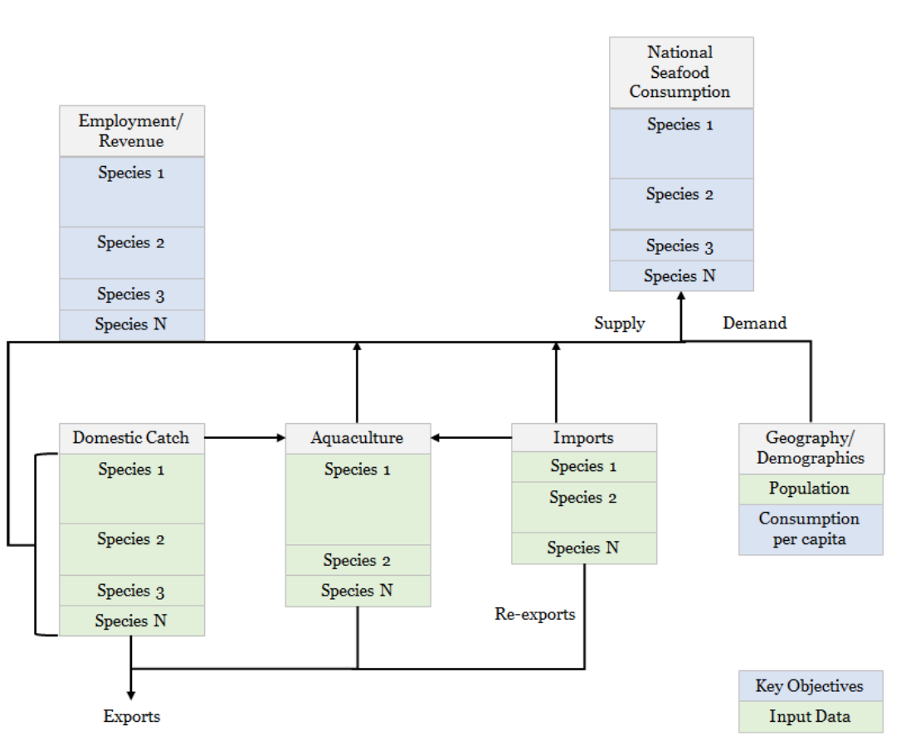

```{r setup, eval = T, echo=F, warning=F, message=F}

#### READ ME !!! ####
# Run this chunk before knit so you make sure you have all pkgs installed in R
# Please include any package used in your analysis

ipak <- function(pkg){
  new.pkg <- pkg[!(pkg %in% installed.packages()[, "Package"])]
  if (length(new.pkg)) 
    install.packages(new.pkg, dependencies = TRUE)
  sapply(pkg, require, character.only = TRUE)
}

#### Library ####
packages <- c(
  # "readxl", # Read dataframe
  "dplyr", # Data manipulation
  "tidyr", # Data manipulation
  "ggplot2", #Nice grpahs and spatial analysis
  # "plotly",
  "purrr", #for loading multiple datasets
  # "rgdal",
  # "RColorBrewer",
  "knitr",
  "kableExtra",
  "data.table",
  "ggrepel"#,
  # "gridExtra",
  # "ggmap",
  # "rgeos",
  # "sp",
  # "rgdal", #Spatial analysis 
  # "tools" #Spatial analysis 
)

suppressWarnings(
  suppressMessages(
    suppressPackageStartupMessages(
      ipak(packages)
    )
  )
)

```


```{r Data_Fun, eval = T, echo = F, warning = F, message = F}

#### Functions ####

# Note that the main function is on a separate file (corefx.r)
source('Functions/corefx.R')

#### For all plots look alike ###

ggtheme_plot <- function() {
  theme(
    plot.title = element_text(size = rel(1), hjust = 0, face = "bold"),
    panel.background = element_blank(),
    strip.background = element_blank(),
    # strip.text       = element_text(size = base_size, face = "italic"),
    panel.border     = element_blank(),
    panel.grid.minor = element_blank(),
    panel.grid.major = element_blank(),
    axis.ticks = element_blank(),
    axis.text.x = element_text(size = 8),
    axis.text.y = element_text(size = 8),
    axis.title = element_text(size = 8),
    legend.key = element_rect(colour = NA, fill = NA),
    legend.position  = "top",
    legend.title = element_text(size = 10),
    legend.text = element_text(size = 8),
    strip.text.x = element_text(size = 14, colour = "darkgrey")
  )
}


#### Datasets ####

# International Datasets #### 

# All datafiles should be in THIS path
Int_Data_Path <- "./clean_databases/International/"

#### SAU dataset used for international analysis chunks:
# 1, 2 & 3, 4

# # # File name
SAU_F_Name <- "SAU_Dataset.csv"
# #read dataset
SAU_Database <- fread(paste(Int_Data_Path,
                            SAU_F_Name,
                            sep = ""))
#### UN dataset used for international analysis chunks:
# 4

UN_F_Name <- "UN_Dataset.csv"

UN_Database <- read.csv(paste(Int_Data_Path,
                              UN_F_Name,
                              sep = ""))


UN_F_Name <- "International_Data.csv"

International_D<- read.csv(paste(Int_Data_Path,
                              UN_F_Name,
                              sep = ""))

```

# Project Goal and Objectives

- Determine the contribution of specific fisheries to domestic fish consumption and domestic livelihoods throughout Brazil, Chile, and Peru. 

- Critical analysis highlighting important capture fisheries for domestic food security, in the context of vulnerable populations and regions.

- Determine most important capture fisheries for food provision, and domestic seafood consumption patterns through time and space.

- Determine most important capture fisheries and fisheries sectors for regional employment and income.

- Determine most important capture fisheries and fisheries sectors for domestic catch and landed value.

- Deliverable - Final report including a critical analysis of domestic seafood consumption, related fisheries employment and income, and general fishery conditions of each nation included (Brazil, Chile and Peru). - National datasets and associated R-script, properly documented for replicating analyses and results. - Summary of key uncertainties, data gaps and priority areas for future research and policy.

\clearpage


# Excecutive Summary

\clearpage

# Resúmen Ejecutivo

\clearpage

# Background

Latin American nations include some of the world’s most important producers of seafood from capture fisheries and aquaculture and, with a high (51%) proportion of net seafood production traded locally **ref**, domestic fisheries remain highly important for national food security across the region. The UN Food and Agriculture Organization (FAO) estimates that Latin American countries consumed around 6.2 million tons of fish in 2015, averaging a per capita food fish consumption of 9.8 kg/year **ref SOFIA**. The contribution of fisheries to food security and livelihoods is particularly pertinent given the adoption of the UN Sustainable Development Goals (SDGs) **ref Agenda 2030**, where adequate management of marine fisheries can be directly linked to the achievement of goals related to decreasing hunger and poverty throughout the world **ref Singh**. There has been a further increase in attention to global capture fisheries due to the ongoing World Trade Organization (WTO) negotiations on fishery subsidies disciplines **ref**, as these are partially intended to avoid trade and operational distortions that may threaten local food security in maritime nations. 

In 2016, total fish landings in Chile and Peru, two of the world’s top fishing nations, averaged 8 million tons per year [@Fishstat]. In Peru, the seafood sector generates over US1.7 billion per year, supporting over 200 thousand jobs. Moreover, Chile’s aquaculture production is among the largest of the world1 and fish meal and salmon exports generate over US$2.2 billion per year4. Despite comparatively lower catches, Brazil’s fisheries sustain thousands of local families in coastal areas5-6, and inland captures along riverine systems including the Amazon basin are among the largest in the world1. Aside from seafood production volumes, fisheries in Latin America are extremely important as a source of employment and livelihoods along coastal regions, and further inland through value chains. Around 90% of all motorized fishing vessels in Latin America are part of the small-scale fisheries sector (SSF) and are under 12m length1. Despite supporting some **XXXX** people **ref**, this sector is among the most marginalized groups in the region 7, despite it being critical to achieving critical development goals **ref Agenda 2030**, as highlighted by the recent FAO small scale fisheries guidelines that explicitly link the sector with food security, poverty eradication, and social **equity ref FAO SSF Guidelines** [@Fishstat]. 

Given the increasing pressures on vulnerable populations, including climate change but also rapid national and international policy and market shifts, it is imperative to highlight the critical importance of particular capture fisheries for meeting domestic seafood supply. This knowledge can help guide future policies to ensure economic development does not jeopardize health and livelihoods, either in fishing communities or at the national scale. 

# Methods

The objective of this project is to determine the most important species for domestic seafood consumption (regionally, as possible) produced by wild capture fisheries in Brazil, Chile, and Peru, and their relationship with local employment. Given that seafood is a widely traded commodity and that aquaculture has steadily increased market supply, meeting this objective involved using species-specific data on domestic catches, aquaculture, and seafood imports and exports to highlight the most important species and fisheries that contribute to local and national food security and livelihoods. 

## Analytical framework

Given the nature of fisheries data and governance systems, each of the nations considered presented unique analytical challenges (see ‘Data sources’), but a consistent methodological framework (**Fig. 1**) was used to maintain consistency in methods and comparability of results across nations. 

Based on the best available data in each country, total seafood supply was estimated as the sum of per-species production of domestic catch and aquaculture (minus exports), plus the sum of species net imports. Catch statistics were separated by sectors whenever possible, including artisanal, industrial, and subsistence catches. In the case of domestic catch, inputs to aquaculture are subtracted from production (similar to exports); this is particularly relevant for large industrialized fisheries for small pelagics that are almost entirely reduced into fish feeds. The distribution of consumption (demand) of this seafood supply was based on regional (as available) estimates of seafood consumption per capita and regional populations. An important additional aspect for the critical analysis portion of the project was the linking of regions with available socioeconomic and governance indicators, providing a basis for discussing relative vulnerabilities to potential changes in seafood supply. 





The following sections provide detailed methods for estimating i) net seafood supply and ii) revenues for key species in each country. This focuses on production from capture fisheries, but also includes aquaculture and trade supply. This analysis was applied across all countries using different datasets. Results will vary within countries according to the dataset (source) used.

## Estimating National Seafood Supply

We used the framework proposed (Figure 1) to design a model to estimate total seafood supply. The model included fish providing from for wild (ocean) domestic catch, farmed fish, and trade. In addition, estimations accounted for discards at sea and biomass losses due to processing (Table 1).

```{r NSS_Variables, eval = T, echo = F}

data.table(
  Symbol = c(
    "C",
    "A",
    "I",
    "E",
    "D",
    "O",
    "P",
    "L",
    "TDFS",
    "NDFS",
    "TFS",
    "NSS"
  ),
  Description = c(
    "Fish catch, i.e., wild capture production.",
    "Aquaculture production.",
    "Fish imports.",
    "Fish exports.",
    "Rate of losses () from discards (D) at sea.",
    "Rate of losses from other uses (O), i.e., not for human consumption.",
    "Rate of losses from processing (P), i.e., during canning, filleting, etc.",
    "Landings from wild capture production (catch minus discards).",
    "Total domestic fish supply. Total amount of fish produced in the country.",
    "Net domestic fish supply. Total amount of fish produced in the country, minus exports and discards.",
    "Total fish supply. Total amount of fish in the country (NDFS plus imports).",
    "Net seafood supply. Effective amount of fish for human consumption in the country (TFS for human consumption, minus processing waste)."
  )
) %>% 
  # kable("latex", booktabs = T) %>% 
  # kable_styling(full_width = F) %>% 
  #  column_spec(2, width = "15cm") %>% #wraps text in column2
  kable()

```

The model first estimated the total domestic catch of fish supply per species (*i*) from wild captures and aquaculture as follows:

$${TDFS_i} = {C_i} + {A_i}$$

Note that, to avoid double-counting fish production, domestic catch that is fed to farmed fish was subtracted from overall production. This was done as possible given available country information and context (i.e., this may be more of an issue for some countries than others). Then, not domestic fish supply was estimated from fish landed (catch minus discards), aquaculture and exports as follows:

$${NDFS_i} = {L_i} + {A_i} - {E_i} $$


$${L_i} = {C_i} - ({C_i} * {\lambda_{d,i}} )$$


where the second term in Equation 3 allows for a calculation of total discards in each country. In Equations 4 and 5, we assume that all imported seafood (we do not include imports not for human consumption, e.g., fish meal) is ready to be consumed and thus do not include losses from processing. We also assume that all aquaculture production is for human consumption and that none of this production is discarded, though processing losses do occur as in production from capture fisheries (e.g., farmed and wild caught shrimps would receive similar processing).

$${TFS_i} = NDFS_i + I_i$$

Therefore, national seafood supply will be estimated for each country and species as follows:

$$NSS_i = [(L_i - L_i * {\lambda_{o,i}} + A_i] * {\lambda_{p,i}}- E_i + I_i$$


## Estimating National Economic Participation

Estimations of economic participation of fish in each country was computed based on fisheries landings, trade, aquaculture, and market value. Note that landings will have different ex-vessel price depending in the buyer (e.g. direct human consumption, fish meal or fish oil).


```{r NEE_Variables, eval = T, echo = F}

data.table(
  Symbol = c(
    "beta",
    "alpha",
    "I",
    "RI",
    "E",
    "FR",
    "NT"
  ),
  Description = c(
    "Ex-vessel price for catch landed for direct human consumption",
    "Ex-vessel price for catch landed for indirect human consumption",
    "Imports. Economic value of imported fish",
    "Re-Imports. Economic value of fish products re imported in the country",
    "Exports. Economic value of exported fish",
    "Fishing Revenue. The total revenue for that species provided by the fishing activity",
    "Net trade. Economic value of fish traded considering both exports and imports"
  )
) %>% 
  # kable("latex", booktabs = T) %>% 
  # kable_styling(full_width = F) %>% 
  #  column_spec(2, width = "15cm") %>%  #wraps text in column2
  kable()

```


Fishing revenue integrates the different ex-vessel price that landings have, depending on the final destination: direct human consumption (DHC) and indirect human consumption (IHC). Therefore, total revenue (R) is estimated in the SAU database as follows:

$$FR = \sum_{i = 1}^n (L_{i}*\beta_{i})*\beta P_{i} + (L_{i}*\alpha _{i}) *\alpha P_{i}$$

In addition to the landings data, we used the FAO (SOFIA 2016) database to determine the value (US dollars) of fish and crustaceans, mollusks and other aquatic invertebrates imported and exported by Brazil, Chile and Peru. We estimate the net trade (NT) as follows:

$$NT = (E-I)-RI$$

## Data descriptions

This section outlines the sources, types, and limitations of available input data for the models described above. Data searches and analysis were undertaken at two levels. The first collated and used intergovernmental (e.g., FAO) datasets that were comparable across countries but involved various uncertainties. The second involved in-country data searches and validation and, though data quality varied across countries, results represent estimates using the best available information for each country. 


### Intergovernmental Analysis

The first approach using intergovernmental data is a somewhat broad analysis, though it provides general and easily comparable trends in national production by species groups. This also provides a good starting point for highlighting key areas and species of interest that could then be addressed during in-country searches. The intergovernmental analysis used three main datasets:

1. The FAO-SOFIA Catch and trade database. Expand on description
2. The Sea Around Us Dataset (SAU) has reconstructed fisheries catches for all three countries dating from 1950 to 2014. These data present a more accurate and complete picture of global fisheries than nationally collected data (nor the FAO dataset) [@Zeller2016].
3. A recent study estimated the proportion of fish landings designated to human direct consumption and fish meal and fish oil[@Cashion:2018]. Such study used the SAU database, internal reports and other methods for estimating total landings devoted to each segment for all countries in the world.
4. The FISHMAR database for names homologation. 

For the former analysis we used the FAO database to estimate the total landings (tons) of Chile, Brasil, and Peru in 2014, the last year with results in all database. All fishing sectors were aggregated (Industrial, Subsistence and Artisanal) and ** COMMENT: "Recreational" was ignored as it does not contribute to local food security.** Other countries that fish within Chile, Peru and Brasil were also not included in the analysis for the same reason. Landings were grouped by taxa excluding those not identified (e.g. "Marine fishes not identified"). We used the SAU database under the same method to estimate the revenue (US dollars) from each fishery.The SAU landings database reconstruction methods for each country can be accessed for Brazil[@REF], Chile[@REF], and Peru[@REF]. We then used the Tim *et al., 2018* database to estimate how much of the landings go to direct human consumption and how much goes to indirect human consumption...

Data extracted from SAU for Chile included the islands Juan Fernandez, Easter, and Desventuradas. For Brazil landings data included Fernando de Noronha, St Paul and St. Peter Archipelagos, and Trindade & Martim Vaz islands.


### Country-specific data, Brazil 

There is no basic fisheries statistics in the country since 2008. The lack of national fisheries statistics posed a great challenge to this study. Several researchers and fisheries managers consulted during the study pointed out the lack of data to provide basic information on Brazilian fisheries (Supplemental Material X). Information such as how much the country produces, how much it consumes or even the number of fishers in the country is very sparse. In an interview with the most renowned fisheries scientist in the country, Dr. Fabio Hazin (President of  The Committee on Fisheries (COFI) of the FAO), he pointed out that there are between 400 thousand and one million fishers in the country. We contacted people from all fisheries sectors to find out what was available. 

After an extensive search, we gathered the following six different databases representing the different fisheries sectors and conducted an extensive literature research. We also identified other potential sources of information that we were not able to obtain in time for this study.

1. *SIGSIF* - Data obtained from the sanitary inspection services of the Brazilian Ministry of Agriculture. This database contains all seafood processed by fishing industries that caries a federal inspection certificate. This certificate is required for industries to commercialize their product to different states of Brazil and to export and import seafood products. It is a rigorous inspection program, where one of the requirements is to report all seafood that enters each company. Thus, this database includes all seafood products by species imported or from domestic production that enters all seafood processing companies with the federal inspection certificate (total of 472 companies). It includes both aquaculture and wild caught products from both freshwater and the oceanic species. 2016-2017. 

2. *CEAGESP* - is the largest wholesale open seafood market in Latin America, located in the city of São Paulo. It is run by a state-owned company where sellers and buyers from all over the country gather to commercialize seafood and seafood products. We obtained information on all the seafood products commercialized in the market by species and price of commercialization. 2016-2017.

3.  *MDIC* - Import and Export data from the Ministry of Development, Industry and Foreign Trade. This database contains all seafood imported and exported in Brazil. 2014-2017.

4. *State fisheries landings* - Fisheries landings data from three states of Brazil were there is continuous data collection and data are publicly available. These three states (São Paulo, Parana and Santa Catarina) are located in Southern Brazil and have a continuous data collection program sponsored by Petrobras in partnership with Universities. Petrobras is required to collect landings information for insurance purposes and has made some of its data publicly available for research projects. 2016-2017.

5. *IBGE* - Brazilian Institute of Geography and Statistics. This federal institute is responsible for surveying the country to provide basic information on all social aspects of Brazil. We gathered two pieces of information to inform our analysis: household food consumption and income by region of Brazil (last survey dates from 2009 and 2010). 

6. *Fishing Permits* - Number of registered fishers in the country from the extinct Ministry of Fisheries and Aquaculture (MPA). 2003 - 2010.


### Country-specific data, Chile


### Country-specific data, Peru 

Landings of marine living resources reported by Peru’s national marine research institute **(Instituto del Mar del Perú – IMARPE)** between 1997 and 2012 include registries for at least 258 fish species, 43 species of molluscs, 30 species of crustaceans, 4 species of echinoderms, 4 species of brown algae, 2 species of red algae and 1 species of tunicate (**Table xxx**) **[Sueiro & De la Puente 2015]**.


# Results

The results section is divided in two main subsections representing Intergovernmental datasets (*Intergovernmental results*) and local datasets (*Brazil/Chile/Peru*). Results follow the same structure for each country from a fisheries context to a fish consumption supply to an employment and income section. Overall results show the average value of the last 5 years of data, although data provided along with this report dates several years ago.

## Regional Overview

### Fisheries Context

**SAU MAP**

Results from the initial analysis of intergovernmental data show a clear dominance in fisheries landings of both Chile and Peru over Brazil, even thou Brazil captures around 3 times more species than the former. In terms of total fishing revenue, all nations are similar (**Table XX**).

```{r Total_Table, eval = T, echo = F}

Totals <- SAU_Database %>%
  group_by(Reporter,Variable,scientific_name) %>%
  summarise_if(is.numeric,mean,na.rm =T) %>% 
  group_by(Reporter,Variable) %>% 
  summarise(
    "Totals" = round(sum(Value,na.rm=T)),
    "Exploited Species" = n()
  ) %>%
  tidyr::spread(Variable,Totals)


International_D %>%
  gather("Variable","Value",5:12) %>% 
  group_by(Country,Comm.Name,Sci.Name.Fb,Variable) %>%
  summarise_if(is.numeric,mean,na.rm =T) %>% 
  group_by(Country,Variable) %>% 
  summarise(
    "Totals" = round(sum(Value,na.rm=T)/1000,0), #Thousands
    "Exploited Species" = n()
  ) %>%
  filter(Variable %in% c("Aquaculture","Capture","Exports","Imports")) %>% 
  tidyr::spread(Variable,Totals) %>% 
  kable(
    caption = "Summary of results. Database used: SOFIA-FAO. Thousand tones",
    format.args = list(big.mark = ",")
  ) 

```

When we analyze the top ten species in terms of landing volume in tones using the SAU database we found different trends between and within countries (**Fig. XX**). Brazil's most exploited specie (in terms of landings) was the ray-finned fish *Sardinella brasiliensis*. For both Chile and Peru, the most most landed species was *Engraulis ringens*. 

<!-- \clearpage -->

```{r SAU_Landings_Data, eval = T, echo = F, warning =F, message = F, fig.height = 25, fig.width= 20, fig.cap= "Top 10 species by landings from the SAU dataset. Red bars represent species not present in the other category. White boxes represent the contribution of that speciest to the total country landing"}

Totals_Plot <- Totals %>%
  select(-2) %>%
  tidyr::gather("Variable","Totals",2:3)

# Including the proportion of the catch/value of each species
SAU_Prop <- SAU_Database %>%
  left_join(Totals_Plot,
            by = c("Reporter", "Variable")) %>%
  mutate(
    Proportion = round((Value/Totals)*100,2)
  ) %>%
  group_by(Reporter,Variable) %>%
  top_n(n = 10, wt = Proportion) %>%
  group_by(Reporter,scientific_name) %>%
  mutate(Repeated = n()) %>%
  mutate(Repeated = ifelse(Repeated == 1, "No", "Yes"))

# Including the accumulative proportion of plotted species

Prop_Total <- SAU_Prop %>%
  group_by(Reporter,Variable) %>%
  summarise(
    Tot_Prop = sum(Proportion),
    Location = max(Value)
  )

### Plot of total catch

SAU_Prop_C <- SAU_Prop %>% 
  filter(Variable == "Total_tonnes") %>% #Rounds everything without decimals
  mutate_if(is.numeric,round,0)

Prop_Total_C <- Prop_Total %>%
  filter(Variable == "Total_tonnes") %>% 
  mutate_if(is.numeric,round,0)

ggplot() +
  geom_bar(data = SAU_Prop_C, # Catch and value data
           aes(
             x= reorder(scientific_name,-Proportion),
             y = Value/1000, #thousands
             fill = Repeated
           ),
           stat = "identity"
  ) +
  geom_label(data = SAU_Prop_C, # Species proportion data (Barx boxes)
             aes(
               x = reorder(scientific_name,-Proportion),
               y = Value/1000,
               label = paste(as.character(Proportion),"%",sep = " ")
             )
  ) +
  geom_label(data = Prop_Total_C, # Total proportion data
             aes(
               x = 9,
               y = Location/1100,
               label = paste("Proportion of total",Variable, "\n of selected species\n",as.character(Tot_Prop),"%",sep = " ")
             )
  ) +
  theme(axis.text.x = element_text(angle = 45,
                                   hjust = 1,
                                   face = "italic")
  ) +
  scale_fill_manual(values =c("darkred",
                              "darkgreen"),
                    name ="Repeated") +
  facet_wrap(~Reporter,
             scales = "free",
             ncol = 1) +
  labs(
    # title="Top 25 species by landings (left) and value (right)\n from the SAU dataset",
    x ="Species",
    y = "Values \n (Thousand of Tons)"
  ) +
  ggtheme_plot() +
  theme(axis.text.x = element_text(angle = 45, hjust = 1, face = "italic", size = 16))

```

<!-- \clearpage -->

In addition to the internal fish production, Brazil, Chile and Peru all import and export fish (**Fig. XXX**). According to FAO-SOFIA data, imports and exports balances.... 

```{r Trade_Food, eval = F, echo = F, warning=F, fig.align='center', fig.height = 4, fig.width= 6, fig.cap= "Revenue from fisheries production, imports and exports for each nation from the UN database."}


```

### Estimating National Seafood Supply

**Talk about FAO consumptios rates per country. I believe the WHO also has a simliar study. Also describe the table...**

```{r R_Seafood_Consmption, eval = T, echo = F}

Data <-corefx(
  Country=International_D$Country,
  Species = International_D$Comm.Name,
  Catch = International_D$Capture,
  Dis = 0.20,
  DHC = International_D$DHC_Use,
  PL = 0.20,
  AP = International_D$Aquaculture,
  A_PL = 0.20,
  I_DHC = International_D$Imports,
  Exp = International_D$Exports,
  Result = "T",
  n = 5
)


Ignore <- c(
  "Anchoveta.=Peruvian anchovy",
  "Anchoveta.=Peruvian anchovy ",
  "Chilean kelp",
  "Common dolphinfish" # ¿Qué carajos!?
  )

Data %>% 
  filter(!Specie %in% Ignore) %>% 
  group_by(Country,
           Specie) %>% 
  summarise_if(is.numeric,mean,na.rm=T) %>% 
  group_by(Country) %>% 
  top_n(n = 5, wt = `National Seafood Supply`) %>%
  # kable("latex", booktabs = T) %>%
  # kable_styling(full_width = F) %>% 
  #  column_spec(2, width = "13em") %>% #wraps text in column2
  # column_spec(3:6, width = "6em") #%>% 
  kable()

```


### Estimating National Economic Participation

In terms of landing values Brazil's most prolific fishery in 2014 was *Umbrina canosai*, a croaker fished in the southern part of the country. For Chile, the most valuable fishery was *Engraulis ringens*, Peruvian anchoveta. Finally, Peru most valuable fishery in 2014 was the Peruvian scallop *Argopecten purpuratus*.


```{r SAU_Landings_Value, eval = T, echo = F, warning =F, message = F, fig.height = 25, fig.width= 20, fig.cap= "Top 10 species by landings value from the SAU dataset. Red bars represent species not included as top 10 most landed species. White boxes represent the contribution of that speciest to the total country value"}

### Plot of Landing value

SAU_Prop_V <- SAU_Prop %>% 
  filter(Variable == "Landings_Value") %>% #Rounds everything without decimals
  mutate_if(is.numeric,round,0)

Prop_Total_V <- Prop_Total %>%
  filter(Variable == "Landings_Value") %>% 
  mutate_if(is.numeric,round,0)

ggplot() +
  geom_bar(data = SAU_Prop_V, # Catch and value data
           aes(
             x= reorder(scientific_name,-Proportion),
             y = Value/1000, #thousands
             fill = Repeated
           ),
           stat = "identity"
  ) +
  geom_label(data = SAU_Prop_V, # Species proportion data (Barx boxes)
             aes(
               x = reorder(scientific_name,-Proportion),
               y = Value/1000,
               label = paste(as.character(Proportion),"%",sep = " ")
             )
  ) +
  geom_label(data = Prop_Total_V, # Total proportion data
             aes(
               x = 9,
               y = Location/1100,
               label = paste("Proportion of total",Variable, "\n of selected species\n",as.character(Tot_Prop),"%",sep = " ")
             )
  ) +
  theme(axis.text.x = element_text(angle = 45,
                                   hjust = 1,
                                   face = "italic")
  ) +
  scale_fill_manual(values =c("darkred",
                              "darkgreen"),
                    name ="Repeated") +
  facet_wrap(~Reporter,
             scales = "free",
             ncol = 1) +
  labs(
    # title="Top 25 species by landings (left) and value (right)\n from the SAU dataset",
    x ="Species",
    y = "Values \n (Thousand of USD)"
  ) +
  ggtheme_plot() +
  theme(axis.text.x = element_text(angle = 45, hjust = 1, face = "italic", size = 16))

```


Trade is an importat component of fisheries. From the countries analyzed Brazil was the only country to have a net import of fish. Brazil spends more money importing fish than what it makes from producing it and exporting that production. In the other hand, both Chile and Peru have positive surplus from their fisheries and commerce activities being Chile the most "*profitable*" country.

```{r Exports_Per_Country, eval = T, echo = F, warning =F, message = F}

```


## Results Brazil

```{r Brazil_Data, eval =T}

#### Brazil Datasets ####

# All datafiles should be in THIS path
B_Data_Path <- "./clean_databases/Brazil/"

# File names

B_Files <- c(
  "MDIC.csv", # Imports and exports
  "producao_seagesp.csv", #CEAVESP
  "SIGSIF.csv",
  "IBGE_consumption.csv",
  "IBGE_renda.csv",
  "rgp_MPA.csv", # Number of registered fishers
  "Santa_Catarina.csv", #State of Santa Catarina
  "parana.csv" #State of Parana
) 

#Load data

Brasil_Data <- B_Files %>% # read in all the files, appending the path before the filename
  map(~ fread(file.path(B_Data_Path, .))
      ) # Loads all data into a list


```

### Fisheries Context

As previouslly mentioned, there is no fishereis statistics data in Brazil since 2008. Therefore, the only country-wide assesment can be done using the SAU and SOFIA-FAO datasets. However, while these datasets provide some information regarding landigs, it is worth mention that they are far from realistic. In our metting with Dr. Fabio Hazin, he pointed out that data from FAO on Brazilian fisheries is mostly a copy of the production from the previous years. And this has been going on since 2008, when the last year of national fisheries statistics was recorded, and even then, it wasn't very reliable.

### Estimating National Seafood Supply

Using data from FAO and quantity imported and exported, it is possible to estimate the amount of seafood that is consumed in Brazil per year. The estimated consumption of seafood in Brazil is: 760k tonnes from fisheries plus 750k tonnes from aquaculture plus 380k tonnes from imports minus 37k tonnes from exports. This sums to about 1.86 million tonnes of seafood consumed in Brazil. If we divide this number by the number of people (about 200 million) we estimate a consumption of about 9.3 kg/capita/year.

Domestic consumption of fish and seafood in Brazil is estimated to be around 10 kilograms per capita per year (FAO, 2014). Per capita consumption in Brazil is low relive to other countries (average of 18 kg in the world) and the World Health Organization recommendation (12 kg). However, fish and seafood consumption has been steadily increasing from 4.6 kg per capita in 1961 to about 10 kg per capita in 2014 (FAO). Because of Brazil's large population (about 200 million people), this sums up to large amounts of seafood being consumed in the country, although consumption significantly varies across regions of the country. Additionally, estimates from FAO does not account for subsistence consumption of fish, where in some regions of the Amazon can be as high as 169 kg/capita/year (Isaac et al 2015). 

Despite large potential for seafood production from both capture fisheries and aquaculture, Brazil imports large quantities of seafood for domestic consumption. In 2017, Brazil imported more than 380 thousand tonnes of fish and seafood products, while exporting less than 10% of that value (Figure 2). This shows that local production is not meeting seafood demand in the country and increased national production, especially from aquaculture, has great potential to fill this gap.


```{r B_Trade, eval = T, echo = F, warning =F, message = F, fig.cap="Seafood and fish imports and exports from Brazil between 2014 to 2017 (Source: MDIC)"}

#MDIC

Brasil_Data[[1]] %>% 
  group_by(year, carac) %>%
  summarize(sum(quantity_kg)) %>%
  rename(prod = "sum(quantity_kg)") %>% 
  ggplot(.,
         aes(x=year,
             y=prod/1000000, # From gk to tones and to thousands
             fill=carac)
         ) + 
  geom_bar(stat = "identity", position = position_stack(reverse = TRUE)) + 
  labs(x="Year", y="Quantity (Thousand Tonnes)") +
  ggtheme_plot()

```

Fish and seafood import data shows that the main imported species in 2017 was the sardine followed by salmon, catfish fillet (pagasius) and hake fillet (**Table xxx**). There was a major increase in the import of sardine in the last two years, from 17 thousand tonnes imported in 2014 to 90 thousand tonnes in 2017. This increase is mainly result of the decline in sardine catches from the industrial fleet. According to information from research developed about this fishery, about 100 thousand tonnes of sardine was landed in 2014 followed by a decline to about 20 thousand tonnes in 2017 (Pincinato and Asche 2018). According to the authors, this decline is mainly because of environmental variability in the south of Brazil and "El Niño" events that occurred during that period. Thus, Brazilian sardine and imports form a fully integrated market, which maintains a steady supply of sardines to canary industries year-round. 

```{r B_Imports, eval = T, echo = F, warning =F, message = F}

# "MDIC.csv"

###Rank main species imported - production
Brasil_Data [[1]] %>% 
  filter(carac == "import" & year == "2017") %>%
  group_by(description) %>%
  summarize(sum(quantity_kg)) %>%
  rename(Product = description, Quantity = "sum(quantity_kg)") %>%
  arrange(desc(Quantity)) %>%
  transform(Percent = Quantity/sum(Quantity)*100) %>% 
  mutate(Quantity = Quantity/1000) %>% #Million
  mutate_if(is.numeric,round,0) %>% 
  slice(1:9) %>% # top 10
    kable(
        caption = "Main species imported in 2017, Brazil (Source, MDIC)", 
        booktabs = T,
        format.args = list(big.mark = ",")
        ) #%>%
  # kable_styling(latex_options = c("striped", "hold_position"))


```

Data from SEAGESP market suggests that the main species consumed in Brazil in 2017 was tilapia, followed by croaker, sardine, salmon, sharks and weakfishes (Table 7). From these species, tilapia and salmon are from aquaculture production and the remaining are from wild fisheries. Only in São Paulo market, 4.2k tonnes of tilapia was commercialized, with a total for all fish and seafood products of 42k tonnes in 2016 and 37k tonnes in 2017.


```{r CEAGESP_Consumption, eval = T, echo = F, warning =F, message = F}

##CEAGESP
# "producao_seagesp.csv"

###Rank main species - quantity
Brasil_Data[[2]] %>% 
  filter(year == "2016") %>%
  group_by(species_english) %>%
  summarize(sum(production_kg)) %>%
  rename(Species = species_english, Quantity = "sum(production_kg)") %>%
  arrange(desc(Quantity)) %>%
  transform(Percent = Quantity/sum(Quantity)*100) %>% 
  mutate(Quantity = Quantity/1000) %>% #Million
  mutate_if(is.numeric,round,0) %>% 
  slice(1:9) %>% # top 10
    kable(
        caption = "Main species commercialized in CEAGESP market, Sao Paulo, Brazil in 2017 (Source: CEAGESP)", 
        booktabs = T,
        format.args = list(big.mark = ",")
        ) #%>%
  # kable_styling(latex_options = c("striped", "hold_position"))


```

Data from SIGSIF shows that the main species processed in the country in 2017 was tilapia, followed by tambaqui (Colossoma macropomum), sardine, croaker, tambatinga (hybrid aquaculture species from the Amazon), catfish, salmon and tuna (Table 8). From the top 10 species processed in the country, 5 are from aquaculture production and 5 are from wild caught fisheries. A total of 360k tonnes of fish and seafood products were commercialized by 472 processing and distribution companies. This volume corresponded to about 20% of all estimated seafood consumed in the country (1.8b tonnes).

```{r Comercialization, eval = T, echo = F, warning =F, message = F}

# SIGSIF

###Rank main species comercialized 

Brasil_Data[[3]] %>% 
  filter(origin == "PRODUTOR" & year == "2017") %>%
  group_by(species_english) %>%
  summarize(sum(quantity)) %>%
  rename(Species = species_english, Quantity = "sum(quantity)") %>%
  arrange(desc(Quantity)) %>%
  transform(Percent = Quantity/sum(Quantity)*100) %>% 
  mutate(Quantity = Quantity/1000) %>% #Million
  mutate_if(is.numeric,round,0) %>% 
  slice(1:9) %>% # top 10
    kable(
        caption = "Main species comercialized by seafood industries with SIGSIF certificate in Brazil (Source: Minitry of Agriculture)", 
        booktabs = T,
        format.args = list(big.mark = ",")
        ) #%>%
  # kable_styling(latex_options = c("striped", "hold_position"))

```

Consumption of fish and seafood products in Brazil increases significantly during religious dates. Data from SEAGESP suggests that seafood consumption increases during Easter, when other types of meat are not consumed in respect of Christian tradition. For this reason, there is a significant peak in fish and seafood consumption during Easter week (Figure 3).

```{r Comercial_Plot, eval = T, echo = F, warning =F, message = F, fig.cap= "Quantity of fish and seafood products commercialized per month in 2017 at CEAGESP market (Source: CEAGESP)"}

# "producao_seagesp.csv" 2

####graph monthly prodcution
Brasil_Data[[2]] %>% 
  filter(year == "2016") %>%
  group_by(month) %>%
  summarize(sum(production_kg)) %>%
  rename(month = month, 
         prod = "sum(production_kg)") %>% 
  transform(monthabb = month.abb[month]) %>% 
  ggplot(.,
         aes(x = reorder(monthabb, 
                         month),
             y = prod/1000000)
         ) + 
  geom_bar(stat = "identity") + 
  labs(x="Month", y="Quantity (Thausand Tones)") + 
  ggtheme_plot()
```

Fish and seafood consumption in Brazil has distinct patterns according to the region of the country. As shown in IBGE data, the top consumers of fish and seafood products in the country are from the north and northeast regions (Figure 4). These regions are the poorest of the country (Figure 5) and have the greatest number of registered fishers (MPA, 2013), especially from the small-scale sector. Since most of the artisanal production is consumed locally, these regions have greater availability of fish and seafood products relative to capitals far from fishing activities. In addition to greater availability of fish and seafood products, the North and Northeast regions of Brazil have, in general, greater tradition of consuming seafood products. Because of extensive areas of coastline, the northeast region has tradition of eating seafood in restaurants close to the ocean, especially in the summer. Similarly, the North region has extensive areas of rivers and coast, being part of the culture to eat fish and seafood products. In other parts of the country, people traditionally eat other types of protein. Brazil has historically been a agriculture and livestock production country, with large tradition of eating barbecue and bovine meat. In many places there are cultural barriers for regularly consuming fish and seafood products. However, with increased aquaculture production, many of these states are now producing more fish and as consequence are starting to eat more fish. In addition, people are increasingly aware of the health benefits derived from eating fish and seafood products. In summary, the north and northeast regions are the greatest consumers of fish and seafood in the country because of the availability and tradition of consuming fish and seafood products. Because these regions are the poorest of the country, fish and seafood products are crucial for food security, especially in coastal and riverine areas. 


```{r IBGE_Consumption, eval = T, echo = F, warning =F, message = F, fig.cap= "Per capita consumption of protein types per region of Brazil (Source: IBGE)"}

"IBGE_consumption.csv"

Brasil_Data[[4]] %>%
  transform(kg = consumption*365/1000) %>% 
  ggplot(.,
         aes(x=region,
             y=kg,
             fill=protein)) + 
  geom_bar(stat = "identity",
           position = position_stack(reverse = TRUE)) + 
  labs(x="Region",
       y="Per capita Consumption (kg/year)") +
  ggtheme_plot()

```

```{r IBGE_Income, eval = T, echo = F, warning =F, message = F, fig.cap= "Monthly per capta income by region of Brazil in 2014 (Source: IBGE)"}

# "IBGE_renda.csv"

Brasil_Data[[5]] %>% 
  filter(type == "region") %>% 
  ggplot(.,
         aes(x=name,
             y=per_capita
             )
         ) + 
  geom_bar(stat = "identity") + 
  labs(x="Region",
       y="Monthly Per capita Income (R$)") +
  theme(axis.text.x = element_text(angle = 45, hjust = 1)) +
  ggtheme_plot()

```

In the North and Northeast regions, where consumption of seafood is highest, it is important to distinguish resources that are important for food security in coastal and riverine areas. Generally, while the most valuable species are usually sold for profit, smaller and less valuable fish are consumed by fishers and their families. Hundreds of species are consumed in these regions, with very little information on the most important species for food security. 

For those people not involved directly in fishing activity, consumption of fish and seafood products is expensive relative to other protein types (Figure 6). Fish and seafood products are on average three times more expensive than poultry, twice the price of pig meat and 25% more expensive than cow meat (Institute of Agriculture Economics - IEA, 2018). Such difference in price ca explain in part the low consumption of fish and seafood products in Brazil, especially during an economic crisis. In many cases, consumption of fish and seafood products are mostly in restaurants as a "fancy" dinner and not a meat for the day-to-day life. 


```{r Meat_Comparrison, eval = T, echo = F, warning =F, message = F, fig.cap= "Average wholesale price of protein types in the state of Sao Paulo, Brazil (Source: IEA, 2018)"}

data.frame(protein = c("Fish", "Bovine", "Pig", "Poultry"), price = c(31.56, 23.18, 15.24, 10.44)) %>% 
  ggplot(.,
         aes(x = reorder(protein,
                         price), 
             y = price)) + 
  geom_bar(stat = "identity") + 
  labs(x="Protein type", y="Price per Kilogram (R$)"
  ) + 
  ggtheme_plot()

```

In addition to elevated prices, frozen seafood products available in supermarkets are many times unreliable and with poor quality. According to the Ministry of Agriculture, seafood fraud was detected in 21% of the fish sold in supermarkets. In addition, a preeminent newspaper article pointed out that 70% of frozen fillets sold in supermarkets had excess water, reaching up to one third of the total weight of the fish. This practice makes the product even more expensive and discourages people from buying seafood products (Folha de SP, 2008). Therefore, for the average consumer, seafood products are expensive and unreliable relative to other protein options. This explains in part low seafood consumption levels in many parts of the country.   

Data on the main species consumed in Brazil suggests that consumers are mostly driven by price, although there are some exceptions. From the top 10 seafood products sold in CEAGESP, 7 where below the 0.5 percentile of prices (Table 9). This indicates that the primary driver of domestic consumption is affordability. However, there are some expeditions, such as salmon, shark and shrimps. Consumption of these species are mainly driven by desirability, supplying high-end markets and restaurants. Species such as salmon and shrimp have high demand because of their distinct flavor and color. Other species, especially white fish can be more easily substituted by other similar fish.  

```{r Price_Comercialization,  eval = T, echo = F, warning =F, message = F}

##CEAGESP
# "producao_seagesp.csv"

###Rank main species - quantity
Brasil_Data[[2]] %>% 
  filter(year == "2016") %>%
  group_by(species_english) %>%
  summarize(sum(production_kg), mean(price_rs)) %>%
  rename(Species = species_english, Quantity_kg = "sum(production_kg)", Price_RS = "mean(price_rs)") %>%
  transform(Price_percentile = ecdf(Price_RS)(Price_RS)) %>% 
  arrange(desc(Quantity_kg)) %>% 
  mutate(Quantity_kg = Quantity_kg/1000) %>% 
  mutate_if(is.numeric,round,1) %>% 
  slice(1:9) %>% # top 9
    kable(
        caption = "Price (RS/Kg) and quantity (Tones) of main species commercialized in CEAGESP market, Sao Paulo, Brazil in 2017", 
        booktabs = T,
        format.args = list(big.mark = ",")
        ) #%>%
  # kable_styling(latex_options = c("striped", "hold_position"))

```

The aquaculture industry in Brazil has been growing rapidly. According the Brazilian fish farming association, the aquaculture industry is the fastest growing food production sector in the country (PeixeBr, 2018). Brazil has some the largest potential for freshwater aquaculture in the world and will become a significant producer of fish in the next years. Fish farming has been growing around 8% per year in recent years, with a large increase in farming of native fish, especially in the north and middle-west regions. Additionally, Brazil is the fourth largest producer of tilapia in the world, with rapidly growing industries in the south and northeast regions. Another important aquaculture industry in the country is shrimp farming in the northeast region, although it has not been growing the production in recent years. With the expansion of the aquaculture industry in the country, the domestic supply of seafood will increase thus increasing accessibility of fish and seafood product for Brazil's population. In the North region, farmed fish is already affecting the market and reducing prices. Today, a large portion of the fish consumed in the region is produced by aquaculture. Tilapia is already the second most commercialized species in the CEAGESP market in São Paulo and the top species processed by seafood companies in the country. Cachuma (or Tambaqui) is a native species farmed in the north and mid-west regions and is the second most processed fish by seafood industries in Brazil. Thus, aquaculture products are already an important source of seafood for Brazil and has the perspective to grow rapidly in the future.  

### Estimating National Economic Participation

To respond to the economic question we put together several pieces of information from different sources to have an estimate of the importance of fisheries for employment in Brazil. Data from IBGE (2013) estimates that Brazil had about 500 thousand fishers throughout the country, with 90% from the small-scale sector and 10% from the industrial sector **(Campos and Chaves 2016)**. Data from the extinct Ministry of Fisheries and Aquaculture (MPA) suggests there are many more fishers in Brazil **(Figure xxx)**. According to these data, there were about 900 thousand registered fishers in 2010 throughout the country, with 95% of the registered fishers from the small-scale sector **(MPA, 2013**). There is a large discrepancy between these two sources, which reiterates the uncertainty around estimates of the number of fishers in the country. Nonetheless, these numbers highlight the huge importance of the fisheries sector to employment in Brazil. 

```{r Brazil_Registerd fishers, eval = T, echo = F, warning =F, message = F, fig.cap= "Number of registered fishers in Brazil from 2003 to 2010 (Source: Minitry of Fisheries and Aquaculture)"}

# rgp_MPA.csv
ggplot(Brasil_Data[[6]], aes(x = year, 
                     y = fishers/1000)) + 
  geom_bar(stat = "identity") + 
  labs(x="Year", y="Number of Registered Fishers (Thousands)"
       # caption = "Figure 1 - Number of registered fishers in Brazil from 2003 to 2010 (Source: Minitry of Fisheries and Aquaculture)"
       ) + 
  ggtheme_plot()

```

Employment along the supply chain varies according to the region, fisheries and species commercialized. In the artisanal sector, most of the catch is consumed regionally, or in nearby capitals. However, some valuable fish and seafood are also commercialized in the main capitals - São Paulo and Rio de Janeiro. Typically, there are three main supply chain configurations in artisanal fisheries. First, there are estuarine/mangrove species (mostly crabs, shrimp and bivalves) that are commercialized whole in local markets or processed to achieve larger markets. For example, processing of crab meat is an important activity for coastal communities, especially for fisher woman. To obtain one kilogram of crab meat, a full day's work is required, which involves extraction of the crab, cooking and manually removing the meat. This meat is then distributed through middleman to nearby cities and capitals. Second, most of the fish captured by the artisanal sector is consumed locally or regionally. In most cases, there is no record of the catch or commercialization of these fish, being sold in local markets and restaurants. Third, more valuable fish such as snappers, groupers, snook, weakfish and large shrimp are sold in capitals throughout the country. These fish are sold through middleman and larger seafood industries to large capitals, thus involving a larger number of people in the supply chain. Again, there is no reliable estimate on the total number of people employed in the supply chain of artisanal fisheries. The MPA estimates that there are about two million people involved in these fisheries (**MPA, 2013**). 

Assuming that the number of fishers are between 500 thousand and 1 million, and that about 90% of them are from the small-scale sector, the most important fisheries for employment in the country are those from the artisanal sector. The artisanal sector is where we have the least amount of data on the production and species harvested. There is an estimate from the MPA that 50-70% of the catch from the entire country comes from the artisanal sector (**MPA, 2013**). Small-scale fisheries in Brazil target hundreds of species and there is no reliable information on the most important species for this sector. 

Most of the registered fishers in Brazil are from the North and Northeast regions (MPA report, 2013). In these regions, freshwater resources from the Amazon and estuarine fisheries are very important. From the Amazonas state, the top commercialized fish are: curimatã (*Prochilodus nigricans*), jaraqui (*Semaprochilodus spp.*), matrinchã (*Brycon amazonicus*), pacu *(Mylossoma duriventre*), tambaqui (*Colossoma macropomum*) and tucunaré (*Cichla monoculus*) (**data from the secretary of fisheries in the Amazon state - Sepror, 2018**). In estuaries, there are many important resources such as the mangrove crabs, shrimps, bivalves, weakfish and snook (information gathered though literature review and interviews). Besides these fisheries, the small-scale fishers target all ecosystems and resources, such as pelagic, reefs, demersal and coastal. In the Northeast region for example, reef fisheries are very important, capturing some highly valued species such as snappers, groupers and lobsters. In the south, the mullet fishery is very important, with the first quota system for Brazil implemented in 2018 to manage this fishery. Therefore, the artisanal sector is a multi-species fishery, with the main species depending on the region and ecosystem. 

Industrial fisheries in Brazil employ only about 10% of the fishers and is responsible for about 30-50% of the fisheries production. The industrial sector in Brazil is mainly concentrated in the south of the country, especially in Santa Catarina state where the main industrial fisheries port is located (**Itajai port**). Landings data from Santa Catarina indicate that sardines are the most important species, followed by corvina and skipjack tuna (**Table X**). Another important industrial fisheries fleet is located in the mouth of the Amazon river, in the north of Brazil. The main resource captured in the region is the catfish piramutaba (Brachyplatystoma vaillantii), although there is no data available from this fleet. Therefore, the top fisheries by employment in the industrial sector are represented in the landings data from the Santa Catarina state and the piramutaba fishery in the north.  

```{r Brazil_SC, eval = T, echo = F, warning =F, message = F}

# Santa_Catarina
###Graph main species - production

Brasil_Data[[7]] %>% 
  filter(year == "2017") %>%
  group_by(species_english) %>%
  summarize(sum(production_kg)) %>%
  rename(Species = species_english, Production = "sum(production_kg)") %>%
  arrange(desc(Production))%>%
  transform(Percent = Production/sum(Production)*100) %>% #rounds everything 
  mutate(Production = Production/1000) %>% #Million
  mutate_if(is.numeric,round,0) %>% 
  slice(1:10) %>% # top 10
  kable(
        caption = "Main species caught (Thousand tones) in Santa Catarina state, Brazil in 2017 (Source: Univali)", 
        booktabs = T,
        format.args = list(big.mark = ",")
        ) #%>%
  # kable_styling(latex_options = c("striped", "hold_position"))

```

In the industrial sector, the majority of the catch is processed by large companies to be distributed in supermarkets and restaurants all over the country. According to data published by the Seafood Industry Association (ABIPESCA), the seafood industry employs about 8 thousand direct employments and 30 thousand indirect employments. Data from the seafood companies (SIGSIF) indicates that the most important industrial fisheries are sardines, croacker, tuna and piramutaba catfish (Table 2). Thus, the industrial sector employs relatively less people per ton of captured fish compared to the artisanal sector. 

```{r SIGIF, eval = T, echo = F, warning =F, message = F}

### Rank main species comercialized 
# SIGIF

Brasil_Data[[3]] %>% 
  filter(origin == "PRODUTOR" & form == "EXTRATIVO" & year == "2017") %>%
  group_by(species_english) %>%
  summarize(sum(quantity)) %>%
  rename(Species = species_english, Quantity = "sum(quantity)") %>%
  arrange(desc(Quantity)) %>%
  transform(Percent = Quantity/sum(Quantity)*100) %>% 
  mutate(Quantity = Quantity/1000) %>% #Million
  mutate_if(is.numeric,round,0) %>% 
  slice(1:10) %>%  #top 10
  kable(
    caption = "Main species comercialized (thousand tpones) by seafood industries with SIF certificate in Brazil (Source: Ministry of Agriculture)",
    booktabs = T,
    format.args = list(big.mark = ",")
    ) #%>%
  # kable_styling(latex_options = c("striped", "hold_position"))


```

Because there is no reliable national-level landings data in Brazil since 2008, it is challenging to determine the top fisheries by income generated in the country. Data available are mainly from the industrial sector, where sardines, croaker and tuna are the main species caught. However, information from the SIGSIF (Table 2) and Santa Catarina state landings does not have any information on price. 

A report by Nielsen analytic (Nielsen, 2018) shows that the canned sardine market in Brazil is valued at about 1.4 billion Brazilian Reais (approx. 380 million Dollars) and the canned tuna market is worth about 145 million Brazilian Reais (approx. 39 million Dollars). Additionally, according to the Brazilian seafood industry association, seafood industries have an aggregate revenue of 8 billion Brazilian Reais (approx. 2.2 billion Dollars) per year. These numbers demonstrate the strength of the seafood market (especially canned market) in Brazil and the importance of sardines for income and food security in the country.

Data from SEAGESP market have important information on the value of seafood in the country. This database contains quantity and price information for all seafood products. Products sold in the market are both from industrial and artisanal sectors. Table 3 shows the main species ranked by value sold in the CEAGESP market in 2017. The most valuable species in this year were sardines followed by sharks, croaker, tuna and acoupa weakfish (Table 3). Sharks are not distinguished by species and are captured by both artisanal and industrial fleets. Sardines, croakers and tunas are caught mainly by the industrial fleet, while the acoupa weakfish is mainly caught by artisanal fisheries from the north and northeast regions of Brazil. Snook is also one of the top 10 species sold in the market and mainly captured by the artisanal sector. It is one of the species with greater price in the market.    

```{r CEAGESP, eval = T, echo = F, warning =F, message = F}

###Graph main species - production

Brasil_Data[[2]] %>% 
  filter(year == "2017" & origin == "extraction") %>%
  group_by(species_english) %>%
  summarize(sum(value_rs)) %>%
  rename(Species = species_english, Value_RS = "sum(value_rs)") %>%
  arrange(desc(Value_RS)) %>%
  transform(Percent = Value_RS/sum(Value_RS)*100) %>% 
  mutate(Value_RS = Value_RS/1000) %>% #Million
  mutate_if(is.numeric,round,0) %>% 
  slice(1:10) %>%  #top 10
  kable( 
      caption = "Main species comercialized (thousand tones) in 2017 at CEAGESP fishmarket, Sao Paulo, Brazil (Source: CEAGESP)", 
      booktabs = T,
      format.args = list(big.mark = ",")
      ) #%>%
  # kable_styling(latex_options = c("striped", "hold_position"))

```

Many important small-scale resources are not sold in the SEAGESP market but are important sources of income through sale in local markets. Resources such as crabs, mullets, shrimp, snappers and groupers are very important sources of income for small-scale fishers. Only from our databases there are over 500 different species reported. For example, in Paraná state most of the production is from small-scale fisheries. In this state, shrimps, weakfishes and crab are the most important species in terms of value (Table 4). 

```{r Parana, eval = T, echo = F, warning =F, message = F}

###Rank main species - value
Brasil_Data[[8]] %>% 
  filter(year == "2016") %>%
  group_by(species_english) %>%
  summarize(sum(value_rs)) %>%
  rename(Species = species_english, Value_RS = "sum(value_rs)") %>%
  arrange(desc(Value_RS)) %>%
  transform(Percent = Value_RS/sum(Value_RS)*100) %>% 
  mutate(Value_RS = Value_RS/1000) %>% #Million
  mutate_if(is.numeric,round,0) %>% 
  slice(1:10) %>%  #top 10
  kable( 
    caption = "Main species caught in the Parana state, Brazil, 2016 (Source: Fundepag)", 
    booktabs = T,
    format.args = list(big.mark = ",")
  ) #%>%
# kable_styling(latex_options = c("striped", "hold_position"))
  
  
  
```

Another important piece of information regarding income generated are the main species exported in Brazil. Data from the Ministry of Development, Industry and Foreign Trade (MDIC) show that the main species exported are lobsters, followed by other fish, swim bladders and pelagic fish (tunas and swordfish) (Table 5). The main species exported, lobsters, are caught exclusively by the artisanal sector, with resources threatened by over exploitation (according to the Ministry of Environment). Because of the high value, the lobster fishery is profitable even when the resource is depleted. Exports of lobsters in Brazil reached staggering US$ 73 million in 2017, with no reported landings of the species in the country. 


```{r Exports, eval = T, echo = F, warning =F, message = F}

### Rank main species exported - value

Brasil_Data[[1]] %>% 
  filter(carac == "export" & year == "2017") %>%
  group_by(description) %>%
  summarize(sum(value_uss)) %>%
  rename(Product = description, Value_USS = "sum(value_uss)") %>%
  arrange(desc(Value_USS)) %>%
  transform(Percent = Value_USS/sum(Value_USS)*100) %>% 
  mutate(Value_USS = Value_USS/1000) %>% #Million
  mutate_if(is.numeric,round,0) %>% 
  slice(1:10) %>%  #top 10
  kable( 
    caption = "Main species exported in 2017, Brazil (Source: MDIC). Thousand of USD", 
    booktabs = T,
    format.args = list(big.mark = ",")
  ) #%>%
# kable_styling(latex_options = c("striped", "hold_position"))

```


## Results Chile
### Fisheries Context
### Estimating National Seafood Supply
### Estimating National Economic Participation

## Results Peru
### Fisheries Context
### Estimating National Seafood Supply
### Estimating National Economic Participation

# Critical Analysis
## Overall of the region
### Brazil
### Chile
### Peru
# Conclusions
# References
# Data
# Supplemental Material List

